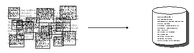
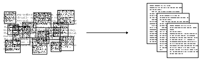

::: {.callout-note}
## Notebook from Class Available To Download

If you want to review our in-class code, you can download the Jupyter notebook by clicking here <a href="../../assets/files/AdvancedComputationalMethods.ipynb" download>AdvancedComputationalMethods.ipynb</a>.
:::

## Reviewing Entities and Genre: Extracting Signals from Unstructured Text

In the last lesson, we built a pipeline for structuring unstructured text: tokenizing our novels, extracting characters via named entities with `spaCy`, and turning those entities into a co-occurrence network. We could've looked at all entities for instance:

| Type | What it captures | Genre signal |
|------|-----------------|-------------|
| `PERSON` | Character and person names | Character density; needed for co-occurrence networks |
| `GPE` | Countries, cities, states | Geographic specificity — high in historical fiction, low in domestic realism |
| `LOC` | Non-GPE locations (mountains, seas) | Landscape-heavy genres like adventure, fantasy |
| `ORG` | Organizations, institutions | Political novels, thrillers |
| `DATE` | Dates and time expressions | Historical fiction tends to anchor itself in explicit dates |
| `NORP` | Nationalities, religions, political groups | Historical and political fiction |
| `EVENT` | Named historical/cultural events | Historical fiction, war novels |

Which would've required slightly expanding our existing code:

```python
from tqdm import tqdm

ENTITY_TYPES = ['PERSON', 'GPE', 'LOC', 'ORG', 'DATE', 'NORP', 'EVENT']

def get_all_entities(text):
    """Extract entities of all relevant types in a single spaCy pass."""
    result = {etype: [] for etype in ENTITY_TYPES}
    if pd.isna(text) or len(str(text)) == 0:
        return result
    doc = nlp(str(text)[:100000])
    for ent in doc.ents:
        if ent.label_ in result:
            result[ent.label_].append(ent.text)
    return result

# Run spaCy once per novel which will take a few minutes
tqdm.pandas(desc="Extracting entities")
entity_results = combined_novels_nyt_df['eng_text'].progress_apply(get_all_entities)

# Add a list column and a count column for each entity type
for etype in ENTITY_TYPES:
    col = etype.lower()
    combined_novels_nyt_df[f'{col}_entities'] = entity_results.apply(lambda x: x[etype])
    combined_novels_nyt_df[f'{col}_count'] = combined_novels_nyt_df[f'{col}_entities'].apply(len)
```

::: {.callout-note collapse="true"}
## Dataset Available on Canvas

This dataset is available in the files on Canvas as `combined_novels_with_entities.csv`. It includes the following columns:

- `person_entities`: a list of all `PERSON` entities found in the novel
- `person_count`: the total number of `PERSON` entities
- `gpe_entities`: a list of all `GPE` entities found in the novel
- `gpe_count`: the total number of `GPE` entities
- `loc_entities`: a list of all `LOC` entities found in the novel
- `loc_count`: the total number of `LOC` entities
- `org_entities`: a list of all `ORG` entities found in the novel
- `org_count`: the total number of `ORG` entities
- `date_entities`: a list of all `DATE` entities found in the novel
- `date_count`: the total number of `DATE` entities
- `norp_entities`: a list of all `NORP` entities found in the novel
- `norp_count`: the total number of `NORP` entities
- `event_entities`: a list of all `EVENT` entities found in the novel
- `event_count`: the total number of `EVENT` entities

:::

Now that we have the entity counts, we could then visualize how many entities have been identified, using Altair.

First we would generate a total count of mentions per entity type across the corpus:

```python
ENTITY_TYPES = ['PERSON', 'GPE', 'LOC', 'ORG', 'DATE', 'NORP', 'EVENT']
count_cols = [f'{e.lower()}_count' for e in ENTITY_TYPES]

# --- Chart 1: total mentions per entity type across the full corpus ---
totals = (
    combined_novels_nyt_df[count_cols]
    .sum()
    .reset_index()
    .rename(columns={'index': 'entity_type', 0: 'total_count'})
)
totals['entity_type'] = totals['entity_type'].str.replace('_count', '').str.upper()
```

```{python}
#| echo: false
# ── Hidden setup cell — loads the pre-built viz dataset ──────────────────
import pandas as pd
import altair as alt
# Force Vega-Embed to load from CDN as a plain script, not via RequireJS
alt.renderers.set_embed_options(
    vega_version=alt.VEGA_VERSION,
    vegalite_version=alt.VEGALITE_VERSION,
    vegaembed_version=alt.VEGAEMBED_VERSION
)


total_entities = pd.read_csv('../../assets/files/combined_novels_total_entity_counts.csv')

bar = alt.Chart(total_entities).mark_bar().encode(
    x=alt.X('total_count:Q', title='Total Mentions'),
    y=alt.Y('entity_type:N', sort='-x', title=None),
    color=alt.Color('entity_type:N', legend=None),
    tooltip=['entity_type', 'total_count']
).properties(title='Total Entity Mentions by Type', width=450, height=220)

bar
```

We can see that `PERSON` is by far the most frequent entity, which makes sense for novels, though interesting `EVENT` is the lowest. This extracting of entities is technically a form of *augmentation*. As a next step, we might go through and try to validate the entities, clean them up using additional libraries like [BookNLP](https://github.com/booknlp/booknlp){target="_blank"}, or use them to build more complex features like character networks.

**But to augment data, we need to start thinking about *what* we want to add, and *why*.**

In the last lesson, we looked at identified characters across novels, which tells us a bit about how names are used across novels, and might even be interesting for looking at character names as a way to categorize novels over time. But the community of characters in a novel is not the only thing we can extract. We can also look at places, organizations, dates, and so on. Each of those entity types gives us a different window into the novel's content and style, and may relate to different ways to categorize and augment the data about the novel.

**Remember the goal of using computation is not just to analyze, but to enhance our understanding of the data.**

One angle we have yet to explore but is commonly used in research on literature is `genre`. Genre is a notoriously slippery category; it's not a fixed property of a text but a contested, multidimensional construct that can be defined in terms of marketing categories, literary conventions, reader expectations, and more. So, one question we might want to explore with data is how genre relates to the entities that appear in a novel. Do science fiction novels have more `ORG` entities because they feature more institutions? Do historical novels have more `DATE` entities because they anchor themselves in specific time periods?

We can start to do that with our same entity extraction dataset.

```python
genre_means = (
    combined_novels_nyt_df
    .groupby('genre')[count_cols]
    .mean()
    .reset_index()
    .melt(id_vars='genre', var_name='entity_type', value_name='mean_count')
)
genre_means['entity_type'] = genre_means['entity_type'].str.replace('_count', '').str.upper()

# Min-max normalize within each entity type so columns are comparable
genre_means['normalized'] = genre_means.groupby('entity_type')['mean_count'].transform(
    lambda x: (x - x.min()) / (x.max() - x.min() + 1e-9)
)
```

Notice here though that I am normalizing the counts within each entity type, not across the whole dataset. This is because `PERSON` counts are on a completely different scale than `EVENT` counts, and I want to be able to compare genres within each entity type without one dominating the visualization.

```{python}
genre_means = pd.read_csv('../../assets/files/combined_novels_genre_entity_means.csv')

stacked_bar = alt.Chart(genre_means).mark_bar().encode(
    y=alt.Y('entity_type:N', title='Entity Type', axis=alt.Axis(labelAngle=0)),
    x=alt.X('mean_count:Q', title='Mean Mentions per Novel (stacked across genres)'),
    color=alt.Color('genre:N', title='Genre'),
    tooltip=[
        alt.Tooltip('entity_type:N'),
        alt.Tooltip('genre:N'),
        alt.Tooltip('mean_count:Q', format='.1f', title='Mean per Novel')
    ]
).properties(
    title='Mean Entity Mentions per Novel by Type and Genre',
    width=500,
    height=350
)

stacked_bar
```

This graph gives us a much better sense of how different genres use different kinds of entities. But it is still tricky to see the relationship. A heatmap would be a much better option.

```{python}
heatmap = alt.Chart(genre_means).mark_rect().encode(
    x=alt.X('entity_type:N', title='Entity Type'),
    y=alt.Y('genre:N', title='Genre', sort='-x'),
    color=alt.Color('normalized:Q',
                    scale=alt.Scale(scheme='blues'),
                    title='Normalized Mean Count'),
    tooltip=[
        alt.Tooltip('genre:N'),
        alt.Tooltip('entity_type:N'),
        alt.Tooltip('mean_count:Q', format='.1f', title='Mean per Novel'),
        alt.Tooltip('normalized:Q', format='.2f', title='Normalized')
    ]
).properties(
    title='Entity Type Composition by Genre (normalized within type)',
    width=400,
    height=350
)

heatmap
```

Now we can see that while `PERSON` entities are the most common across the board, they actually appear much more in `action` and `bildung`. Whereas though `EVENT` is much less frequent, it occurs the most in `mystery`. This type of datafication is the kind of insight that can lead us to ask deeper questions about how genre conventions shape the kinds of entities that appear in novels, and how those entities in turn shape our understanding of genre.

### Information Extraction Methods



This approach to datafication is a form of **information extraction** that we learned about in the last lesson. We are extracting structured information (entities) from unstructured text (the novels) and using that to augment our dataset. This is a powerful way to add new dimensions to our data, but it's important to remember that the signals we get from this kind of extraction are noisy and partial. The fact that `GPE` entities are more common in `action ` doesn't mean every action novel will have lots of place names, or that every novel with lots of place names is action fiction.

I wanted to share some common approaches and Python Libraries that you might want to explore further.

*Methods for textual data:*

- **Part of Speech Tagging**: This is a technique that assigns parts of speech to each word in a sentence. For example, it might tag a word as a noun, verb, adjective, etc. This can be useful for identifying the grammatical structure of a sentence.
- **Dependency Parsing**: This is a technique that assigns syntactic structure to a sentence. For example, it might identify the subject, object, and verb in a sentence. This can be useful for understanding the relationships between words in a sentence.
- **Coreference Resolution**: This is a technique that identifies when two or more words in a sentence refer to the same entity. For example, it might identify that "he" and "John" refer to the same person. This can be useful for understanding the relationships between entities in a text.

*Popular Python libraries for these tasks include:*

- **spaCy library** [https://spacy.io/](https://spacy.io/): As we've seen, spaCy is a popular Python library for NLP that provides a wide range of tools for information extraction, including Named Entity Recognition (NER), Part of Speech Tagging, Dependency Parsing, and Coreference Resolution. spaCy is known for its powerful architecture and multiple models for different languages. Here's an example of a dependency parse tree from spaCy:
- 
<figure>
	<a href="https://spacy.io/images/displacy-long2.svg">
	
	</a>
</figure>

- **Stanford CoreNLP** [https://stanfordnlp.github.io/CoreNLP/](https://stanfordnlp.github.io/CoreNLP/): Stanford CoreNLP is a suite of tools for NLP that provides a wide range of tools for information extraction, including Named Entity Recognition (NER), Part of Speech Tagging, Dependency Parsing, and Coreference Resolution. Stanford CoreNLP is an older library but is still widely used for these tasks.
- **Riveter NLP** [https://github.com/maartensap/riveter-nlp](https://github.com/maartensap/riveter-nlp) is a Python package that measures social dynamics between personas mentioned in a collection of texts. The package identifies and extracts the subjects, verbs, and direct objects in texts; it performs coreference resolution on the personas mentioned in the texts.
- **The Classical Language Toolkit** [https://github.com/cltk/cltk](https://github.com/cltk/cltk) is a Python library that provides NLP tools for classical languages. The library includes tools for tokenization, lemmatization, part-of-speech tagging, and named entity recognition for classical languages like Latin and Greek.
- **BookNLP** [https://github.com/dbamman/book-nlp](https://github.com/dbamman/book-nlp) is a Python library that provides NLP tools for analyzing novels. The library includes tools for tokenization, lemmatization, part-of-speech tagging, and named entity recognition for novels.

*Methods for image or video data:*

- **Object Detection**: This is a technique that identifies objects in an image or video. For example, it might identify a person, car, or tree in an image. This can be useful for understanding the content of an image or video, and in many ways is similar to NER, which we will explore more in-depth below.
- **Facial Recognition**: This technique is a subset of Object Detection that identifies faces in an image or video. For example, it might identify a person's face in an image. It is usually discussed as a separate category from Object Detection because it is a specialized form of Object Detection, and because of the deeply problematic ethical implications of facial recognition technology.
- **Optical Character Recognition (OCR)**: We have discussed this technique in-depth, but never as an information extraction technique, even though that is technically what it is doing, as we can see in this figure:
  
<figure>
	<a href="https://cdn.prod.website-files.com/65560eafdce64b3d914e8df3/66c658f2af995ea4228a8861_65560eafdce64b3d914e915a_sequence-modeling-2.webp">
	
	</a>
</figure>

- **Edge Detection**: This is a technique that identifies edges in an image or video. For example, it might identify the edges of a person, car, or tree in an image. This can be useful for understanding the content of an image or video, and for tasks like image classification and object detection.
- **Image Segmentation**: This is a technique that identifies regions in an image or video. It is similar to object detection, but it identifies regions instead of objects. This can be useful for understanding the content of an image or video, and for tasks like image classification and object detection.

<figure>
	<a href="https://www.optisolbusiness.com/wp-content/uploads/2021/05/1_bkZq95raD6O6eTTE_9OTZA.png">
	
	</a>
</figure>

*Popular Python libraries for these tasks include:*

- **OpenCV** [https://opencv.org/](https://opencv.org/): OpenCV is a popular Python library for computer vision that provides a wide range of tools for image and video analysis, including object detection, facial recognition, and image segmentation. OpenCV is known for its speed and accuracy and is widely used in industry and academia.
- **TensorFlow** [https://www.tensorflow.org/](https://www.tensorflow.org/): TensorFlow is a popular Python library for machine learning that provides a wide range of tools for image and video analysis, including object detection, facial recognition, and image segmentation. TensorFlow is known for its flexibility and is widely used in industry and academia.
- **PyTorch** [https://pytorch.org/](https://pytorch.org/): PyTorch is a popular Python library for machine learning that provides a wide range of tools for image and video analysis, including object detection, facial recognition, and image segmentation. PyTorch is known for its flexibility and is widely used in industry and academia.
- **Dlib** [http://dlib.net/](http://dlib.net/): Dlib is a popular Python library for computer vision that provides a wide range of tools for image and video analysis, including object detection, facial recognition, and image segmentation. Dlib is known for its speed and accuracy and is widely used in industry and academia.
- **Scikit-Image** [https://scikit-image.org/](https://scikit-image.org/): Scikit-Image is a popular Python library for image processing that provides a wide range of tools for image and video analysis, including object detection, facial recognition, and image segmentation. Scikit-Image is known for its speed and accuracy and is widely used in industry and academia.
- **Distant Viewing Toolkit** [https://distantviewing.org/](https://distantviewing.org/): The Distant Viewing Toolkit is a Python library that provides tools for analyzing images and videos. The library includes tools for object detection, facial recognition, and image segmentation, and is specifically designed for digital humanities research.

This overview is by no means comprehensive, but it should give you a sense of the range of information extraction techniques that are available for analyzing cultural data, and some of the popular Python libraries that you can use to implement them. In the next section, we'll look at how we can use some of these techniques to extract signals from our novels and augment our dataset in new ways.

### Information Retrieval Methods



Now that we are seeing how information extraction can help us augment and understand our textual data, we can start to explore information retrieval methods to also augment our understanding. It is important to note that the line between information extraction and retrieval can be blurry, but in general, information extraction is about extracting structured information from unstructured text, while information retrieval is about retrieving relevant information from a collection of documents.

*Methods for textual data:*

- **Topic Modeling** is a technique that identifies topics in a corpus of text data. Topic modeling works by identifying groups of words that frequently appear together in the corpus and assigning them to topics. Each topic is a group of words that are related to each other, and each document in the corpus is assigned a distribution over the topics. There are many different implementations of topic modeling, including *Latent Semantic Allocation* (LSA), *Latent Dirichlet Allocation* (LDA), and *Non-negative Matrix Factorization* (NMF).

<figure>
    <a href="https://yosinski.com/mlss12/media/slides/MLSS-2012-Blei-Probabilistic-Topic-Models_020.png">
    
    </a>
</figure>

- **Word Embeddings** is a technique that represents words as vectors in a high-dimensional space. Word embeddings are useful for capturing the semantic relationships between words in a corpus of text data. There are many different implementations of word embeddings, including *Word2Vec*, *GloVe*, and *FastText*.
- **Contextual Embeddings** is a technique that represents words as vectors in a high-dimensional space, taking into account the context in which the words appear. Contextual embeddings are useful for capturing the semantic relationships between words in a corpus of text data. There are many different implementations of contextual embeddings, including *BERT*, *GPT-2*, and *XLNet*.
- **Document Similarity & Ranking** is a suite of techniques including *Cosine Similarity*, *Jaccard Similarity*, and *BM25* that are used to measure the similarity between documents in a corpus of text data. Document similarity and ranking are useful for identifying similar documents in a corpus and for ranking documents based on their relevance to a query.

*Popular Python libraries for these tasks include:*

- **Gensim** [https://radimrehurek.com/gensim/](https://radimrehurek.com/gensim/): Gensim is a popular Python library for topic modeling and word embeddings. Gensim provides a wide range of tools for analyzing text data, including LDA, Word2Vec, and Doc2Vec.
- **FastText** [https://fasttext.cc/](https://fasttext.cc/): FastText is a popular Python library for word embeddings. FastText provides a wide range of tools for analyzing text data, including word embeddings and text classification.
- **BERT** [https://huggingface.co/transformers/model_doc/bert.html](https://huggingface.co/transformers/model_doc/bert.html): BERT is a popular Python library for contextual embeddings. BERT provides a wide range of tools for analyzing text data, including contextual embeddings and text classification.
- **Scikit-Learn** [https://scikit-learn.org/](https://scikit-learn.org/): Scikit-Learn is a popular Python library for document similarity and ranking. Scikit-Learn provides a wide range of tools for analyzing text data, including cosine similarity, Jaccard similarity, and BM25.
- **Transformers** [https://huggingface.co/transformers/](https://huggingface.co/transformers/): Transformers is a popular Python library for contextual embeddings. Transformers provides a wide range of tools for analyzing text data, including BERT, GPT-2, and XLNet.

*Methods for image or video data*:

- **Image Classification** is a technique that assigns labels to images based on their content. For example, it might classify an image as a cat, dog, or car. Image classification is useful for understanding the content of images and for tasks like object detection and image segmentation.
- **Image Clustering** is a technique that groups similar images together based on their content. For example, it might group images of cats together and images of dogs together. Image clustering is useful for organizing large collections of images and for tasks like image retrieval and image recommendation.
- **Image Similarity & Ranking** is a suite of techniques including *Cosine Similarity*, *Jaccard Similarity*, and *Euclidean Distance* that are used to measure the similarity between images. Image similarity and ranking are useful for identifying similar images in a collection and for ranking images based on their relevance to a query.

*Popular Python libraries for these tasks include:*

- Many of the same libraries used for textual data analysis can also be used for image and video data analysis, including OpenCV, TensorFlow, PyTorch, and Scikit-Image. These libraries provide a wide range of tools for analyzing image and video data, including object detection, facial recognition, and image segmentation.

We are hopefully are already getting a sense of why entities aren't necessarily the strongest indicators of genre. For instance, just because a `PERSON` does not appear as frequently in `scifi` texts doesn't mean that there are no characters from that genre. Indeed, many science fiction novels have rich character networks, but they may not be as densely packed with named characters as action novels. So, while entity counts can give us some insight into genre conventions, they are not the whole story.

In today's lesson, we are going to explore more ways of using what is normally thought of as `text analysis` to augment our dataset with a focus on this `genre` question.

We are going to explore three different methods for extracting genre signals from the text itself:

1. **TF-IDF** — which uses vocabulary to ask: does this novel's distinctive language look like the genre it claims to be?
2. **Topic Modeling (LDA)** — uses latent thematic structure to ask: do the topics LDA finds cluster by genre?
3. **LLM Classification with Ollama** — uses a local language model, informed by signals from the first two methods, to normalize genre labels and extract additional features

Each method will help us augment our dataset to create a set of complementary signals we can use to study genre as a contested, multidimensional category rather than a fixed fact.

---

## Cleaning Project Gutenberg Texts

Before we start, there's an important preprocessing step we haven't addressed yet: every Project Gutenberg file includes a standard header and footer–– licensing text, donation appeals, and metadata––that we want to remove before analysis. Otherwise this boilerplate will appear as the most "distinctive" content of every novel, swamping any meaningful signal.

The `gutenbergpy` library [https://pypi.org/project/gutenbergpy/](https://pypi.org/project/gutenbergpy/){target="_blank"} handles this for us:

```bash
pip install gutenbergpy
```

```python
import pandas as pd
from tqdm import tqdm
import gutenbergpy.textget

# Load our original dataset. For space considerations we are just going to use the dataset with text, not with entities.

combined_novels_nyt_df = pd.read_csv("combined_novels_with_text.csv")

# Function to clean the text of a novel given its Project Gutenberg URL
def clean_gutenberg_text(url):
    """Strip Project Gutenberg headers/footers using the book's PG ID."""
    if pd.notna(url):
        pg_id = url.split('/pg')[-1].split('.')[0]
        if not pg_id.isdigit():
            return None
        try:
            raw_book = gutenbergpy.textget.get_text_by_id(pg_id)
            clean = gutenbergpy.textget.strip_headers(raw_book)
            # gutenbergpy returns bytes; decode to string
            return clean.decode('utf-8', errors='replace')
        except Exception as e:
            print(f"Error for id {pg_id}: {e}")
            return None
    return None
tqdm.pandas(desc="Cleaning books")
combined_novels_nyt_df['cleaned_text'] = combined_novels_nyt_df['pg_eng_url'].progress_apply(clean_gutenberg_text)

```

::: {.callout-warning}
## Dataset Available on Canvas

The `clean_gutenberg_text()` function makes a network request for each book, which can take a few minutes to run for the full corpus. So I have provided a version of this dataset with the cleaned text already included as `combined_novels_with_cleaned_text.csv` on Canvas. You can load that directly if you want to skip the cleaning step. I've also done the same transformation on our entities dataset, which is available as `combined_novels_with_entities_and_cleaned_text.csv`. The cleaned text is in the `cleaned_text` column in both datasets.

:::

---

## TF-IDF: Building Genre Vocabulary Signals

`Term Frequency - Inverse Document Frequency` (TF-IDF) was first proposed by Karen Spärck Jones in 1972 under the name "term specificity" and later formalized by Steve Robertson in 1976. It has become one of the most widely used techniques in information retrieval, and for good reason: it surfaces terms that are *distinctive to a specific document* relative to the rest of the corpus, rather than just the most frequent terms overall.

<figure>
    <a href="https://miro.medium.com/max/1200/1*qQgnyPLDIkUmeZKN2_ZWbQ.png">
    
    </a>
</figure>

The intuition is exactly what you'd expect from Zipf's Law: words like "the" and "said" appear in every novel, so they tell us nothing about what makes any one novel distinctive. TF-IDF penalizes words that appear everywhere and rewards words that are concentrated in specific documents.

The math works like this:

```bash
term_frequency(t, d)       = count of term t in document d
inverse_document_frequency = log(total documents / documents containing t) + 1
tf_idf(t, d)               = term_frequency × inverse_document_frequency
```


Based on this chart, we can see that first we count the terms after tokenization within each document, and then we calculate the inverse document frequency for each term across the corpus. Finally, we multiply the term frequency by the inverse document frequency to get the TF-IDF score for each term in each document. So in the chart `blue` is distinctive of document 1, because it only appears in the first document, whereas `bright` though it appears in three documents is weighted much lower because it appears in multiple document, so it is not distinctive of any one document.

To reiterate, a high TF-IDF score means a word appears frequently in *this* document but rarely across the corpus as a whole. For our example, we'll use that signal in two ways: first to profile what vocabulary is *genre-distinctive*, and then to train a simple classifier that adds a predicted genre column to our dataset.

::: {.callout-note}
For a thorough walkthrough of TF-IDF from a digital humanities perspective, see Matthew J. Lavin's [*Analyzing Documents with TF-IDF*](https://programminghistorian.org/en/lessons/analyzing-documents-with-tfidf) in *Programming Historian* and Melanie Walsh's [textbook chapter](https://melaniewalsh.github.io/Intro-Cultural-Analytics/05-Text-Analysis/01-TF-IDF.html).
:::

### Computing TF-IDF with Scikit-Learn

We'll use scikit-learn's `TfidfVectorizer`, which handles tokenization, stop word removal, and the TF-IDF calculation in one step:

```bash
pip install scikit-learn
```

```python
from sklearn.feature_extraction.text import TfidfVectorizer
import numpy as np

# Drop rows with missing cleaned text
tfidf_df = combined_novels_nyt_df.dropna(subset=['cleaned_text']).copy()

# min_df=2: ignore terms appearing in fewer than 2 documents (typos, OCR errors)
# max_df=0.75: ignore terms appearing in more than 75% of documents (too common to be distinctive)
vectorizer = TfidfVectorizer(
	stop_words='english',
    max_features=5000,
    min_df=2,
    max_df=0.75,
    
)

tfidf_matrix = vectorizer.fit_transform(tfidf_df['cleaned_text'])
feature_names = vectorizer.get_feature_names_out()

print(f"Matrix shape: {tfidf_matrix.shape}")
print(f"  {tfidf_matrix.shape[0]} documents × {tfidf_matrix.shape[1]} terms")
```

I want to highlight a few of the arguments we are passing to `TfidfVectorizer`:
- `stop_words='english'` tells the vectorizer to remove common English stop words like "the", "and", "is", etc., which are not informative for distinguishing between genres. If we do not remove stop words, they will dominate the TF-IDF scores and drown out more meaningful signals.
- `max_features=5000` limits the number of terms to the top 5000 by TF-IDF score, which helps reduce noise and computational load. If we were to give it the full corpus to the Vectorizer, we would get a matrix shaped as `(188, 128952)`, which means we have 188 documents and 128,952 unique terms. This is a very high-dimensional space, and many of those terms will be rare or not distinctive, so limiting to the top 5000 helps us focus on the most meaningful signals, along with removing stop words.
- `min_df=2` tells the vectorizer to ignore terms that appear in fewer than 2 documents, which helps filter out typos and OCR errors that might only appear in one novel. We could drop this parameter, because that would give us the most distinctive terms per novel, but since we are interested in genre-level signals, we want to focus on terms that appear in multiple novels, so we set `min_df=2` to filter out those one-off terms.
- `max_df=0.75` tells the vectorizer to ignore terms that appear in more than 75% of documents, which helps filter out terms that are too common to be distinctive. If we don't add this flag, words like `said` might appear as the most distinctive term for every novel, which is not helpful for our analysis. By setting `max_df=0.75`, we ensure that we are only looking at terms that are distinctive to specific genres, rather than terms that are common across all genres.

We could start to explore the most distinctive terms for each novel, with a simple function that pulls the top N terms for a given document index:

```python
def get_top_tfidf_terms(row_index, n=10):
    """Return the top N TF-IDF terms for a given document row index."""
    row = tfidf_matrix[row_index]
    # Get the indices of the top N scores
    top_indices = np.argsort(row.toarray()[0])[::-1][:n]
    return [(feature_names[i], round(row[0, i], 4)) for i in top_indices]

# Show top terms for the first 5 novels
for i, row in tfidf_df.head(5).iterrows():
    idx = tfidf_df.index.get_loc(i)
    print(f"\n{row['title']} ({row['pub_year']}):")
    for term, score in get_top_tfidf_terms(idx):
        print(f"  {term:20s} {score}")
```

Which should show us the following output:

```bash

Don Quixote (1605):
  sancho               0.6738
  quixote              0.6042
  jpg                  0.1744
  señor                0.1614
  thou                 0.1556
  thee                 0.106
  knight               0.1048
  dulcinea             0.1017
  panza                0.0978
  errant               0.0784

Alice's Adventures in Wonderland (1865):
  alice                0.9732
  rabbit               0.0995
  duchess              0.089
  mock                 0.0885
  mouse                0.0683
  hare                 0.0574
  dinah                0.057
  jury                 0.0459
  footman              0.0285
  _i_                  0.0268
```

And we can start to see that TFIDF is helpful for distinguishing documents (hence it's popularity in databases and search engines), but it is not necessarily helpful for distinguishing genres, since many of the top terms are character names or other novel-specific details. 

We can start to see the issue more if we look at the terms most distinctive across genres.

```python
import altair as alt

# Use all genres — only exclude rows with no genre label at all
genre_df = tfidf_df.dropna(subset=['genre']).copy()
all_genres = genre_df['genre'].unique().tolist()

# Re-index the matrix rows to match genre_df
genre_indices = [tfidf_df.index.get_loc(i) for i in genre_df.index]
tfidf_matrix_genres = tfidf_matrix[genre_indices]

# Compute genre centroids
genre_centroids = {}
for genre in all_genres:
    mask = (genre_df['genre'] == genre).values
    genre_centroids[genre] = np.asarray(tfidf_matrix_genres[mask].mean(axis=0))

def top_centroid_terms(genre, n=12):
    centroid = genre_centroids[genre].flatten()
    top_idx = centroid.argsort()[::-1][:n]
    return [(feature_names[i], float(centroid[i])) for i in top_idx]

fingerprint_rows = []
for genre in all_genres:
    for term, score in top_centroid_terms(genre):
        fingerprint_rows.append({'genre': genre, 'term': term, 'centroid_score': score})

fingerprint_df = pd.DataFrame(fingerprint_rows)
```

Which gives us the following genre vocabulary fingerprints:

```{python}
fingerprint_df = pd.read_csv('../../assets/files/combined_novels_genre_fingerprint.csv')

alt.Chart(fingerprint_df).mark_bar().encode(
    x=alt.X('centroid_score:Q', title='Mean TF-IDF Score'),
    y=alt.Y('term:N', sort='-x'),
    color='genre:N',
    facet=alt.Facet('genre:N', columns=2),
    tooltip=['genre', 'term', 'centroid_score']
).properties(width=300, height=220).resolve_scale(y='independent')
```

Notice that we are still getting A LOT of character names. That is somewhat expected, since character names are often distinctive to specific novels and genres. One option we could do is use our NER dataset to filter out terms that are likely to be character names.

Here's some updated code to do that:

```python
import re
import ast
from sklearn.feature_extraction.text import TfidfVectorizer
import numpy as np

def parse_entity_list(val):
    """Handle both real lists (in-memory) and stringified lists (loaded from CSV)."""
    if isinstance(val, list):
        return val
    if isinstance(val, str) and val.startswith('['):
        try:
            return ast.literal_eval(val)
        except Exception:
            return []
    return []

def remove_person_tokens(row):
    """Strip person entity tokens from a novel's cleaned text."""
    text = str(row['cleaned_text'])
    entities = parse_entity_list(row['person_entities'])

    if not entities:
        return text

    # Split multi-word names ("Elizabeth Bennet" → {"elizabeth", "bennet"})
    # Skip tokens of 2 chars or fewer to avoid clipping common words
    name_tokens = {
        token.lower()
        for entity in entities
        for token in re.findall(r'[a-zA-Z]+', str(entity))
        if len(token) > 2
    }

    filtered = [
        w for w in re.findall(r'[a-zA-Z]+', text)
        if w.lower() not in name_tokens
    ]
    return ' '.join(filtered)

# Drop rows with missing cleaned text or person_entities
tfidf_df = combined_novels_nyt_df.dropna(subset=['cleaned_text', 'person_entities']).copy()

tfidf_df['cleaned_text_no_persons'] = tfidf_df.apply(remove_person_tokens, axis=1)

vectorizer = TfidfVectorizer(
    max_features=5000,
    min_df=2,
    max_df=0.75,
    stop_words='english'
)

tfidf_matrix = vectorizer.fit_transform(tfidf_df['cleaned_text_no_persons'])
feature_names = vectorizer.get_feature_names_out()

print(f"Matrix shape: {tfidf_matrix.shape}")
print(f"  {tfidf_matrix.shape[0]} documents × {tfidf_matrix.shape[1]} terms")
```

Then if we visualize the genre centroids again, we should see fewer character names and more genre-distinctive terms:

```{python}
fingerprint_df = pd.read_csv('../../assets/files/combined_novels_genre_fingerprint_without_entities.csv')
# Visualize the updated genre centroids
alt.Chart(fingerprint_df).mark_bar().encode(
    x=alt.X('centroid_score:Q', title='Mean TF-IDF Score'),
    y=alt.Y('term:N', sort='-x'),
    color='genre:N',
    facet=alt.Facet('genre:N', columns=2),
    tooltip=['genre', 'term', 'centroid_score']
).properties(width=300, height=220).resolve_scale(y='independent')
```

Now we can see far more distinctive words per genre, and we can start to interpret these as signals of genre conventions. For instance, the `action` genre has `captain`, whereas `fantasy` has `pirates`. Now we could save the top genre terms as a kind of "vocabulary fingerprint" for each genre, and use that to augment our dataset. But first, let's look at another way to group documents by their latent thematic structure: topic modeling with LDA.

### Projecting Unlabeled Novels onto Genre Centroids

We built those centroids from novels that already have genre labels. But `tfidf_df` also contains novels where `genre` is `NaN` — those are exactly what we want to augment. We can measure each unlabeled novel's cosine similarity to every genre centroid and surface the closest match as a vocabulary-based genre suggestion:

```python
from sklearn.metrics.pairwise import cosine_similarity

# Use all genres — only exclude rows with no genre label at all
genre_df = tfidf_df[tfidf_df.genre != 'na'].dropna(subset=['genre']).copy()
all_genres = genre_df['genre'].unique().tolist()

# Re-index the matrix rows to match genre_df
genre_indices = [tfidf_df.index.get_loc(i) for i in genre_df.index]
tfidf_matrix_genres = tfidf_matrix[genre_indices]

# Compute genre centroids
genre_centroids = {}
for genre in all_genres:
    mask = (genre_df['genre'] == genre).values
    genre_centroids[genre] = np.asarray(tfidf_matrix_genres[mask].mean(axis=0))

def top_centroid_terms(genre, n=12):
    centroid = genre_centroids[genre].flatten()
    top_idx = centroid.argsort()[::-1][:n]
    return [(feature_names[i], float(centroid[i])) for i in top_idx]

# Isolate the unlabeled novels
unlabeled_df = tfidf_df[tfidf_df['genre'] == 'na'].copy()
print(f"{len(unlabeled_df)} novels with no genre label")

# Get their rows from the TF-IDF matrix
unlabeled_indices = [tfidf_df.index.get_loc(i) for i in unlabeled_df.index]
tfidf_matrix_unlabeled = tfidf_matrix[unlabeled_indices]

# Cosine similarity to each genre centroid
centroid_matrix = np.vstack([genre_centroids[g] for g in all_genres])
sim_scores = cosine_similarity(tfidf_matrix_unlabeled, centroid_matrix)
sim_df = pd.DataFrame(sim_scores, columns=all_genres, index=unlabeled_df.index)

# Add nearest genre and confidence as new columns
unlabeled_df['tfidf_genre_suggestion'] = sim_df.idxmax(axis=1)
unlabeled_df['tfidf_genre_confidence'] = sim_df.max(axis=1).round(4)

# Save top 5 distinctive terms per novel — context for the LLM step later
def get_top_terms_unlabeled(row_index, n=5):
    row = tfidf_matrix_unlabeled[row_index]
    top_idx = np.argsort(row.toarray()[0])[::-1][:n]
    return ', '.join(feature_names[i] for i in top_idx)

unlabeled_df['tfidf_top_terms'] = [
    get_top_terms_unlabeled(i) for i in range(tfidf_matrix_unlabeled.shape[0])
]

unlabeled_df[['title', 'genre', 'author', 'tfidf_genre_suggestion', 'tfidf_genre_confidence', 'tfidf_top_terms']].head(10)
```

Now we should see that TFIDF is suggesting that books like *Wuthering Heights* that had no genre previously should be labeled as `romance`, and that `Moby Dick` should be labeled as `action`. These are not perfect suggestions, but they are a strong signal that we can use to augment our dataset and inform the next steps of our analysis.


---

## Topic Modeling with LDA

TF-IDF gave us a vocabulary-level signal: what words are distinctive of each genre's centroid. Topic modeling now lets us ask a different question from a different angle: are there latent **thematic structures** running through the corpus that also cluster by genre — and if so, can we add those structures as new columns to our dataset?

The most widely used approach is **Latent Dirichlet Allocation (LDA)**, introduced by Blei, Ng, and Jordan in 2003. The core idea is that:

- A **corpus** is made of documents
- Each **document** is a mixture of topics
- Each **topic** is a distribution over words

<figure>
    <a href="https://yosinski.com/mlss12/media/slides/MLSS-2012-Blei-Probabilistic-Topic-Models_020.png">
    
    </a>
</figure>

So rather than saying "this novel is about Crime," LDA might say "this novel is 60% topic A (crime/investigation words), 25% topic B (Victorian society words), 15% topic C (family/domestic words)." The topics themselves are not pre-defined — LDA discovers them from word co-occurrence patterns in the corpus. This is what makes it an *unsupervised* method: you don't tell it what topics to look for.

Where TF-IDF asked *what vocabulary marks this genre*, LDA asks *what themes co-occur across the corpus and do they line up with genre?* The two signals are complementary: vocabulary fingerprints are precise and interpretable; topic distributions are softer but capture thematic patterns that cut across individual word choices.

Topic modeling has a rich history in digital humanities — it was popularized for humanities research by David Newman and Sharon Block in 2006 and has been applied to everything from newspaper archives to scientific journals to Twitter corpora.

::: {.callout-note}
For a thorough introduction to topic modeling from a digital humanities perspective, see Ted Underwood's ["Topic Modeling Made Just Simple Enough"](https://tedunderwood.com/2012/04/07/topic-modeling-made-just-simple-enough/). For a pointed critique of how the method is often misused, see Benjamin Schmidt's ["Words Alone: Dismantling Topic Models in the Humanities"](http://journalofdigitalhumanities.org/2-1/words-alone-by-benjamin-schmidt/). The core interpretive question — do the topics LDA finds correspond to anything humanistically meaningful, or are they statistical artifacts? — is worth raising before running the code.
:::

### Preparing the Data for LDA

LDA works with raw term counts rather than TF-IDF weights. We'll use `genre_df`, the same all-genres subset we built for the TF-IDF fingerprints (all rows with a non-null genre label) and the person-filtered text, so character names don't dominate the topics any more than they dominated our vocabulary fingerprints (though you are welcome to experiment with the unfiltered text if you want to see how much of a difference it makes):

```python
from sklearn.feature_extraction.text import CountVectorizer
from sklearn.decomposition import LatentDirichletAllocation

count_vectorizer = CountVectorizer(
    max_features=5000,
    min_df=2,
    max_df=0.75,
    stop_words='english'
)

count_matrix = count_vectorizer.fit_transform(genre_df['cleaned_text_no_persons'])
count_feature_names = count_vectorizer.get_feature_names_out()

print(f"Count matrix shape: {count_matrix.shape}")
print(f"  {count_matrix.shape[0]} documents × {count_matrix.shape[1]} terms")
```

Here we are using the same parameters as before to limit the vocabulary to the most distinctive terms, but instead of TF-IDF weights, we are getting raw counts of how many times each term appears in each document. This is the format that LDA expects as input.

The next step is to **fit** the LDA model to this count matrix. This will discover the latent topics in the corpus and give us a new matrix where each document is represented as a distribution over those topics.

The key hyperparameter here is `n_components`: the number of topics. There's no objectively correct number; it's an interpretive choice. As a starting point, setting it to roughly the number of distinct genres in the dataset gives us a model where we can meaningfully ask whether topics map onto genres. We can always increase it later for more granular structure:

```python
N_TOPICS = len(all_genres)  # one topic per genre as a starting point

lda_model = LatentDirichletAllocation(
    n_components=N_TOPICS,
    random_state=42,
    max_iter=20,
    learning_method='batch'
)

# This will take a minute or two
lda_matrix = lda_model.fit_transform(count_matrix)

print(f"LDA output shape: {lda_matrix.shape}")
print(f"  {lda_matrix.shape[0]} documents × {lda_matrix.shape[1]} topics")
```

You should now see a new matrix where we have 175 documents and 12 topics.

Each topic is a distribution over all vocabulary terms. The top words give us a sense of what the topic is "about":

```python
def print_top_words(model, feature_names, n_top_words=12):
    for topic_idx, topic in enumerate(model.components_):
        top_idx = topic.argsort()[::-1][:n_top_words]
        top_words = [feature_names[i] for i in top_idx]
        print(f"Topic {topic_idx:2d}: {', '.join(top_words)}")

print_top_words(lda_model, count_feature_names)
```

You should see the following output, which shows the top 12 words for each of the 12 topics:

```bash
Topic  0: jo, aramis, madame, athos, porthos, la, cardinal, monseigneur, bathsheba, king, paris, queen
Topic  1: mrs, couldn, doesn, wasn, em, dr, tea, hadn, baby, car, miss, marry
Topic  2: odette, percival, aunt, social, paris, ph, murmured, dr, le, colour, century, fran
Topic  3: bloom, joe, miss, dublin, martin, lenehan, zoe, bloody, citizen, ireland, king, dignam
Topic  4: island, captain, th, chapter, engineer, sailor, rocks, virginian, vessel, nautilus, coast, deck
Topic  5: ha, em, ma, miss, couldn, ain, coach, rejoined, honour, brass, eh, tea
Topic  6: thee, thy, ye, hath, hast, wherefore, quoth, thine, wilt, ere, ay, honour
Topic  7: madame, monte, cristo, francs, paris, albert, valentine, alexey, alexandrovitch, franz, countess, inspector
Topic  8: sha, nat, moscow, army, rost, emperor, napoleon, officer, russian, nicholas, petersburg, regiment
Topic  9: thou, thee, marius, chapter, th, rue, la, se, worship, thy, paris, priest
Topic 10: uncle, captain, ye, chapter, wi, major, hath, lad, arthur, dinah, toots, cousin
Topic 11: mrs, dr, miss, papa, aunt, honour, uncle, marry, colonel, cousin, agnes, fang
```

Many of these remain character titles or names, but we can start to see some thematic patterns emerging. Topic 0 is clearly about *The Three Musketeers* with its references to "jo", "aramis", "madame", "athos", and "porthos". Topic 4 has a strong nautical theme with "island", "captain", "engineer", "sailor", and "vessel". Topic 8 is about Russia with "moscow", "emperor", "napoleon", and "petersburg". These thematic clusters are what LDA is designed to discover. The next question is whether these topics cluster by genre, which we can visualize with a heatmap of mean topic weight per genre.

To do that first we need to add the topic weights back to our original dataframe as new columns. Each topic weight represents how much that topic is present in the novel, so these become new features that we can use to analyze genre patterns.

```python
topic_cols = [f'topic_{i}' for i in range(N_TOPICS)]
topics_df = pd.DataFrame(lda_matrix, columns=topic_cols, index=genre_df.index)

# Join topic weights back to novel metadata
novels_topics_df = genre_df[['title', 'author', 'genre', 'pub_year']].join(topics_df)

# Add the dominant topic as a single summary column
novels_topics_df['dominant_topic'] = topics_df.idxmax(axis=1)

print(f"Added {N_TOPICS} topic columns + 'dominant_topic' to {len(novels_topics_df)} novels")
novels_topics_df[['title', 'genre', 'dominant_topic'] + topic_cols[:3]].head()
```

Now we can ask the central question: do the topics LDA discovered cluster by genre? We'll use the same heatmap approach as the entity type analysis earlier in the lesson with mean topic weight per genre, normalized within each topic so that genres are comparable regardless of overall topic prevalence:

```python
import altair as alt

topic_genre_df = novels_topics_df.melt(
    id_vars=['genre'],
    value_vars=topic_cols,
    var_name='topic',
    value_name='weight'
)

topic_genre_means = (
    topic_genre_df
    .groupby(['genre', 'topic'])['weight']
    .mean()
    .reset_index()
)

# Normalize within each topic so genres are comparable
topic_genre_means['normalized'] = topic_genre_means.groupby('topic')['weight'].transform(
    lambda x: (x - x.min()) / (x.max() - x.min() + 1e-9)
)
```

This will give us a dataframe where each row is a genre-topic pair with the mean topic weight for that genre, normalized to a 0–1 scale within each topic. Now we can visualize this as a heatmap:

```{python}
topic_genre_means = pd.read_csv('../../assets/files/combined_novels_topic_genre_means.csv')
alt.Chart(topic_genre_means).mark_rect().encode(
    x=alt.X('topic:N', title='LDA Topic'),
    y=alt.Y('genre:N', title='Genre'),
    color=alt.Color('normalized:Q',
                    scale=alt.Scale(scheme='oranges'),
                    title='Normalized Mean Weight'),
    tooltip=[
        alt.Tooltip('genre:N'),
        alt.Tooltip('topic:N'),
        alt.Tooltip('weight:Q', format='.3f', title='Mean Weight'),
        alt.Tooltip('normalized:Q', format='.2f', title='Normalized')
    ]
).properties(
    title='Topic-Genre Alignment (normalized within topic)',
    width=500,
    height=350
)
```


Now we have even more augmented data to work with. We might compare how the top terms for each topic align with the top terms for each genre from our TF-IDF analysis. We might also look at how the dominant topic column aligns with genre labels, or use the full set of topic weights as features in a classifier. The key point is that LDA gives us a different kind of signal — thematic structure rather than vocabulary — that we can use to analyze genre patterns in a complementary way to TF-IDF.

### Projecting Unlabeled Novels into Topic Space

The `count_vectorizer` and `lda_model` were fitted on labeled novels. We can now project the unlabeled novels into that same topic space using `transform()` — no retraining needed. This gives each unlabeled novel a topic distribution learned from the labeled corpus:

```python
# Transform unlabeled novels through the already-fitted models
unlabeled_count_matrix = count_vectorizer.transform(unlabeled_df['cleaned_text_no_persons'])
unlabeled_lda_matrix = lda_model.transform(unlabeled_count_matrix)

# Add topic weight columns and dominant topic to unlabeled_df
unlabeled_topics_df = pd.DataFrame(
    unlabeled_lda_matrix, columns=topic_cols, index=unlabeled_df.index
)
unlabeled_df = unlabeled_df.join(unlabeled_topics_df)
unlabeled_df['dominant_topic'] = unlabeled_topics_df.idxmax(axis=1)

# Build a lookup of top words per topic — used as context in the LLM prompt
topic_top_words = {}
for topic_idx, topic in enumerate(lda_model.components_):
    top_idx = topic.argsort()[::-1][:8]
    topic_top_words[f'topic_{topic_idx}'] = ', '.join(count_feature_names[i] for i in top_idx)

print(f"unlabeled_df now has {unlabeled_df.shape[1]} columns")
unlabeled_df[['title', 'author', 'tfidf_genre_suggestion', 'dominant_topic']].head(10)
```

`unlabeled_df` now carries three complementary signals for each novel with no genre label: the TF-IDF genre suggestion from vocabulary, the dominant LDA topic from thematic structure, and the raw top terms that drove both. In the next section, we'll pass all of that context to an LLM and ask it to make a final genre call — using its reading comprehension to weigh the signals and make a decision.

---

## LLM Classification with Ollama

TF-IDF gave us a vocabulary signal and LDA gave us a thematic signal, but both work in a bag-of-words way that can't read a sentence. Large language models offer something different: we can hand the model both a passage of text *and* the signals we've already computed, and ask it to synthesize them into a final genre judgment.

This makes the LLM the right third step in the pipeline rather than a standalone method. We're not asking it to classify blind, we're giving it vocabulary clues from TF-IDF, thematic clues from LDA, and a passage of actual prose, and asking it to weigh all three to fill in the missing genre labels in `unlabeled_df`.

We'll use [Ollama](https://ollama.com/){target="_blank"}, which lets you run LLMs locally. No API key, no usage fees, no data sent to external servers. This local approach is useful for humanities research where texts may be under copyright or contain sensitive content.

### Setting Up Ollama

First, install Ollama from [https://ollama.com/](https://ollama.com/){target="_blank"}. Then pull a model. `llama3.2` is small enough to run comfortably on most laptops:

```bash
# In your terminal (not in Python):
ollama serve
# In a separate terminal, pull the model:
ollama pull llama3.2
```

In your virtual environment, install the Python library for Ollama:

```bash
pip install ollama
```

Verify it's working:

```python
import ollama

response = ollama.chat(
    model='llama3.2',
    messages=[{'role': 'user', 'content': 'Say hello in one sentence.'}]
)
print(response['message']['content'])
```

::: {.callout-warning}
## Model Size and Performance

`llama3.2` (3B parameters) works fine on most laptops. For older machines, `tinyllama` is much smaller. For machines with good GPUs, `llama3.1:8b` will give better results. You can find more models on the [Ollama Library](https://ollama.com/library){target="_blank"}. Just remember to update the model name in the code below if you choose a different one.
:::

### Classifying Without Prior Signals: The Baseline

Before using our computational signals, it's worth establishing a baseline: what does the LLM assign when it only sees the text? This lets us see concretely what the signals add.

We'll use the genre taxonomy from our own dataset rather than a hardcoded list, so the LLM's labels will be directly comparable to the ones we have:

```python
import ollama

# Build the genre list from our actual dataset
genre_list = '\n'.join(f'- {g}' for g in sorted(all_genres))

def classify_cold(row):
    """Zero-shot genre classification — text only, no prior signals."""
    text = str(row['cleaned_text_no_persons'])
    if pd.isna(text) or len(text) < 100:
        return None
    passage = text[2000:3000]

    prompt = f"""You are a literary scholar classifying novels by genre.

Novel: "{row['title']}" by {row['author']}

Passage:
{passage}

Classify this novel into EXACTLY ONE of the following genres:
{genre_list}

Respond with ONLY the genre name from the list above. No explanation, no punctuation."""

    try:
        response = ollama.chat(
            model='llama3.2',
            messages=[{'role': 'user', 'content': prompt}]
        )
        return response['message']['content'].strip()
    except Exception as e:
        print(f"Error for {row['title']}: {e}")
        return None

# Test on a small sample first
sample = unlabeled_df.head(5).copy()
sample['llm_genre_cold'] = sample.apply(classify_cold, axis=1)
sample[['title', 'author', 'tfidf_genre_suggestion', 'llm_genre_cold']]
```

Now we might see that while *Wuthering Heights* is classified as a `romance`, *Moby Dick* is instead classified as an allegory.

One update we could make to our code is to ask the LLM to return a `rationale` for its classification.

```python
def classify_cold(row):
    """Zero-shot genre classification — text only, no prior signals."""
    text = str(row['cleaned_text_no_persons'])
    if pd.isna(text) or len(text) < 100:
        return None, None
    passage = text[2000:3000]

    prompt = f"""You are a literary scholar classifying novels by genre.

Novel: "{row['title']}" by {row['author']}

Passage:
{passage}

Classify this novel into EXACTLY ONE of the following genres:
{genre_list}

Respond in this EXACT format:
GENRE: [genre name from the list above]
RATIONALE: [one sentence explaining what in the passage led to this classification]"""

    try:
        response = ollama.chat(
            model='llama3.2',
            messages=[{'role': 'user', 'content': prompt}]
        )
        raw = response['message']['content'].strip()
        genre, rationale = None, None
        for line in raw.split('\n'):
            if line.startswith('GENRE:'):
                genre = line.partition(':')[2].strip()
            elif line.startswith('RATIONALE:'):
                rationale = line.partition(':')[2].strip()
        return genre, rationale
    except Exception as e:
        print(f"Error for {row['title']}: {e}")
        return None, None

sample = unlabeled_df.head(5).copy()
results = sample.apply(classify_cold, axis=1, result_type='expand')
sample[['llm_genre_cold', 'llm_genre_cold_rationale']] = results

sample[['title', 'author', 'tfidf_genre_suggestion', 'llm_genre_cold', 'llm_genre_cold_rationale']]
```

Now we might learn from the model what specific elements of the passage led it to classify the books.

To help inform this classification, we can also pass the TF-IDF and LDA signals alongside the text. The prompt tells the model what each method found and asks it to weigh those signals against what it reads, confirming them if the passage agrees or overriding them if the text makes a stronger case for something else:

```python
def classify_with_signals(row):
    """Genre classification informed by TF-IDF vocabulary and LDA topic signals."""
    text = str(row['cleaned_text_no_persons'])
    if pd.isna(text) or len(text) < 100:
        return None, None
    passage = text[2000:3000]

    dominant = row['dominant_topic']
    topic_words = topic_top_words.get(dominant, 'unknown')

    prompt = f"""You are a literary scholar classifying novels by genre.

Novel: "{row['title']}" by {row['author']}

Two computational methods have already analyzed this novel:
- Vocabulary analysis (TF-IDF) suggests: {row['tfidf_genre_suggestion']} (confidence: {row['tfidf_genre_confidence']:.2f})
  Most distinctive terms: {row['tfidf_top_terms']}
- Topic modeling (LDA) found this thematic cluster: {topic_words}

Now read this passage and make your own judgment:
{passage}

Based on the passage AND the signals above, classify this novel into EXACTLY ONE of these genres:
{genre_list}

If the passage confirms the vocabulary analysis, use that genre. If the passage makes a stronger case for something different, use the passage.

Respond in this EXACT format:
GENRE: [genre name from the list above]
RATIONALE: [one sentence explaining what in the passage led to this classification]"""

    try:
        response = ollama.chat(
            model='llama3.2',
            messages=[{'role': 'user', 'content': prompt}]
        )
        raw = response['message']['content'].strip()
        genre, rationale = None, None
        for line in raw.split('\n'):
            if line.startswith('GENRE:'):
                genre = line.partition(':')[2].strip()
            elif line.startswith('RATIONALE:'):
                rationale = line.partition(':')[2].strip()
        return genre, rationale
    except Exception as e:
        print(f"Error for {row['title']}: {e}")
        return None, None

results = sample.apply(classify_with_signals, axis=1, result_type='expand')
sample[['llm_genre_signals', 'llm_genre_signals_rationale']] = results

sample[['title', 'author', 'tfidf_genre_suggestion', 'llm_genre_cold', 'llm_genre_signals', 'llm_genre_signals_rationale']]
```

Now we could compare these signal-informed classifications to the cold classifications and the TF-IDF suggestions. How often does the LLM confirm the vocabulary signal? How often does it override it based on what it reads? Do the overrides feel justified when you look at the passage and rationale?

```python
sample['cold_agrees_tfidf'] = sample['llm_genre_cold'] == sample['tfidf_genre_suggestion']
sample['signals_agrees_tfidf'] = sample['llm_genre_signals'] == sample['tfidf_genre_suggestion']
sample['methods_agree'] = sample['llm_genre_cold'] == sample['llm_genre_signals']

print(f"Cold LLM agrees with TF-IDF suggestion:            {sample['cold_agrees_tfidf'].mean():.0%}")
print(f"Signal-informed LLM agrees with TF-IDF suggestion: {sample['signals_agrees_tfidf'].mean():.0%}")
print(f"Both LLM approaches agree with each other:         {sample['methods_agree'].mean():.0%}")

# Show disagreements with rationale — these are the interesting cases
disagreements = sample[~sample['methods_agree']][[
    'title', 'tfidf_genre_suggestion',
    'llm_genre_cold',
    'llm_genre_signals', 'llm_genre_signals_rationale'
]]

if len(disagreements) > 0:
    print(f"\n{len(disagreements)} novel(s) where cold and signal-informed disagree:\n")
    for _, row in disagreements.iterrows():
        print(f"  {row['title']}")
        print(f"    TF-IDF suggestion : {row['tfidf_genre_suggestion']}")
        print(f"    Cold LLM          : {row['llm_genre_cold']}")
        print(f"    Signal-informed   : {row['llm_genre_signals']}")
        print(f"    Rationale         : {row['llm_genre_signals_rationale']}")
        print()
else:
    print("\nAll approaches agree on this sample.")

```

We might get the following output, showing how often the LLM agrees with the TF-IDF signal and where the disagreements lie:

```bash
Cold LLM agrees with TF-IDF suggestion:            20%
Signal-informed LLM agrees with TF-IDF suggestion: 60%
Both LLM approaches agree with each other:         60%

2 novel(s) where cold and signal-informed disagree:

  Moby Dick
    TF-IDF suggestion : action
    Cold LLM          : allegory
    Signal-informed   : action
    Rationale         : The strong presence of maritime and nautical terms, such as "sperm", "gun", "log", and "life buoy", and the repetitive structure of chapters titled with nautical symbols (e.g., "CHAPTER 2" and "CHAPTER Pequod") aligns more closely with an action-oriented genre, suggesting a fast-paced and dynamic narrative, rather than the thematic explorations implied by the LDA results.

  Little Women
    TF-IDF suggestion : romance
    Cold LLM          : bildung
    Signal-informed   : romance
    Rationale         : The passage's focus on domestic scenes, emotional relationships (e.g., "Face to face with boy," "Curling herself up in big chair"), and gentle activities (e.g., eating apples, playing music) suggests a romantic tone consistent with the novel's classification as a romance.
```

However, I say might because one of the issues with LLMs is that they can be inconsistent. Running the same prompt twice can give different answers. So for our purposes we might keep exploring the consistency of the results on this sample before we run the signal-informed classifier across the full set of unlabeled novels, which we could use the following code to do:

```python
from tqdm import tqdm
tqdm.pandas(desc="Classifying novels")

unlabeled_df['llm_genre'] = unlabeled_df.progress_apply(classify_with_signals, axis=1)

print(f"Classified: {unlabeled_df['llm_genre'].notna().sum()} / {len(unlabeled_df)} novels")
unlabeled_df[['title', 'author', 'tfidf_genre_suggestion', 'dominant_topic', 'llm_genre']].head(20)
```

### Extracting Additional Features

Genre is just one thing we can ask the LLM to do. We can also prompt it to extract structured narrative features or entities to compare to the NER approach. These add more columns to our augmented dataset and give the genre label useful context:

```python
def extract_features(row):
    """Extract structured narrative features from a passage."""
    text = str(row['cleaned_text_no_persons'])
    if pd.isna(text) or len(text) < 100:
        return None
    passage = text[1000:2500]

    prompt = f"""Analyze this passage from "{row['title']}" by {row['author']}.

Passage:
{passage}

Respond in this EXACT format:
NARRATOR: [first-person / third-person limited / third-person omniscient / unknown]
TIME_PERIOD: [approximate era, e.g. "Victorian England", "1920s America", "medieval", "contemporary"]
TONE: [one word, e.g. "melancholic", "satirical", "suspenseful", "comic"]
CONFIDENCE: [high / medium / low]"""

    try:
        response = ollama.chat(
            model='llama3.2',
            messages=[{'role': 'user', 'content': prompt}]
        )
        return response['message']['content'].strip()
    except Exception:
        return None

def parse_features(raw):
    if raw is None:
        return {}
    result = {}
    for line in raw.split('\n'):
        if ':' in line:
            key, _, value = line.partition(':')
            result[key.strip()] = value.strip()
    return result

unlabeled_df['raw_features'] = unlabeled_df.progress_apply(extract_features, axis=1)
features_expanded = unlabeled_df['raw_features'].apply(parse_features).apply(pd.Series)
unlabeled_df = pd.concat([unlabeled_df, features_expanded], axis=1)

unlabeled_df[['title', 'llm_genre', 'NARRATOR', 'TIME_PERIOD', 'TONE', 'CONFIDENCE']].head(10)
```

`unlabeled_df` now carries everything we promised at the start of the lesson: novels that entered with no genre label, leaving with a full set of complementary signals.

```python
output_cols = [
    'title', 'author', 'pub_year',
    'tfidf_genre_suggestion', 'tfidf_genre_confidence', 'tfidf_top_terms',
    'dominant_topic', 'llm_genre',
    'NARRATOR', 'TIME_PERIOD', 'TONE', 'CONFIDENCE'
]
# Keep only columns that actually exist (in case any step was skipped)
output_cols = [c for c in output_cols if c in unlabeled_df.columns]

unlabeled_df[output_cols].to_csv("combined_novels_genre_augmented.csv", index=False)
print(f"Saved {len(unlabeled_df)} newly classified novels with {len(output_cols)} columns")
```

::: {.callout-tip}
## On using LLMs for humanities research

A few things worth discussing as a class before taking these results at face value:

**On reliability:** LLMs can hallucinate — confidently assert things that are wrong. The `CONFIDENCE` field and the cold vs. signal-informed comparison are useful checks, but neither replaces reading a sample of outputs yourself. For any publishable research use, manual validation of at least a random sample is essential.

**On interpretive authority:** When the LLM assigns a genre or describes a novel's tone, who is doing the interpretation? The model draws on patterns from its training data, which reflects particular critical and commercial traditions. The signals we gave it also reflect those traditions. This is no different in kind from any other classification scheme — but it's less transparent about *whose* categories it's reproducing.

**On reproducibility:** LLM outputs are probabilistic. Running the same prompt twice can give different answers. For exploratory work this is usually fine; for research that depends on the specific labels, you'd want to fix a random seed or document the model version carefully.

**On what makes this pipeline interesting:** By passing computational signals into the prompt, we're not asking the LLM to work blind — we're asking it to adjudicate between vocabulary evidence, thematic evidence, and its own reading of the text. The cases where it overrides the TF-IDF suggestion are worth close reading. They're the places where language understanding catches something that statistics missed — or where the statistics were actually right and the LLM was wrong. Both outcomes teach us something.
:::

---

## Comparing the Three Methods

Now that we've run all three approaches on the same corpus, it's worth reflecting on what each one is actually doing and when you'd reach for each:

| Method | What it finds | Supervised? | Interpretability | Best for |
|--------|--------------|-------------|-----------------|----------|
| TF-IDF | Distinctive vocabulary per document | No | High — you see the exact words | Finding what makes documents unique; document similarity |
| LDA Topic Modeling | Latent thematic clusters across corpus | No | Medium — topics need human interpretation | Discovering themes in large corpora you haven't read |
| LLM Classification | Whatever you describe in a prompt | No (zero-shot) | Low — model reasoning is opaque | Flexible labeling tasks; extracting structured features |

None of these methods tells you what a text *means*. They are tools for surfacing patterns that a human analyst then has to interpret. The most powerful DH work tends to use computational methods to generate hypotheses and focus attention, then combines those findings with close reading.

---

## Further Reading

The following resources go deeper on the methods covered in this lesson. They are not required but are highly recommended for your final projects.

**TF-IDF and Document Similarity**

- Matthew J. Lavin, ["Analyzing Documents with TF-IDF,"](https://programminghistorian.org/en/lessons/analyzing-documents-with-tfidf) *Programming Historian* 8 (2019)
- John R. Ladd, ["Understanding and Using Common Similarity Measures for Text Analysis,"](https://programminghistorian.org/en/lessons/common-similarity-measures) *Programming Historian* 9 (2020)

**Topic Modeling**

- Ted Underwood, ["Topic Modeling Made Just Simple Enough"](https://tedunderwood.com/2012/04/07/topic-modeling-made-just-simple-enough/) (2012)
- Benjamin Schmidt, ["Words Alone: Dismantling Topic Models in the Humanities,"](http://journalofdigitalhumanities.org/2-1/words-alone-by-benjamin-schmidt/) *Journal of Digital Humanities* 2.1 (2012)

**LLMs for Humanities Research**

- Koeser, Rebecca Sutton, and Zoe LeBlanc. ["Missing Data, Speculative Reading."](https://doi.org/10.22148/001c.116926) *Journal of Cultural Analytics* 9, no. 2 (2024) — an example of careful, critical use of computational classification in DH
- Ollama documentation: [https://ollama.com/](https://ollama.com/)

**Broader Methods Surveys**

- Thomas Jurczyk, ["Clustering with Scikit-Learn in Python,"](https://doi.org/10.46430/phen0094) *Programming Historian* 10 (2021)
- Matthew J. Lavin, ["Regression Analysis with Scikit-Learn,"](https://doi.org/10.46430/phen0099) *Programming Historian* 11 (2022)
- Ted Underwood et al., ["Cohort Succession Explains Most Change in Literary Culture,"](https://doi.org/10.15195/v9.a8) *Sociological Science* 9 (2022) — an example of combining multiple methods at scale
