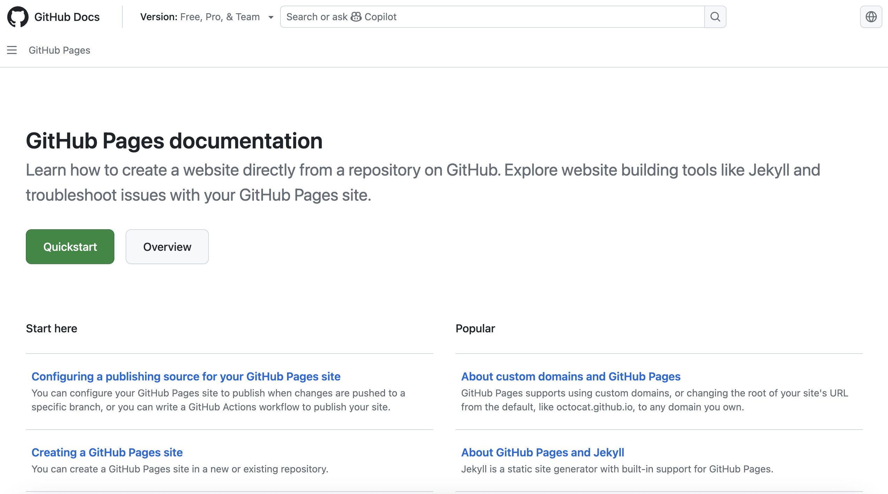
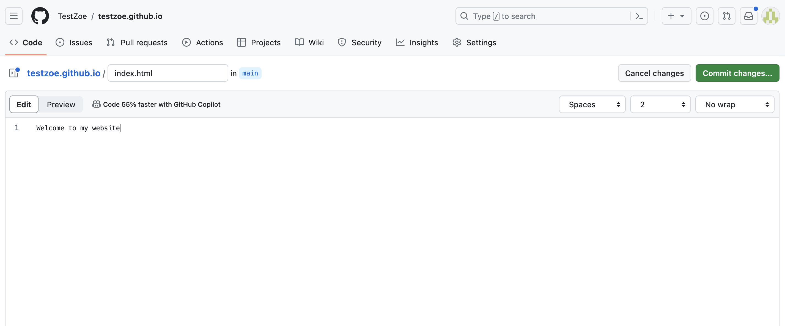
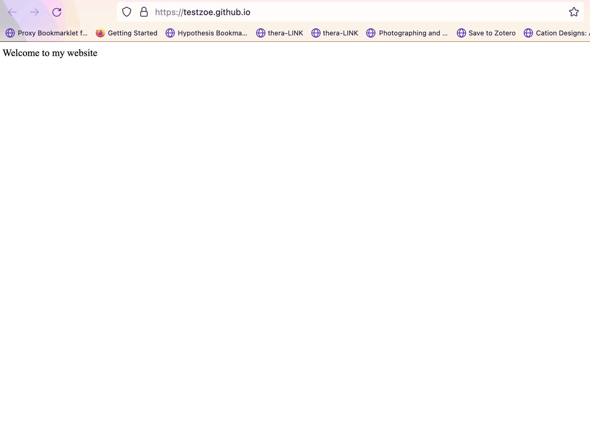

# From HTML to The Web

Last week we learned how to create webpages using HTML. But what is a webpage? How does it work? And how do we access it? These are the questions we'll explore today.

::: {.notes}
We've been learning about the technologies that create web pages (HTML, CSS, JavaScript), but we haven't yet discussed the infrastructure that makes those pages accessible to people around the world. This lesson is about understanding the web itself—the interconnected system of computers, protocols, and standards that allow us to share information globally.
:::

## Acknowledgements

:::: {.columns}
::: {.column width="40%" .r-fit-text}
This lesson draws from Ashley Blewer's fantastic *Halt and Catch Fire Syllabus*, a project designed around the TV show that explored the history of computing in the 1980s and 1990s. I'd highly recommend both the show and the syllabus, which you can find at [https://bits.ashleyblewer.com/halt-and-catch-fire-syllabus/](https://bits.ashleyblewer.com/halt-and-catch-fire-syllabus/){target="_blank"}
:::
::: {.column width="60%" }
[](https://bits.ashleyblewer.com/halt-and-catch-fire-syllabus/)
:::
::::

# What is the Web?

We all use the web constantly, but what exactly is it?

## The World Wide Web

:::{.r-fit-text}
[**From Wikipedia:**](https://en.wikipedia.org/wiki/World_Wide_Web){target="_blank"}

> "The World Wide Web (WWW), commonly known as the Web, is an information system where documents and other web resources are identified by Uniform Resource Locators (URLs), which may be interlinked by hypertext, and are accessible over the Internet. The resources of the WWW are transferred via the Hypertext Transfer Protocol (HTTP) and may be accessed by users by a software application called a web browser and are published by a software application called a web server."
:::
::: {.notes}
While this is technically accurate, there's a lot of important history and concepts packed into this definition. Let's break it down piece by piece to understand how the web actually works and where it came from.

Key concepts to understand:
- URLs: how we identify and locate resources
- Hypertext: linked documents
- HTTP: the protocol for transferring data
- Web browsers: applications that display web pages
- Web servers: applications that host web pages
:::

## The History: From Vision to Reality

The core idea of hypertext and the web is about **linking information across machines**.

. . .

- **Vannevar Bush's *Memex*** (1940s) - envisioned using microfilm to link information


::: {.notes}
The web didn't emerge from nowhere. There were important antecedents and influences.

Vannevar Bush wrote an influential essay called "As We May Think" that imagined a device called the Memex using microfilm to store and link information. This was visionary thinking about interconnected information.
:::

## The History: From Vision to Reality

- **Ted Nelson's *Project Xanadu*** (1960s-70s) - create a system to link any information to any other. You can read more at [https://en.wikipedia.org/wiki/Project_Xanadu](https://en.wikipedia.org/wiki/Project_Xanadu){target="_blank"}


::: {.notes}
Ted Nelson developed Project Xanadu, which tried to create a system where you could link any piece of information to any other piece. It was very influential but never fully realized. 
:::

## The History: From Vision to Reality

- **Douglas Engelbart** - first computer mouse and hypertext system

:::: {.columns}
::: {.column width="40%" }

:::
::: {.column width="60%" .r-fit-text}

:::
::::

## The History: From Vision to Reality

But it was **Tim Berners-Lee** (1980s-90s) who created the web we know today.

[](https://worldwideweb.cern.ch/browser/){target="_blank"}

::: {.notes}

But it was really Tim Berners-Lee working at CERN (the European Organization for Nuclear Research) in the 1980s and 1990s who developed the World Wide Web as we know it. 
This diagram shows Berners-Lee's initial vision for the web. You can actually explore it via an emulator at https://worldwideweb.cern.ch/browser/, which allows you to "party like it's 1989" and see the first web browser in action.
:::

## Tim Berners-Lee's Vision

Berners-Lee developed three key components:

- **URI (Universal Resource Identifier)** - to identify resources on the web
- **HTTP (HyperText Transfer Protocol)** - to transfer hypertext between computers
- **HTML (HyperText Markup Language)** - universal language for creating web pages

::: {.notes}

The three components he created were revolutionary:

1. **URI/URL** - Berners-Lee saw this as the web's most fundamental innovation. URIs enable hypertext links to direct browsers to specific resources. By giving every resource a unique identifier, you could create a truly interconnected system.

2. **HTTP** - This is the protocol (set of rules) for how computers communicate when transferring web content. It's a simple request-response system: browser requests something, server responds with data.

3. **HTML** - This became the "fabric" or "connective tissue" of the web. With HTML as a universal language, anyone could create web pages that anyone else could view, regardless of their computer or software.
:::

## Exploring the Origins


For a detailed timeline of internet and computing history from the 1960s-1990s, see the Computer History Museum's timeline: [https://www.computerhistory.org/internethistory/](https://www.computerhistory.org/internethistory/){target="_blank"}

::: {.notes}
These resources let you see the actual historical documents and understand how the web emerged from research needs at CERN.
:::

## Learn More?

For more on this history, I highly recommend Anne Helmond's historiography: "A Historiography of the Hyperlink: Periodizing the Web through the Changing Role of the Hyperlink" in *The SAGE Handbook of Web History* (2019).

You can read more about the web's history at [https://worldwideweb.cern.ch/](https://worldwideweb.cern.ch/)

# Understanding URLs

## What is a URL?

A **URL (Uniform Resource Locator)** is a web address—a string of characters that provides a way to access a specific resource on the web.

. . .

URLs are made up of different components:

[](https://developer.mozilla.org/en-US/docs/Learn_web_development/Howto/Web_mechanics/What_is_a_URL){target="_blank"}

::: {.notes}
A URL is another term for a URI or a web address, which Berners-Lee envisioned as way to locate anything on the web. It is a string of characters that provides a way to access a specific resource on the web. URLs are made up of different components, which you can see in this diagram:

This diagram is from the Mozilla Web Docs, which provide a great overview of the topic [https://developer.mozilla.org/en-US/docs/Learn_web_development/Howto/Web_mechanics/What_is_a_URL](https://developer.mozilla.org/en-US/docs/Learn_web_development/Howto/Web_mechanics/What_is_a_URL). You've already encountered URLs when we created an `a` tag in our HTML page.

:::

## What is a URL?

```html
<a href="https://ischool.illinois.edu/">My first page!</a>
```

This creates a **hyperlink** or **link** that allows us to navigate to other webpages. We created an **external link** because we linked to a webpage outside our own website.

## What is a URL?

You can also create:

- **Internal links** - linking to other pages on your own website
- **Anchors** - linking to specific sections within a webpage (this is how the sidebar navigation on our course site works)

More on hyperlinks: [https://developer.mozilla.org/en-US/docs/Learn_web_development/Howto/Web_mechanics/What_are_hyperlinks](https://developer.mozilla.org/en-US/docs/Learn_web_development/Howto/Web_mechanics/What_are_hyperlinks){target="_blank"}

:::{.notes}
But URLs are more than just links; they are the way we access webpages. Mozilla describes URLs as akin to postal addresses, an analogy I find helpful. Just as you need an address to send a letter, you need a URL to send a request to a webpage. Before delving into the anatomy of URLs, understanding domain names and the web's functionality is beneficial.
:::

## Clients and Servers

The web is built on a **client-server model**:


. . .

- **Client** = computer that *requests* data
- **Server** = computer that *hosts* and *sends* data

::: {.notes}
While we often talk about the "cloud," the concept of the web was originally based on the idea of a "web" of interconnected computers.

Each computer operates as both a client and a server. This core idea—client requesting, server responding—remains central to how the web functions.

The data sent from servers to clients usually consists of HTML documents, but it can also include images, videos, audio, or virtually any type of data.

Here's a simplified diagram showing this relationship.
:::

## How Clients and Servers Communicate


. . .

This core idea remains central to how the web functions, though our current internet is vastly more complex.

::: {.notes}
This simplified diagram shows the basic back-and-forth:
1. Client sends a request
2. Server receives the request
3. Server sends back a response
4. Client receives the response

This happens billions of times per second across the internet.

Although our current internet is vastly more complex, this core idea of a client **requesting** data and a server **hosting** and **sending** data remains central to how the web functions.

Much of the data sent from servers to clients consists of HTML documents, but it can also include images, videos, audio, or virtually any type of data.
:::

# HTTP: The Protocol

## What is HTTP?

**HTTP (HyperText Transfer Protocol)** is how clients and servers communicate.

You'll notice URLs start with `http://` or `https://`—this indicates the protocol being used.

::: {.notes}
Tim Berners-Lee developed HTTP as the standard way to transmit data across the web. It's a simple request-response protocol.
:::

## What is HTTP?

I particularly like [Julia Evans' Zine on HTTP](https://jvns.ca/blog/2019/09/12/new-zine-on-http/){target="_blank"} for explaining this concept:

[](https://tweets.jvns.ca/tweets_media/1155318552129396736-EAiEGSgXsAELERE.jpg){target="_blank"}

## What is HTTP?

When you enter a URL in your browser:

1. Browser sends an **HTTP request** to a server
2. Server validates the request
3. Server sends back an **HTTP response** with status codes

::: {.notes}

When you type "google.com" into your browser, you're actually:

1. Sending an HTTP request to Google's server
2. The server checks if the request is valid
3. If valid, the server sends back the HTML, CSS, JavaScript, and other files that make up the Google homepage

The key innovation of HTTP is that it's stateless—each request is independent. This makes it simple and efficient.
:::

## HTTP Status Codes

There's a number of different types of status codes, that you can see here:

[](https://tweets.jvns.ca/tweets_media/1145824140462608387-D-bI-xyWkAAY0Qb.jpg){target="_blank"}

## HTTP Status Codes

Most important:

- **200 OK** = request successful
- **404 Not Found** = resource doesn't exist

::: {.notes}
When a server responds to an HTTP request, it sends back a status code that indicates what happened.

Status codes are grouped by number range:

- 1xx = informational
- 2xx = success (200 is the most common)
- 3xx = redirection
- 4xx = client errors (404 is very common—"page not found")
- 5xx = server errors

When you've seen an error message saying a page doesn't exist, you were seeing a 404 error. This is a status code sent back by the HTTP protocol when the server couldn't find the requested resource.

One famous 404 page is this one:
:::

## Famous 404 Pages


::: {.notes}
Many websites have fun with their 404 pages since users will see them when they try to access a page that doesn't exist. This is an opportunity to be creative while still communicating that something went wrong.
:::

## Understanding URLs: The Protocol

Now let's break down the URL components:

[](https://developer.mozilla.org/en-US/docs/Learn/Common_questions/Web_mechanics/What_is_a_URL#scheme){target="_blank"}

. . .

The **scheme or protocol** tells the browser how to communicate with the server.

::: {.notes}
The first part of a URL is the scheme/protocol. This tells the browser what set of rules to use when communicating with the server.

Common schemes:
- `http://` - unsecured connection
- `https://` - secured connection (the 's' stands for "secure")
- `ftp://` - file transfer protocol
- `file://` - local file on your computer

Most modern websites use `https://` because it encrypts the data being transmitted, which is important for security and privacy.
:::

## Websites, Browsers, and Search Engines

These three are different software applications:

**Website** = collection of web pages identified by a common domain name, hosted on a server

**Web Browser** = software application (Chrome, Firefox, Safari) used to access websites and view pages

**Search Engine** = web service (Google, DuckDuckGo) that allows users to search for content on the web

::: {.notes}
It's important to understand these distinctions:

A website is a collection of related web pages. For example, our course website is one website, but it contains many different pages. A website is identified by its domain name and is published on one or more web servers.

A web browser is software you run on your computer. You can use it to open HTML files stored on your computer (using the `file://` protocol) or to access websites hosted on servers (using `http://` or `https://`).

A search engine is a service that crawls the web, indexes content, and lets you search for things. Search engines use automated programs called "bots" or "spiders" that follow URLs to discover and index content.

All three use the HTTP protocol, but they serve different purposes.
:::

# Domain Names and DNS

## What is a Domain Name?

The **authority or domain name** is the name of the server hosting the website:


## What is a Domain Name?

Originally, you accessed websites using **IP addresses** (series of numbers identifying a computer):


::: {.notes}
Before domain names existed, you had to remember IP addresses to access computers. An IP address looks like `192.168.1.1` or similar.

:::

## What is a Domain Name?

For example, the 1995 classic, thriller movie [*The Net*](https://en.wikipedia.org/wiki/The_Net_(1995_film)){target="_blank"}, starring Sandra Bullock, there's a scene where she searches using IP addresses. You can watch a clip here: [https://youtu.be/M1K-B8QVLyo?t=242](https://youtu.be/M1K-B8QVLyo?t=242){target="_blank"}

IP addresses are still used today under the hood, but they're not user-friendly. Imagine having to remember your bank's website as `104.21.32.105` instead of `bank.com`!

## The Domain Name System (DNS)

The [**Domain Name System (DNS)**](https://en.wikipedia.org/wiki/Domain_Name_System){target="_blank"} is like a "phone book" or "address book" that translates IP addresses into human-readable domain names.

. . .

Every time you enter a URL in your browser:

1. Browser queries DNS server: "What IP address is associated with google.com?"
2. DNS returns the IP address
3. Browser connects to that IP address using HTTP

::: {.notes}
DNS is a critical piece of internet infrastructure. It's a distributed system of computers (DNS servers) that maintains a database mapping domain names to IP addresses.

When you type "google.com" into your browser, the browser doesn't actually know where Google's servers are. It sends a query to a DNS server asking "What's the IP address for google.com?" The DNS server responds with the IP address, and then the browser can make its HTTP request to that address.

This system is what makes the web human-friendly. Without DNS, we'd have to remember hundreds of IP addresses.
:::

## Domain Name Structure


. . .

Two main components:

- **Top-Level Domain (TLD)** = `.com`, `.org`, `.edu` (registered by ICANN)
- **Second-Level Domain (SLD)** = `google` in `google.com` (registered by individuals/organizations)

::: {.notes}
Domain names have a hierarchical structure, read right-to-left.

**Top-Level Domains (TLDs):**
- Originally meant to indicate the type of organization (`.com` for commercial, `.org` for organization, `.edu` for education)
- Now also include country codes (`.uk` for United Kingdom, `.ca` for Canada)
- Registered and managed by ICANN (Internet Corporation for Assigned Names and Numbers)
- There's actually a long history and fraught politics around TLDs since they're often tied to nation states

Interesting note: While there's a `.us` for the United States, most US websites use `.com` or `.gov` (for government). This reflects how commercially-driven the early web was.

**Second-Level Domains (SLDs):**
- The part to the left of the TLD
- `mozilla` in `mozilla.org`
- Registered through domain name registrars like GoDaddy
- Important: you don't own a domain in perpetuity—you lease it and must renew it

This rental model leads to two interesting phenomena:
1. You have to keep paying to keep your domain
2. Domain name speculation—people buy domains hoping to sell them for profit

For more on TLDs, see this article about dead TLDs: https://astrid.tech/2022/04/05/1/dead-tlds/

For more on internet governance and the politics of domains, read books like Milton Mueller's *Networks and States* or Laura DeNardis' *The Global War for Internet Governance*.

There's also Ingrid Burrington's fascinating piece on visiting a Domain-Names Conference: [https://www.theatlantic.com/technology/archive/2017/02/domain-names-dot-horse/516438/](https://astrid.tech/2022/04/05/1/dead-tlds/)
:::

## Learn More?

For more on TLDs, see this article about dead TLDs: [https://astrid.tech/2022/04/05/1/dead-tlds/](https://astrid.tech/2022/04/05/1/dead-tlds/)

For more on internet governance and the politics of domains, read books like Milton Mueller's *Networks and States* or Laura DeNardis' *The Global War for Internet Governance*.

There's also Ingrid Burrington's fascinating piece on visiting a Domain-Names Conference: [https://www.theatlantic.com/technology/archive/2017/02/domain-names-dot-horse/516438/](https://astrid.tech/2022/04/05/1/dead-tlds/)

# Hosting HTML Pages with GitHub Pages

[](https://docs.github.com/en/pages){target="_blank"}


::: {.notes}

**GitHub Pages** allows you to host static websites for free directly from a GitHub repository.

. . .

This is perfect for:

- Portfolios and personal websites
- Project sites and documentation
- Learning how web hosting works
While we have primarily been using GitHub for its versioning and collaboration features, it also has a feature called GitHub Pages that allows you to host static websites for free. You don't need to pay for hosting or configure a server—GitHub handles all of that automatically.

A "static website" means it's just HTML, CSS, and JavaScript files that don't require a server-side database or computation. It's perfect for portfolios, documentation, blogs, and learning.
:::

## Option 1: Personal Website (github.io)

A personal `github.io` site is great for building a portfolio that you can use on your resume or to showcase your work.

::: {.notes}
If you want to create a personal portfolio website that you can use for your career, this is the best option.
:::

## Option 1: Step 1 - Create the Repository

Create a new repository with the exact name: **`yourusername.github.io`**

For example: `ZoeLeBlanc.github.io`


::: {.notes}
The special naming convention tells GitHub that this repository should be hosted as your personal website.

Make sure:
- The repository is **Public** (required for GitHub Pages to work)
- You can add a `README.md` if you'd like (optional)
:::

## Option 1: Step 2 - Add Your HTML Files

Clone the repository and add your `index.html` file (and any other HTML, CSS, or JavaScript files).



::: {.notes}
The `index.html` file is important—it's the file that GitHub serves when someone visits your site. So `yourusername.github.io/` automatically displays your `index.html`.
:::

## Option 1: Step 3 - Push to GitHub

Use the standard git workflow:

```sh
git add .
git commit -m "Initial commit: add digital object page"
git push origin main
```

Once you push, GitHub automatically detects the change and starts hosting your site. No configuration needed!

::: {.notes}
After you push, GitHub will automatically begin the deployment process.
:::

## Option 1: Step 4 - Find Your Live Site

Your website is now live at: `https://yourusername.github.io`

Verify deployment by checking the **Actions** tab for green checkmarks:


::: {.notes}
You can verify the deployment by going to your repository and clicking the Actions tab. You should see green checkmarks indicating successful deployment.
:::

## Option 2: Group/Organization Website

If your group wants to create a collaborative showcase, you can enable GitHub Pages on your group's repository.

::: {.notes}
If you already have a personal github.io site or don't want to create one from scratch, you can use your group's repository instead.
:::

## Option 2: Step 1 - Choose Your Repository

Use your existing group repository (the one assigned to your group in the course).

## Option 2: Step 2 - Add Your HTML Files

Create a folder structure for your digital object:

```
group-repository/digital-objects/
├── index.html (main showcase page)
├── member1-name/
│   └── index.html
├── member2-name/
│   └── index.html
└── member3-name/
    └── index.html
```

## Option 2: Step 3 - Enable GitHub Pages

In your repository, go to **Settings** → **Pages**:

. . .

- Under "Source," select the branch (usually `main`)
- Click Save

GitHub will now host your site.

::: {.notes}
This configuration tells GitHub which branch contains the files to deploy.
:::

## Option 2: Step 4 - Find Your Live Site

Your group's website will be hosted at:

`https://cultureasdata-uiuc.github.io/is310-spring-2026-group-*/digital-objects`

Check deployment status in the **Actions** tab, just like with Option 1.

## Monitoring Your Deployment

Whether you choose Option 1 or Option 2, you can always check your deployment status:

1. Go to your repository on GitHub
2. Click the **Actions** tab
3. Look for the most recent workflow run

. . .

A green checkmark ✓ means your site deployed successfully.



::: {.notes}
You can see live deployment confirmation in the Actions tab.
:::

## Understanding What's Happening

When you push your HTML files to GitHub, here's what happens behind the scenes:

1. GitHub detects the push to your repository
2. GitHub Pages automatically builds your site
3. Your HTML, CSS, and JavaScript files are copied to a web server
4. Your site becomes accessible at your unique URL

::: {.notes}
This is the complete web ecosystem in action.
:::

## Understanding What's Happening

When someone visits your URL:

1. Their browser sends an **HTTP request** to GitHub's servers
2. GitHub's servers respond with your **HTML file**
3. The browser **renders** the page

You've created content (HTML), version controlled it (Git), and deployed it to a live web server!

::: {.notes}
You've now participated in the entire web ecosystem—creating content (HTML), version controlling it (Git), hosting it (GitHub Pages), and making it accessible on the internet! This is what we've been building toward throughout this lesson—actually participating in the web as both a creator and a participant in the client-server model.
:::

## Your Turn: Doing It Live Assignment

[](../materials/introducing-humanities-computing/08-intro-web.qmd#assignment-doing-it-live)


