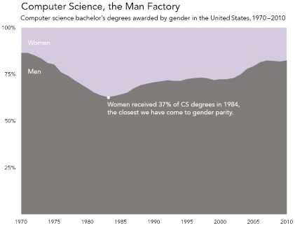
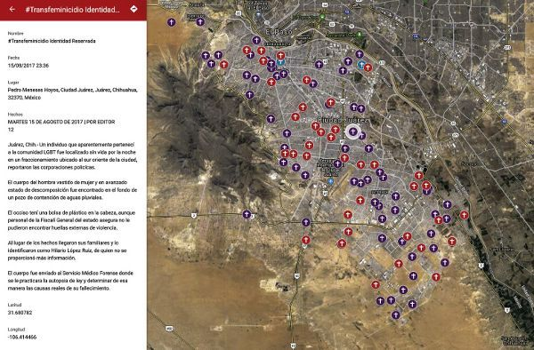

# Reviewing Homework

## Source & Style Volunteers?

## Doing It Live Volunteers?

# Data Feminism

## The Power Chapter

- Why do the authors start with the experience of Serena Williams? What happened to her and why is it emblematic? 
- What is the problem of “nobody counting” or “particularly weak” data collection?

## What do the authors mean by “examine power”? 

What is the Matrix of Domination? 

## How does this relate to voting rights?

## What is the difference between a minority and a minoritized group? 

## What is the privilege hazard and OPP?

{target="_blank"}

# What Counts Gets Counted Chapter

- How does this privilege hazard and matrix of domination impact “what gets counted counts”? 
- How did it shape the experiences of Maria Munir, or female screenwriters in the UK, or the *ProbPublica* reporting on maternal health?

## What are classification systems? 

What are their dangers and what was the problem with Facebook’s gender classification system?

:::: {.columns}
::: {.column width="50%" }

:::
::: {.column width="50%" }

:::
::::

## Why can’t we just build better or more accurate classification systems? 

Why is gender particularly difficult category to collect? How does this relate to rethinking binaries and hirearchies?

## Example of the Census

:::{.r-fit-text}
{target="_blank"}
:::

## Example of Pockets

:::{.r-fit-text}
{target="_blank"}
:::

## What is the Paradox of Exposure and how does that relate to binaries?

. . . 

What is the solution? 

Couldn’t we just solve the problem with just diversifying datasets? 

## What is ground-up or counter-data collection?

## Gender Violence At The Border Dataset

{target="_blank"}

## Example of SUCHO 

{target="_blank"}

## How can data visualization also help? 

## Example of ProfGender

[](https://benschmidt.org/profGender/#%7B%22database%22%3A%22RMP%22%2C%22plotType%22%3A%22pointchart%22%2C%22method%22%3A%22return_json%22%2C%22search_limits%22%3A%7B%22word%22%3A%5B%22his%20kids%22%2C%22her%20kids%22%5D%2C%22department__id%22%3A%7B%22%24lte%22%3A25%7D%7D%2C%22aesthetic%22%3A%7B%22x%22%3A%22WordsPerMillion%22%2C%22y%22%3A%22department%22%2C%22color%22%3A%22gender%22%7D%2C%22counttype%22%3A%5B%22WordCount%22%2C%22TotalWords%22%5D%2C%22groups%22%3A%5B%22unigram%22%5D%2C%22testGroup%22%3A%22C%22%7D){target="_blank"}

## How can documentation help as well?

{target="_blank"}

## Final Questions

- Whose goals get prioritized in data science?
- Can we do good with data?