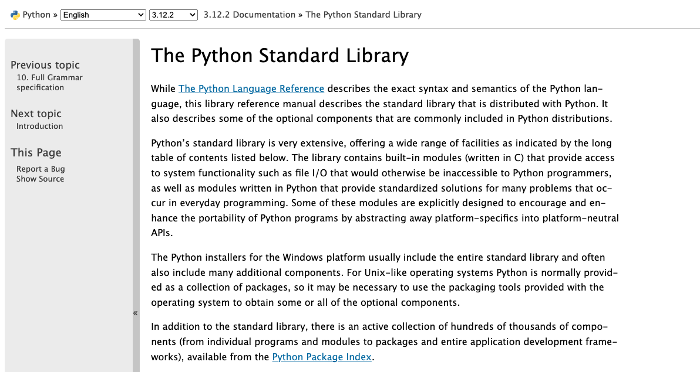
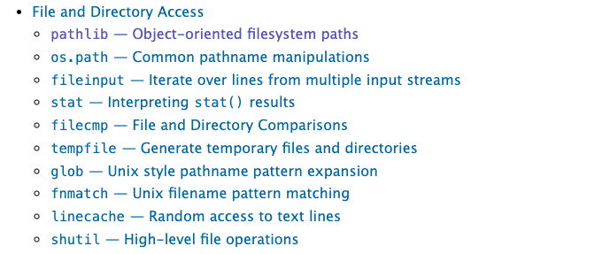
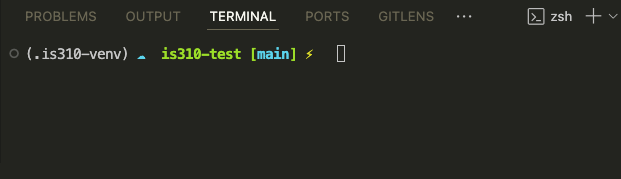
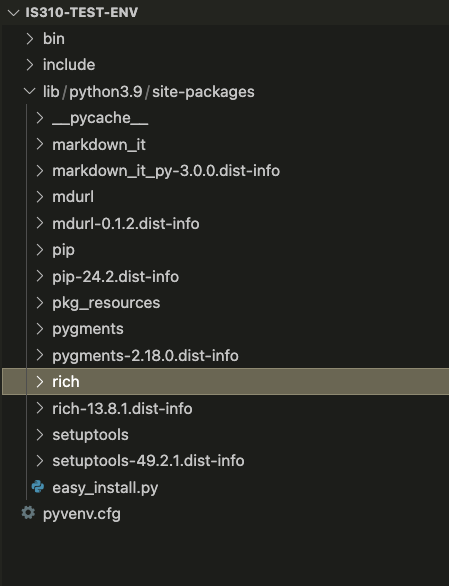
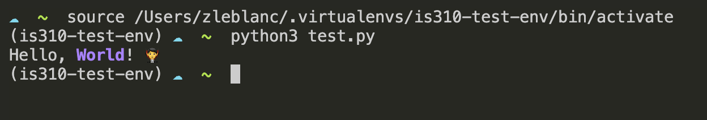
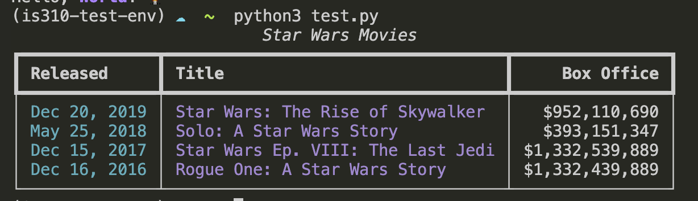
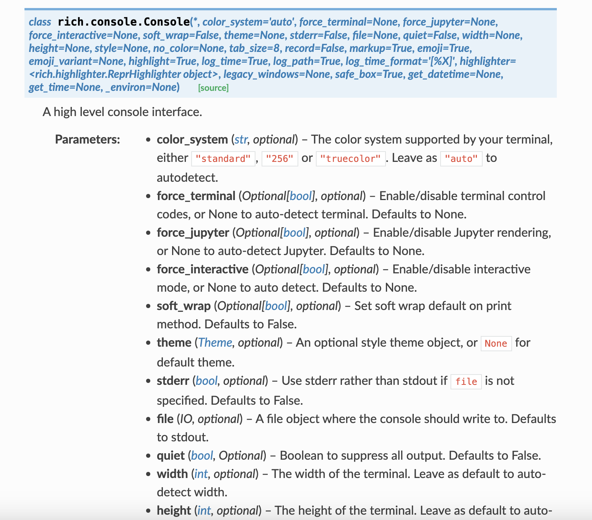

# Quick Review Time!

## How Can I Start Writing Python Quickly?
::: {.notes}
Once you have Python working, you can type `python3` (or `python` if it refers to a Python 3 version) and this will open the interactive Python interpreter where you can write your python code and have the computer execute it. This Python interpreter is a type of program that reads and executes Python code (i.e. either Python syntax or files that end with `.py`). The interactive Python interpreter is an excellent way to sandbox your ideas or check your syntax. You can exit using `exit()`.

Type `"Hello world"` in the interpreter and press enter. Make sure to use single or double quotes around the this text (otherwise you'll see a `SyntaxError`, something we'll discuss later in this lesson).
The Python interpreter is great for testing code and learning, but it's not practical for real work. Once you quit the interpreter, you lose all your code. That's where scripts come in—they let us write code that persists, can be run again and again, and can be shared with others.

You'll notice that unlike with `"Hello World"` the interpreter doesn't just show our data back to us. Instead, it *prints* out the result of our calculations. This is because the interpreter is designed to show us the results of our calculations. In our first example, we weren't doing any calculations, so the interpreter just showed us our data. In our second example, we were doing calculations, so the interpreter showed us the results of our calculations.

Now, you can experiment with the interpreter, and you'll notice that if you use the up arrow, you can access your previous commands. However, the interpreter can do more than just print out data and do calculations. It can also store data.
:::

. . .

How do we check our python version?

. . .

How do we open the interpreter?

. . .

How do we enter data into the interpreter?

. . .

What happens when you quit?


## What Are Variables?

::: {.notes}
Rather than retyping our `"Hello World"`, we can save it into something called a *variable* that let's us reuse it again and again.
The key thing to understand is that in Python we use the = symbol to assign values to variables. The variable is always on the left side of the = equal sign, and the value you want to store in the variable is on the right side of the =.

Once we do this though, you’ll notice that our strings that were stored in these variables will be erased! This is because in Python if you assign a new value to a variable, it will overwrite the old value of the variable.

If you’re curious, this is due to the fact that Python is a dynamically typed language, which means that the data type of a variable can change. This is different from statically typed languages, like Java, where the data type of a variable cannot change. This is a key difference between Python and other programming languages, but don’t worry if this is confusing. You’ll get used to it as you work with Python more and eventually learn other programming languages, as well!

<u>Here are some rules for naming variables in Python:</u>

- A variable name must start with a letter or the underscore character (so you could do both `_one` and `one`). Your variable name can also start with or contain a capital letter, but by convention, we don't do this. So you're better off doing `one` rather than `One`.
- A variable name cannot start with a number (so you can't do `1one`)
- A variable name can only contain alpha-numeric characters and underscores (A-z, 0-9, and _ ). So no spaces or special punctuation characters, like `!`, `@`, `#`, `$`, `%`, etc.
- A variable also can't have a space in the name, so you can't do `one one`. Python uses spaces to separate different parts of the code, so if you use a space in a variable name, Python will think you're trying to separate two different parts of your code.
- A variable can't have a **reserved word** as a name. The creators and developers of Python have selected a series of words that have a special meaning and function when you are programming in Python. If you try to use these words, then your computer will get confused. For example, if you try to use `and` as a variable name, you'll get a Syntax Error again . You can see a list of reserved words [here](https://www.w3schools.com/python/python_ref_keywords.asp), as well as in the figure below. Don't worry about memorizing these, but it's helpful to know that they exist.


Finally, you should know that variable names are **case-sensitive**. So, `one` and `One` are two different variables.

*What makes a good variable name?*

As a general rule of thumb, I would recommend choosing names that are relatively short and descriptive. You'll often see the use of `x` or `y` as variable names in Python, but I find these are too short to be helpful. Instead, I would recommend you try to balance describing what's stored within the variable and keeping it shorter so that you don't have too much to type. Also to reiterate, in Python we tend to use underscores for naming variables versus Javascript where you use camelCase, so `one_one` is better than `oneOne` in Python.
:::

. . .

How do we write variables?

. . .

What happens if we assign new values to an existing variable?

. . .

What are best practices for writing variable names? What are reserved keywords?

## What are Data Types?
. . .

When do we use quotations?

. . .

What are the differences between intergers and floats?

. . .

How do we check for true or false?

## What Are Operators?

. . .

How can we add variables together or subtract them?

. . .

How can we check if variables contain the same values?


## What Are Data Structures?

. . .

How do we write lists? What can they contain?
. . .

How do we access values in a list? How can we get the last two values or the first two?

. . .

How do we combine lists?

. . .

How do we write dictionaries? What can they contain?

. . .

How do we add new values to a dictionary? 

. . .

When should we use a list or a dictionary structure?


## Why Scripts?

What is the value of using a script rather than the interpreter?

. . .

How do we create a Python script?

. . .

How do we run a Python script?

. . .

How can we output from a script?

## What are Built-In Methods?

What are some of the built-in methods you have learned so far?

. . .

How can we check the type or length of a variable?

. . .

How can we shorten text with a built-in method? What is a delimiter and how can we use it to manipulate strings?

. . .
How could we ask for user input with a built-in method?

## What is Control Flow?

What happens if we call a variable before it is defined?

. . .

What is a `for-loop`? How do we write them in Python and why does indentation matter?

. . .

When we loop through a list, what does the variable represent and what is iteration?

. . .

What happens to that variable after the loop ends?

. . .

How would you loop through the keys and values of a dictionary?

. . .

What's the `.items()` method?

## What Are Functions?

What's the syntax for creating a function?

. . .

What are arguments?

. . .

How do you pass data into a function?

. . .

Why would you use `return` in a function?

. . .

What happens to the returned value?

. . .

If you create a variable inside a function, can you use it outside?

. . .

What's **local scope** vs **global scope**?

# What Are Conditionals?

What's the structure of a conditional statement?

. . .

What operators could you use to test conditions?

. . .

What's the difference between `=` and `==`?

. . .
How could you test more than one condition?

. . .

What keywords let you combine conditions?

. . .

What if you have more than two possibilities?

. . .

When would you use `elif` instead of multiple `if` statements?

::: {.notes}
elif (else if) lets you test multiple conditions in sequence. If the first if is False, it checks the elif. You can have many elifs. This is cleaner and more efficient than multiple separate if statements.
:::

# Check In? 

Any questions?? 

Ideally this is just review but please speak up now before we start new content! Also optional homework for those newer to Python is available at the end of the Advanced Python lesson.

# Complex Python

## Advanced Data Structures

::: {.r-fit-text}
We've learned a lot about storing data in different structures. But what if we want to combine **data and functions** into one cohesive unit? What if we wanted to build upon this initial list to add more metadata and information about each movie, and also maybe even reuse this code in multiple scripts? Then we might want to consider rewriting the code into a **class**.

```python
def check_movie_release(movie):
    if movie['release_year'] < 2000:
        print(f"{movie['name']} was released before 2000")
    else:
        print(f"{movie['name']} was released after 2000")
        return movie['name']

recent_movies = []

favorite_movies =[
    {
        "name": "The Matrix I",
        "release_year": 1999,
        "sequels": ["The Matrix II", "The Matrix III", "The Matrix IV"]
    },
    {
        "name": "Star Wars IV",
        "release_year": 1977,
        "sequels": ["Star Wars V", "Star Wars VI", "Star Wars VII", "Star Wars VIII", "Star Wars IX"],
        "prequels": ["Star Wars I", "Star Wars II", "Star Wars III"]
    }
]

for movie in favorite_movies:
    result = check_movie_release(movie)
    if result is not None:
        recent_movies.append(result)

print(recent_movies)
```
:::

::: {.notes}
Dictionaries are great for describing complex data, but when we want to add behavior (functions) to our data, classes become more powerful.
:::

## What is a Class?

::: {.r-fit-text}
While dictionaries are great for describing complex data within a single object, a class is really useful to encapsulate both data and functions in a single cohesive unit.

A class is a particular type of **object**. We can create ("instantiate") an object of a class and store it as a variable. A variable therefore contains (technically, contains a reference to) an *instance* of a class.

We've already used a lot of built-in classes. Strings, lists, dictionaries are all classes. We can have Python tell us what kind of class it is using the built-in function `type()`.

```sh
>>> a = [1,2,3]
>>> type(a)
<class 'list'>
>>> b = "123"
>>> type(b)
<class 'str'>
```
:::

::: {.notes}
You can check what class something is by using the type() function. Every object in Python is an instance of a class.
:::

## The Simplest Class

```python
# Define a class
class Blank:
    pass  # Pass means "Move along, please. Nothing to see here."

# Create an instance of the class and invoke it
Blank()
```

This class does nothing when instantiated, but it shows the basic syntax.

::: {.notes}
To first define a class, we need to use the keyword `class` followed by the name of the class (which can be anything!) and then a semi colon. All the logic of the class is indented (just like with functions, loops, and conditionals) and then we call the class similar to a function, using its name and parentheses to pass arguments to the class.

In this case, since the class has no actual logic in it, just the keyword `pass`, which is a reserved keyword in Python and that tells Python to do nothing. So when we call the class, nothing actually happens. For any class, when you invoke it, it executes the `__init__` method, which is another built in method from Python (this one is called a **constructor** method). Thus, since our example above didn't define any logic for the built-in `__init__` method, nothing happened.
:::

## A Simple Movie Class

```python
class Movie:
    def __init__(self, name):
        self.movie_name = name

a_movie = Movie("The Matrix")
a_movie.movie_name
```

The `__init__` method runs when you create an instance. `self` represents the instance itself. Self references the class **instance** that is created when you call a class, which is why `self` is the first argument to ***any*** function defined in a class. You can read more about [class scope here](https://docs.python.org/3/tutorial/classes.html#python-scopes-and-namespaces).{target="_blank"}

::: {.notes}
`self` is the first argument to any method in a class. It refers to the specific instance you've created. When you set `self.movie_name = name`, you're creating an attribute on that instance.
:::

## Adding Methods

Methods are functions **inside** a class. They operate on the instance's data.

. . .

```python
def add_directors(self, directors):
    """Adds directors to the movie"""
    if isinstance(directors, list) is False:
        directors = [directors]
    self.directors.extend(directors)
```

::: {.notes}
Methods always take `self` as the first argument. This allows them to access and modify the instance's attributes. Notice the docstring—this documents what the method does.
:::

## A More Complex Class

```python
class Movie:
    def __init__(self, name):
        self.movie_name = name
        self.directors = []
        self.release_year = None
        self.age = 0
        self.sequels = []
```

Initialize attributes as empty or None to structure your data.

::: {.notes}
By initializing attributes in `__init__`, you define the shape of your class. This makes it clear what data the class will hold.
:::

## Class Attributes vs Methods

**Attributes**: Data stored in the class (like `self.movie_name`)

**Methods**: Functions that operate on that data (like `add_directors()`)

::: {.notes}
This separation of data and behavior is the core of object-oriented programming. It makes code more organized and reusable.
:::

## Adding More Functionality

So what's going in this code block?

```python
class Movie:
    """Contains methods for data about a movie

    Methods:
    --------
    add_directors
    add_release_year
    calculate_age
    """
    def __init__(self, name):
        self.movie_name = name
        self.directors = []
        self.release_year = None
        self.age = 0
        self.sequels = []
        self.prequels = []


    def add_directors(self, directors):
        """Adds a list of directors of the movie

        Method argument:
        -----------------
        directors(list) -- A list of people who director the movie
        """
        if isinstance(directors, list) is False:
            directors = [directors]

        self.directors.extend(directors)


    def add_release_year(self, year):
        """Adds the release year of the movie

        Method argument:
        -----------------
        year(integer or string) -- A year the movie was released
        """

        self.release_year = int(year)

    def add_sequels(self, sequels):
        """Adds a list of sequels to the movie

        Method argument:
        -----------------
        sequels(list) -- A list of sequels to the movie
        """
        if isinstance(sequels, list) is False:
            sequels = [sequels]

        self.sequels.extend(sequels)

    def add_prequels(self, prequels):
        """Adds a list of prequels to the movie

        Method argument:
        -----------------
        prequels(list) -- A list of prequels to the movie
        """
        if isinstance(prequels, list) is False:
            prequels = [prequels]

        self.prequels.extend(prequels)


    def calculate_movie_age(self):
        """Calculates the age of the movie
        """
        self.age = 2024 - self.release_year

a_movie = Movie("The Matrix I")
a_movie.add_directors(["Lana Wachowski", "Lilly Wachowski"])
a_movie.add_release_year(1999)
a_movie.add_sequels(["The Matrix II", "The Matrix III", "The Matrix IV"])
a_movie.calculate_movie_age()
print(a_movie.age)
print(a_movie.add_directors.__doc__) # To view the docstring for the method
```

::: {.notes}
First we're taking our `Movie` class and expanding it so that it can contain more information about each movie. We still only initially create the class with one argument - the movie's name. But we've also added additional attributes to the `__init__` function. First, we have `directors`, which holds a list; then release year, which is an integer; age, which is also an integer; sequels, which is a list; and prequels, which is also a list.

Do you notice that the syntax here looks like a dictionary? That's because we can use a similar pattern to dictionaries for creating our attributes.

While this function is somewhat similar to our `Movie` class, we've also added a number of functions, which we call **methods** to the class.

The first method `add_directors` takes two arguments, `self` and `directors`. Just like in the `__init__` method, `self` represents the class instance and directors is a list of directors. In the `__init__` method, we define the directors attribute on `self` as an empty list. Then in our `add_directors` method we extend this initial empty list, adding the new directors to the list.
:::

## Adding More Methods

What if we wanted to add a method for printing out an entire movie's information? What is this code doing and how can we call this method?

```python
def get_movie_info(self):
    """Prints out the movie's information
    """
    for key, value in self.__dict__.items():
        print(f"{key}: {value}")

```
::: {.notes}
What if we wanted to add a method for printing out an entire movie's information? We could try looping through the class object and print out each attribute. Or we could use the built-in `__dict__` functionality that prints out the values for a class.
We can then call this method on our `a_movie` object.
This is a very simple example of a class, but it's a good start. We can use classes to store complex data structures and then use methods to manipulate that data. We can also use classes to create reusable code that can be used in multiple scripts.
:::

## Adding More Classes

What if we wanted to store prequels and sequels as instances of our `Movie` Class? What is this code doing exactly?

```python
class Movie:
    """Contains methods for data about a movie

    Methods:
    --------
    add_directors
    add_release_year
    calculate_age
    """
    def __init__(self, name, release_year=None):
        self.movie_name = name
        self.directors = []
        self.release_year = release_year
        self.age = 0
        self.sequels = []
        self.prequels = []

    def add_directors(self, directors):
        """Adds a list of directors of the movie

        Method argument:
        -----------------
        directors(list) -- A list of people who director the movie
        """
        if isinstance(directors, list) is False:
            directors = [directors]

        self.directors.extend(directors)

    def add_release_year(self, year):
        """Adds the release year of the movie

        Method argument:
        -----------------
        year(integer or string) -- A year the movie was released
        """

        self.release_year = int(year)

    def calculate_movie_age(self):
        """Calculates the age of the movie
        """
        self.age = 2024 - self.release_year

    def add_sequel(self, sequel, release_year):
        """Adds a sequel to the movie

        Method argument:
        -----------------
        sequel(string) -- The name of the sequel
        release_year(integer) -- The release year of the sequel
        """
        sequel_movie = Movie(sequel, release_year)
        self.sequels.append(sequel_movie)

    def add_prequel(self, prequel, release_year):
        """Adds a prequel to the movie

        Method argument:
        -----------------
        prequel(string) -- The name of the prequel
        release_year(integer) -- The release year of the prequel
        """
        prequel_movie = Movie(prequel, release_year)
        self.prequels.append(prequel_movie)

    def get_movie_info(self):
        """Prints out the movie's information
        """
        for key, value in self.__dict__.items():
            if key in ['sequels', 'prequels']:
                print(f"{key}: {[movie.movie_name for movie in value]}")
            else:
                print(f"{key}: {value}")

    def get_release_year(movie):
    """Returns the release year of the movie"""
    return movie.release_year

    def calculate_movie_order(self):
        """Calculates the order of movies based on release year
        """
        all_movies = [self] + self.sequels + self.prequels
        all_movies.sort(key=get_release_year)
        return [movie.movie_name for movie in all_movies]

a_movie = Movie("The Matrix I")
a_movie.add_directors(["Lana Wachowski", "Lilly Wachowski"])
a_movie.add_release_year(1999)
a_movie.calculate_movie_age()
a_movie.add_sequel("The Matrix II", 2003)
a_movie.add_sequel("The Matrix III", 2003)
a_movie.add_sequel("The Matrix IV", 2021)
a_movie.add_prequel("The Matrix 0", 1998)
a_movie.get_movie_info()
print(a_movie.calculate_movie_order())
```
::: {.notes}
This is a more complex version of our `Movie` class. We've added two new methods, `add_sequel` and `add_prequel`, which take the name of the sequel or prequel and the release year of the sequel or prequel. We then create a new instance of the `Movie` class and append it to the `sequels` or `prequels` list. We also added a new method, `calculate_movie_order`, which sorts all the movies based on their release year and then returns a list of the movie names in order. To do this we use the built-in `sort` method, which sorts a list in place, and the `key` argument, which takes a function that returns a value that the list should be sorted by. In this case, we use the `get_release_year` method to get each release year, and then sort the list of movies by their release year.

This type of programming is called **object-oriented programming** and it's a very powerful way to organize your code. It's also a very common way to organize code in Python, and you'll see it often, even if you don't write it yourself.
:::

## Quick Exercise for Practice (Optional But Recommended)

1. Try copying the `Movie` class into your `first_script.py` and then create a new instance of the class. Then try adding a sequel and prequel to the movie and then printing out the movie's information. Remember that if you're creating a new movie, you'll need to create a new variable to save the new instance of the `Movie` class and then add the directors and release year to the movie.
2. Try adding a function to the `Movie` class that saves their rating. Then try adding a rating to the movie and printing out the movie's information.

# Comments and Documentation

You'll notice in our `Movie` class that we've added a lot of comments. Comments are a way to add human-readable text to your code that explains what the code is doing. Comments are not executed by the Python interpreter, so they don't affect the code's behavior. They are just there to help you and other people understand the code. I highly recommend adding comments to your code, especially if you're working on a team or if you're writing code that you might not look at for a while.

## Inline Comments

```python
movie = dict()  # Could also write {}
```

Use `#` to comment a single line.

::: {.notes}
Inline comments are useful for explaining **why** you did something, not necessarily what the code does (the code itself should be clear about that).
:::

## Block Comments (Docstrings)

```python
def add_directors(self, directors):
    """Adds directors to the movie

    Arguments:
    directors (list) -- List of director names
    """
    # implementation here
```

. . .

Docstrings are triple-quoted strings at the start of functions/classes.

```python
print(a_movie.add_directors.__doc__) # To view the docstring for the method
```

::: {.notes}
You'll notice that earlier we were able to print out the block comment for the `add_directors` method. This is because the block comment is actually a special type of comment called a **docstring** that is used to document a function or a class. The docstring is the first thing that appears in a function or class and is enclosed in triple quotes. It's a good idea to add a docstring to every function and class you write, as it helps other people understand your code and also helps you remember what your code does.
:::

## Documentation

:::: {.columns}
::: {.column width="40%" .r-fit-text}
In addition to comments, the other main resource for understanding how to use a class or function is the documentation. The documentation is a set of instructions that explains how to use a class or function.

This documentation explains how to define a class, how to create an instance of a class, and how to use methods in a class. It also explains how to use inheritance, which is a way to create a new class that inherits the attributes and methods of an existing class.

Learning to read documentation is a critical skill, so would highly recommend taking a look at the documentation when it is available.
:::
::: {.column width="60%" .r-fit-text}
[](https://docs.python.org/3/tutorial/classes.html){target="blank"}
:::
::::


::: {.notes}
Good documentation helps others (and future you) understand the code. It's an investment that pays off when you revisit code months later.
:::

# Python Libraries & Imports

So you're probably wondering when to use classes? Mostly we won't be delving into code complicated enough to require to write your own classes, but you will be using lots of code that is based on this pattern. That's because the class is the primary way that Python organizes its standard library and the wider ecosystem of external libraries.

Let's dig into the Python documentation to understand more! 

## The Standard Library

[](https://docs.python.org/3/library/){target="_blank"}

The Python Standard Library contains modules built into Python.

::: {.notes}
pathlib is a great example. Instead of working with file paths as strings, you can use Path objects that are smarter and cross-platform.
:::

## PathLib

Let's scroll down to the [Pathlib module](https://docs.python.org/3/library/pathlib.html){target="_blank"}.



Now click on the link to the `pathlib` module.

## PathLib Methods


First take a look at the [source code!](https://github.com/python/cpython/blob/3.8/Lib/pathlib.py){target="_blank"} Notice how it's organized, and try and find the documentation for the `class Path` (*hint* use control F).

Let's take a look at the methods in the `class Path` [https://docs.python.org/3/library/pathlib.html#methods](https://docs.python.org/3/library/pathlib.html#methods){target="_blank"}. How would we would print out the current working directory using `pathlib`? 

## Importing Libraries

Let's try importing in `Pathlib` into our script.

```python
import pathlib

pathlib.Path()
```

. . .

Or import a specific class:

```python
from pathlib import Path
```

::: {.notes}
We can easily bring classes into other code using the `import` keyword (another reserved word!), which does some magic to allow us to use classes defined in other files. This is how we can use parts of the Python Standard Library that aren't directly built into the base language. It's also how we use modules written by other programmers from the larger Python community. We can even use `import` to import our own classes.

The syntax for importing is `import` followed by the name of the module. In this case, we're importing the `pathlib` module. Once we've imported the module, we can use the classes and functions defined in the module. There's two ways to do this. We can either use the `.` operator to access the class or function:

Or we can use the `from` keyword (reserved word) to import a specific class or function from the module. Both options work exactly the same when we use them in our code, but the second option is a little more concise and is often used when we only need to use one class or function.
:::

## Aliasing Imports

```python
import pathlib as pl
```

. . .

Now you can use `pl.Path()` instead of `pathlib.Path()`.

::: {.notes}
With import statements, you can also alias the module or class you're importing. This is often used to make the code more readable or to avoid conflicts with other classes or functions that have the same name.
:::

## Using pathlib

So now that we've explored ways to import `pathlib`, let's try using this module. We'll start by using `pathlib` to print out the current working directory.

```python
from pathlib import Path

current_directory = Path.cwd()
print(current_directory)

file = Path('data.csv')
print(file.read_text())
```

::: {.notes}
Path objects have methods like `.cwd()` to get the current working directory and `.read_text()` to read file contents as a string.
:::

## File Input and Output

But `pathlib` is useful not just for printing out working directories, it can also let us load in files.

## Reading in Data

Let's try it out with Pathlib by passing in one of the datasets from the *Responsible Datasets in Context* Project that we have been reviewing each week. You can use any of the datasets, but I'm selecting the one by Os Keyes and Melanie Walsh. “U.S. National Park Visit Data (1979-2023) – Responsible Datasets in Context.” *Responsible Datasets in Context*, June 1, 2024. [https://www.responsible-datasets-in-context.com/posts/np-data/](https://www.responsible-datasets-in-context.com/posts/np-data/){target="_blank"}.

Once you've downloaded the data, you should have a file called `US-National-Parks_RecreationVisits_1979-2023.csv`. Now let's try using `pathlib` to read in the data.

## Reading Files

```python
from pathlib import Path

file = Path('US-National-Parks_RecreationVisits_1979-2023.csv')
print(file, type(file))
```

Now if this code worked, it should show you the exact file path of your spreadsheet and then the type of the object, either `<class 'pathlib.PosixPath'>` or `<class 'pathlib.WindowsPath'>`. Not to get too complicated but this is because the `Path` class is a subclass of the `PosixPath` class (not really going to get into subclassing but think of it as building classes on top of one another - like Lego or Jenga).

::: {.notes}
Now depending on where you file is located, you might need to change the path (often files are in your Downloads folder, in which case you might write `Users/user_name/Downloads/US-National-Parks_RecreationVisits_1979-2023.csv`). Remember computers need the **exact path**, so if you're not sure where your file is located, you can use the `cwd` method to print out the current working directory and then add the file name to the end of the path.
:::

## Reading Files

We can also look at the methods built-in to the `Path` class. One in particular is useful for us `read_text` which reads in the contents of a file and returns it as a string. Read more about it here [https://docs.python.org/3/library/pathlib.html#pathlib.Path.read_text](https://docs.python.org/3/library/pathlib.html#pathlib.Path.read_text) and test it out in your script.

```python
from pathlib import Path

file = Path('US-National-Parks_RecreationVisits_1979-2023.csv')
print(file, type(file))

print(file.read_text())
```

What does this do?

::: {.notes}
Now when you save you script and rerun your code in the terminal, you should now see the entirety of our csv file in your terminal. If you try saving that to a variable and checking the type you should see that it's a string.

So now we can simply manipulate that string so that we don't have to hand enter the data.
:::

# Beyond Pathlib: Using the `open` Function

## The `open` Built-in Function

So far we've been using Pathlib to work with files, but there are number of libraries and even some methods built into Python for reading in and writing files.

For example we could use the [`open` built-in function in Python](https://docs.python.org/3/library/functions.html#open).

::: {.notes}
The `open` function is a built-in function that lets you read and write files. It's very flexible and is commonly used in Python code.
:::

## File Input - Basic Approach

To open a file for reading (input), we just do:

```python
input_file = open("US-National-Parks_RecreationVisits_1979-2023.csv","r")
text = input_file.read()
print(text)
input_file.close()
```

Here, we use the `open` function to open a file in mode "r" (read). `open` returns a [File Object](https://docs.python.org/3/tutorial/inputoutput.html#reading-and-writing-files) that provides methods for reading and writing.

::: {.notes}
In this case, the `read` method reads in data from the `input_file` file object and stores it as a string in `text`. We can also pass a Path object to the `open` function.
:::

## Using Path Objects with `open`

We could even just pass in our Path object to the `open` function:

```python
file = Path('US-National-Parks_RecreationVisits_1979-2023.csv')
input_file = open(file,"r")
text = input_file.read()
print(text)
input_file.close()
```

At the end, we can close the file to save some memory, but Python will eventually close it automatically if we don't.

::: {.notes}
This isn't a huge concern unless you're opening thousands of files or the files you're opening are very, very large.
:::

## The `with` Statement

Often, you'll see file handling used with the `with` keyword:

```python
with open("US-National-Parks_RecreationVisits_1979-2023.csv","r") as input_file:
    print(input_file.read())
```

This is functionally the same as our last example. The only difference is that the file is automatically closed at the end of the block.

::: {.notes}
The `with` statement is a context manager that ensures the file is closed automatically. This is the preferred way to handle files in Python.
:::

## File Output

::: {.r-fit-text}
File output is very similar. We just use mode `w`, which overwrites the file specified. We can also use `x` (which only works for new files) or `a` (which appends data at the end of the file).

|Character| Mode |Description|
|-|-|-|
|`r`|Read (default)| Open a file for read only|
|`w` |Write |Open a file for write only (overwrite) and will also create a new file if it doesn't exist|
|`a` |Append |Open a file for write only (append)|
|`r+` |Read+ |Write open a file for both reading and writing|
|`x` |Create |Create a new file|
:::
## Writing to a File Example

To understand file output, let's try working with a file that doesn't exist:

```python
f = open("new_text.txt","w")
for i in range(0,100):
    f.write(str(i**2)+"\n")
```

Once you run it, you should see a new file in your directory called `new_text.txt`, containing a list of numbers.

::: {.notes}
We created those numbers using the built-in `range` function and the `write` method.
:::

## Type Conversion with `write()`

Here's something tricky: `i` and `i**2` are integers, but the file object expects a string. If we try `f.write(i**2)`, we'll get: `TypeError: write() argument must be str, not int`

To get around this, we can convert from int to string using `str()`:

```python
"4"+str(4)  # produces "44"
int("4")+4  # returns 8
```

The newline character `"\n"` inserts a line break. Without it, all the numbers would be on the same line.

## Practice: File I/O with Classes

1. Try adding a function to your `Movie` class that saves the movie's information to a file.
2. Try adding a function to your `Movie` class that reads in a file and sets the movie's information.

::: {.notes}
These exercises will help you understand how to integrate file I/O into your class methods.
:::

## Example: Save Movie Info

Here's a function to save the movie's information to a file:

```python
def save_movie_info(self, file_name):
	"""Saves the movie's information to a file

	Method argument:
	-----------------
	file_name(string) -- The name of the file to save the movie's information to
	"""
	with open(file_name, "w") as f:
		f.write(f"Movie Name: {self.movie_name}\n")
		f.write(f"Directors: {', '.join(self.directors)}\n")
		f.write(f"Release Year: {self.release_year}\n")
		f.write(f"Age: {self.age}\n")
		f.write(f"Sequels: {', '.join([sequel.movie_name for sequel in self.sequels])}\n")
		f.write(f"Prequels: {', '.join([prequel.movie_name for prequel in self.prequels])}\n")
```

## Using Save Movie Info

Now you can call this function on your `a_movie` object:

```python
a_movie = Movie("The Matrix I")
a_movie.add_directors(["Lana Wachowski", "Lilly Wachowski"])
a_movie.add_release_year(1999)
a_movie.add_sequel("The Matrix II", 2003)
a_movie.add_sequel("The Matrix III", 2003)
a_movie.add_sequel("The Matrix IV", 2021)
a_movie.add_prequel("The Matrix 0", 1998)
a_movie.calculate_movie_age()
a_movie.save_movie_info("movie_info.txt")
```

## Example: Read Movie Info

Here's a function to read in a file and set the movie's information:

```python
def read_movie_info(self, file_name):
	"""Reads in a file and sets the movie's information based on the file

	Method argument:
	-----------------
	file_name(string) -- The name of the file to read the movie's information from
	"""
	with open(file_name, "r") as f:
		lines = f.readlines()
		self.movie_name = lines[0].split(": ")[1].strip()
		self.directors = lines[1].split(": ")[1].strip().split(", ")
		self.release_year = int(lines[2].split(": ")[1].strip())
		self.age = int(lines[3].split(": ")[1].strip())
		self.sequels = [Movie(sequel.strip()) for sequel in lines[4].split(": ")[1].strip().split(", ")]
		self.prequels = [Movie(prequel.strip()) for prequel in lines[5].split(": ")[1].strip().split(", ")]
```

## Using Read Movie Info

Now you can call this function on your `a_movie` object:

```python
a_movie = Movie("The Matrix I")
a_movie.read_movie_info("movie_info.txt")
a_movie.get_movie_info()
```

::: {.notes}
These examples show how to integrate file I/O with your class methods to persist and restore object data.
:::

# Virtual Environments & Packages

## What is a Virtual Environment?

We've learned to use libraries that come pre-installed with Python, but now we need to install additional libraries. Before we do, we need to create a **virtual environment**.

A virtual environment is a self-contained directory that contains a Python installation plus additional packages, isolated from the global Python installation.

::: {.notes}
Virtual environments solve the "dependency hell" problem—where different projects need different versions of the same library.
:::

## Why Virtual Environments Matter

::: {.r-fit-text}
From the Python documentation:

> "Python applications will often use packages and modules that don’t come as part of the standard library. Applications will sometimes need a specific version of a library, because the application may require that a particular bug has been fixed or the application may be written using an obsolete version of the library’s interface.

> This means it may not be possible for one Python installation to meet the requirements of every application. If application A needs version 1.0 of a particular module but application B needs version 2.0, then the requirements are in conflict and installing either version 1.0 or 2.0 will leave one application unable to run.

>The solution for this problem is to create a virtual environment, a self-contained directory tree that contains a Python installation for a particular version of Python, plus a number of additional packages." 

You can read more here about [virtual environments](https://docs.python.org/3/library/venv.html#venv-def){target="_blank"}.
:::
## Before We Begin: Check pip

Prior to installing our virtual environment, let's make sure that you have the latest version of `pip`, which stands for "Python Installs Packages."


## Before We Begin: Check pip

If you get any errors, you can check if you have pip installed by running the following command in your terminal:

```sh
pip3 --version
```

`pip` comes built-in to Python and is used to install external libraries. If you don't have pip, visit [https://pip.pypa.io/en/stable/installation/](https://pip.pypa.io/en/stable/installation/){target="_blank"}

::: {.notes}
If you don't have pip, visit https://pip.pypa.io/en/stable/installation/
:::

## `venv`

Now we'll use the built-in Python virtual environment, called `venv`, which you can read more about here [https://docs.python.org/3/library/venv.html](https://docs.python.org/3/library/venv.html){target="_blank"}. One thing to note is that there are LOTS of different ways to setup your virtual environment (which lots of people have *very* strong feelings about). I like this answer from Stack Overflow for giving an overview of the differing options [https://stackoverflow.com/a/65854168/7437781](https://stackoverflow.com/a/65854168/7437781){target="_blank"}.

## Creating Virtual Environments

Now that we have a sense of what a virtual environment is, let's start creating one. We'll start by creating a virtual environment in VS Code and then we'll move to the terminal.

## Creating Virtual Environments in VS Code

::: {.r-fit-text}
::: {.callout-note}
⚡️ This information has been adapted from ["https://code.visualstudio.com/docs/python/environments"]("https://code.visualstudio.com/docs/python/environments"){target="_blank"}. 
:::

In VS Code, open the Command Palette:

- **Mac**: `⇧⌘P`
- **Windows**: `Ctrl+Shift+P`

You can also access the Command Palette by clicking on the `View` menu and selecting `Command Palette`.

Once it is open, you should type `Python: Create Environment` and selecting it in the menu. You'll see two options: `Venv` or `Conda`. You can choose either, but I would recommend using `Venv` since it is built into Python and is the most common way to create a virtual environment.


:::
::: {.notes}
Venv is built into Python and is the most common way to create virtual environments. Make sure you're in a folder (workspace) before creating an environment.
:::

## Selecting Python Version

Once you select `Venv`, you'll be prompted to select the Python interpreter you want to use. You can choose the one that comes with Python, or you can select a different one if you have multiple versions of Python installed on your computer. Please make sure to **not select a Python 2 interpreter, as Python 2 is no longer supported**.


## Locating Your Virtual Environment

Once you've created your virtual environment, you should see it in whatever folder you've opened in VS Code. If you do not open a folder and try to create a virtual environment, you will get an error saying that you need a "workspace" to create a virtual environment. You can create a workspace by opening a folder in VS Code.


## Renaming Your Virtual Environment

If you've successfully created your virtual environment, you should see a `.venv` folder in your project directory. This is where your virtual environment is stored. You'll notice in the image above I renamed my virtual environment to `is310-env`. You can do this by right-clicking on the `.venv` folder and selecting `Rename Folder`. You may need to reopen your VS Code window to see the changes.

## Activating Your Virtual Environment

:::: {.columns}
::: {.column width="60%" .r-fit-text}


:::
::: {.column width="40%" .r-fit-text}

Once created, you should see a `.venv` folder in your project directory. Though remember that `.` folders and files are hidden so you might need to use the relevant command to show them.

You'll notice that VS Code organizes the virtual environments by the type of environment and also if they are globally installed.
:::
::::

## Activated Venv in VS Code


Once you select the virtual environment you want to use, you should see that it is activated in the bottom left corner of your VS Code window.

## Not Activated? Select Interpreter!

If you have not activated your virtual environment, you'll notice that the status bar will say `Select Python Interpreter` and if you click it you'll be able to select the virtual environment you want to use.


## Final Check

Now when you go to open a new terminal in VS Code, you should see that your virtual environment is activated by the `(.venv)` in your terminal. You can also see that the name of your virtual environment is in the terminal prompt so in our case it would be `(is310-env)`.



## Creating Virtual Environments in Terminal (Optional)

To be honest, VS Code has gotten very good at creating virtual environments and I would recommend using that method. However, if you are interested in creating a virtual environment in the terminal, you can follow the instructions below. I'm mostly including this because I still work this way, so you'll see me doing this in class.

## `.virtualenvs`

To create a virtual environment in the terminal, we'll start by opening our terminal and then navigating to the directory where we want to create our virtual environment. I would recommend making the virtual environment in your project directory, though another popular choice is to make a directory in your home directory to store all your virtual environments. You can do that with the commands below:

```sh
cd ~  # This will take you to your home directory
mkdir .virtualenvs # This will create a directory called .virtualenvs
cd .virtualenvs # This will take you into the .virtualenvs directory
```

## Creating Virtual Environments in Terminal

Now that we are in the directory where we want to create our virtual environment (whether that's `is310-coding-assignments` or `.virtualenvs`), we can create it by running the following command:

```sh
python3 -m venv is310-env
```

::: {.notes}
This doesn't seem to do much, but if you look in your new `.virtualenvs` directory (or wherever you created your environment) you should see a new folder called `is310-new-env`. This is again a virtual environment. This command is telling Python to run the `venv` module and create a virtual environment called `is310-env`. You can name your virtual environment whatever you want, but I would recommend naming it something that is descriptive of the project you are working on. **You should only create one virtual environment for this course.** And generally, I would recommend creating a new virtual environment for each project you work on (so think personal projects, group projects, or other courses, etc.).
::: 

## Activating Virtual Environments

Then activate it with:

```sh
# Mac/Linux
source is310-env/bin/activate

# Windows (Command Prompt)
is310-env\Scripts\activate

# Windows (PowerShell)
.\is310-env\Scripts\Activate.ps1
```

If you are getting errors in PowerShell, you may need to change your execution policy. You can do this by running the following command:

```sh
Set-ExecutionPolicy -ExecutionPolicy RemoteSigned -Scope Process
```
::: {.notes}
Now you need to activate our virtual environments. Activating the virtual environment just tells your computer to run Python and installed libraries from the virtual environment rather than the global environment. This might seem like unnecessary work, but as we saw in that xkcd comic, a lot of software can create conflicts over time (often called "dependency hell"). This is a way to avoid that.

To activate our virtual environment in the terminal, we need to use a command called called `source` and after that we need to specify the path to the `activate` file in our virtual environment. The path to the `activate` file is `[LOCATION - OPTIONAL]/[NAME OF VIRTUAL ENVIRONMENT]/bin/activate`.

In this example, `is310-new-env` is the name of the virtual environment and we are giving it the command to run the `activate` file. This will again change the prompt in your terminal to show the name of your virtual environment. This is how you know that your virtual environment is activated. If you are curious, you can explore the `activate` file in your virtual environment to see what it is doing. You can find it in the `bin` directory of your virtual environment.
:::
## Deactivating Virtual Environments

To deactivate your virtual environment in the terminal:

```sh
deactivate
```

Your virtual environment will no longer be in the terminal prompt.

This will deactivate your virtual environment and you'll see that the name of your virtual environment is no longer in your terminal prompt. You can also deactivate your virtual environment in VS Code by selecting `New Terminal` under the `Terminal` menu.

## Adding to `.gitignore`

Virtual environments are specific to your computer. Don't commit them to git.

Add this to your `.gitignore`:

```sh
is310-env/
```

Or if you accidentally committed it:

```sh
git rm -r --cached is310-env
```

::: {.notes}
Since we are using `git` to track our work, we don't want to include our virtual environment in our repository. This is because the virtual environment is specific to your computer and the libraries you have installed. If someone else were to clone your repository, they wouldn't have the same virtual environment as you. This is why we add the virtual environment to our `.gitignore` file. This file tells `git` to ignore certain files or directories when tracking changes. You can add the following line to your `.gitignore` file to ignore your virtual environment:

Now when we run `git status`, we shouldn't see our virtual environment in the list of files that have been changed. If you accidentally added your virtual environment to your repository, you can remove it by running the following command
:::

## Installing Libraries with `pip` in `venv`

Now that we have our virtual environment created and activated in VS Code, we can start to try installing external Python libraries. 

Today, we will try installing the Python package `Rich` by running the following command:

```sh
pip3 install rich
```

**Remember**: Always do this with your virtual environment activated!

::: {.notes}
You'll notice that I'm using `pip3` to install the package. That is because I have multiple versions of Python installed on my computer. Usually if you have multiple versions of Python (specifically Python 2 and 3 versions) then you might need to use `pip3` to install libraries. If you only have Python 3 installed on your computer, you can just use `pip`. You can check which version of Python you have installed by running the following command:
::: 

## Testing the Installation

To verify the installation worked:

```shell
python3
>>> import rich
>>> rich.__version__
```

Or check all installed libraries:

```sh
pip list
```

## `site-packages`

You can also look in your virtual environment directory and see if there is a `site-packages` directory. This is where all the libraries you install with `pip` are stored. You can see that the `Rich` library is installed in the `site-packages` directory.



## The Rich Library

:::: {.columns}
::: {.column width="60%" .r-fit-text}
Rich is Python Library built originally by [Will McGugan](https://www.willmcgugan.com/) to add rich text and beautiful formatting in the terminal. We can see from the GitHub repository [https://github.com/Textualize/rich](https://github.com/Textualize/rich){target="_blank"} that it is a very popular library with almost 50,000 stars and used by almost 300,000 repositories on GitHub. We can see that there is currently 256 contributors and that the project started in 2019.

:::
::: {.column width="40%" .r-fit-text}

:::
::::


## Rich Features

:::: {.columns}
::: {.column width="60%" .r-fit-text}

:::
::: {.column width="40%" .r-fit-text}
We can start to get a sense of what the library can do by looking at the features listed on the GitHub repository but we can also read the documentation for the library to get a better sense of what it can do [https://rich.readthedocs.io/en/stable/introduction.html](https://rich.readthedocs.io/en/stable/introduction.html){target="_blank"}.
:::
::::

## Rich Documentation

::: {.r-fit-text}
This documentation is **very** detailed, but we can start with the Quickstart guidelines [https://rich.readthedocs.io/en/stable/introduction.html#quick-start](https://rich.readthedocs.io/en/stable/introduction.html#quick-start){target="_blank"} to get a sense of how to use the library.

From the guidelines we can see how to import the library into our Python script. In your `is310-coding-assignments` directory, create a new folder called `python-libraries` and create a new file called `rich_example.py`. In this file, add the following code:

```python
from rich import print

print("Hello, [bold magenta]World[/bold magenta]!", ":vampire:")
```
:::
## Rich Outputs

::: {.r-fit-text}
Run it:

```sh
python3 rich_example.py # or python3 python-libraries/rich_example.py if you are in the is310-coding-assignments directory
```

You should see the following output in your terminal:

```shell
Hello, World! 🧛
```



Notice that the word `world` is in bold and magenta and that there is a vampire emoji at the end of the sentence. This is the power of the `Rich` library. 
:::

## Rich Tables

:::: {.columns}
::: {.column width="50%" .r-fit-text}
Rich has powerful classes like `Console` and `Table` for formatting:

```python
from rich.console import Console
from rich.table import Table

console = Console()

table = Table(title="Star Wars Movies")
table.add_column("Released", style="cyan", no_wrap=True)
table.add_column("Title", style="magenta")
table.add_column("Box Office", justify="right")
table.add_row("Dec 20, 2019", "Star Wars: The Rise of Skywalker", "$952,110,690")
table.add_row("May 25, 2018", "Solo: A Star Wars Story", "$393,151,347")
table.add_row("Dec 15, 2017", "Star Wars Ep. VIII: The Last Jedi", "$1,332,539,889")
table.add_row("Dec 16, 2016", "Rogue One: A Star Wars Story", "$1,332,439,889")

console.print(table)
```
:::
::: {.column width="50%" .r-fit-text}
And you should see the following output in your terminal:


:::
::::

::: {.notes}
As you can likely tell, both `Console` and `Table` are classes built into the `Rich` library that allow us to format our text in different ways. We can see that we are able to add a title to our table, add columns, and add rows to our table. We can also see that we are able to format our text in different ways, such as changing the color of the text, justifying the text, and wrapping the text.
:::

## Rich Classes

:::: {.columns}
::: {.column width="50%" .r-fit-text}
[](https://rich.readthedocs.io/en/stable/reference/console.html#rich.console.Console){target="_blank"}

:::
::: {.column width="50%" .r-fit-text}
You'll notice this documentation is somewhat difficult to read, but it does show us the different methods and attributes that are available to us in the `Console` class. We can also click the small green `source` button to see the source code for the class [https://rich.readthedocs.io/en/stable/_modules/rich/console.html#Console](https://rich.readthedocs.io/en/stable/_modules/rich/console.html#Console){target="_blank"}. 
:::
::::

## Rich with Data Structures

:::: {.columns}
::: {.column width="50%" .r-fit-text}
You can use Rich to format data from lists and dictionaries:

```python
from rich.console import Console
from rich.table import Table

# Create a Console instance to print formatted text
console = Console()

# Initial movie data stored in a list of dictionaries
movies = [
    {
        "Released": "Dec 20, 2019",
        "Title": "Star Wars: The Rise of Skywalker",
        "Box Office": "$952,110,690"
    },
    {
        "Released": "May 25, 2018",
        "Title": "Solo: A Star Wars Story",
        "Box Office": "$393,151,347"
    },
    {
        "Released": "Dec 15, 2017",
        "Title": "Star Wars Ep. VIII: The Last Jedi",
        "Box Office": "$1,332,539,889"
    },
    {
        "Released": "Dec 16, 2016",
        "Title": "Rogue One: A Star Wars Story",
        "Box Office": "$1,332,439,889"
    }
]

# Loop through the list of movies
for movie in movies:
    console.print("\n[bold cyan]Reviewing movie information:[/bold cyan]")
    for field, value in movie.items():
        console.print(f"[magenta]{field}[/magenta]: {value}")
```
:::
::: {.column width="50%" .r-fit-text}

:::
::::
::: {.notes}
This shows how Rich integrates beautifully with Python data structures like lists and dictionaries.
:::

## Homework: Command Line Data Curation

Now it's time to put everything together!

Homework instructions available [here](../materials/creating-curating-humanities-data/04-virtual-environments.qmd#homework-command-line-data-curation)


