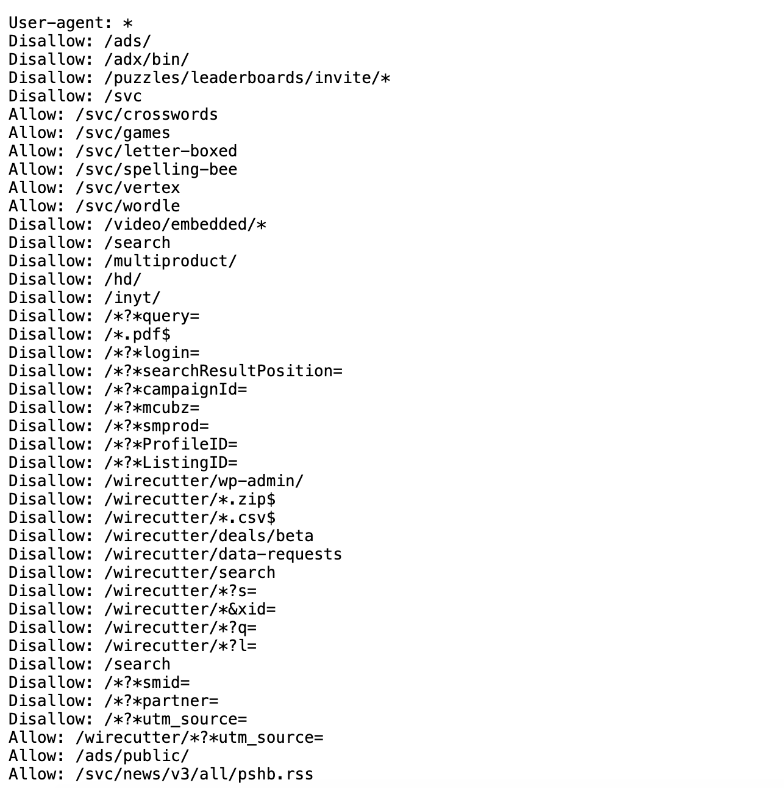
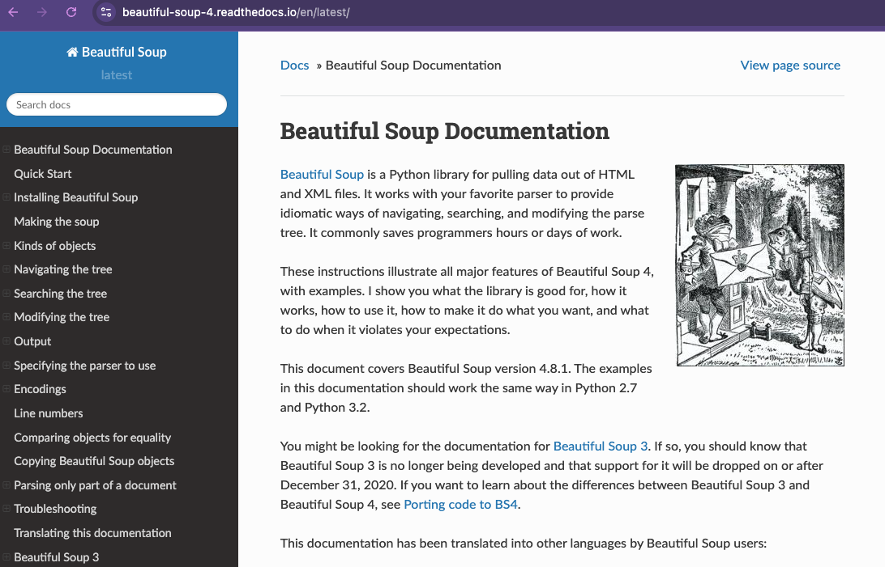
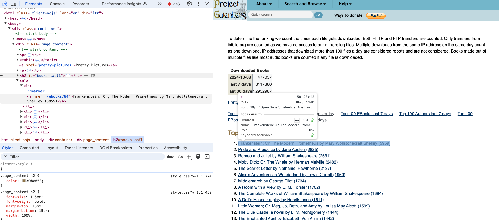
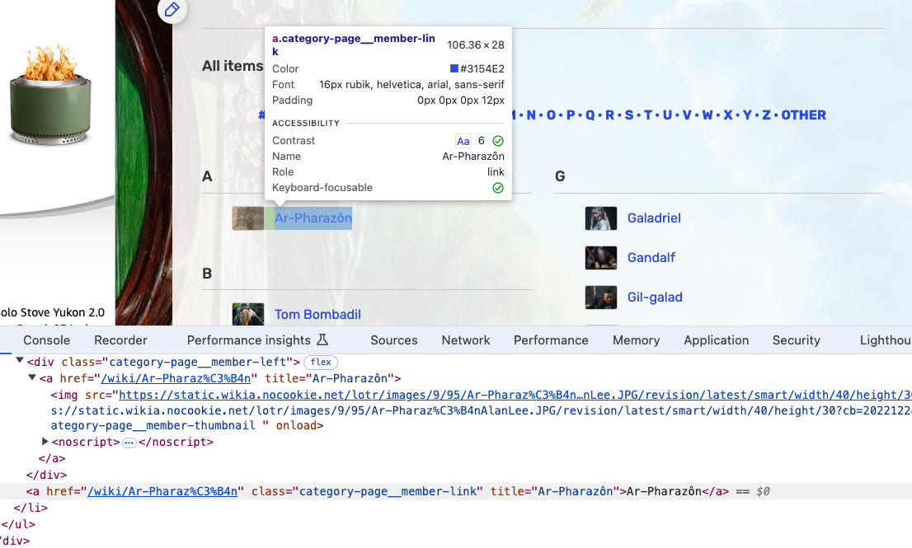
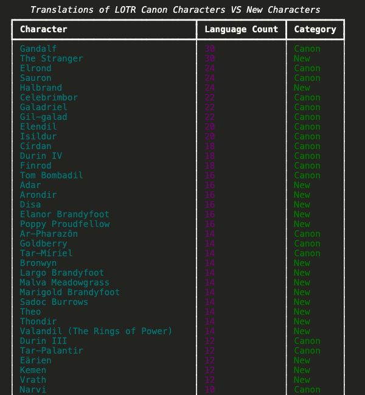

::: {.callout-note}
⚡️ This lesson has been adapted from Melanie Walsh's chapter on Web Scraping in <i>Introduction to Cultural Analytics & Python</i> textbook <a href="https://melaniewalsh.github.io/Intro-Cultural-Analytics/04-Data-Collection/02-Web-Scraping-Part1.html">https://melaniewalsh.github.io/Intro-Cultural-Analytics/04-Data-Collection/02-Web-Scraping-Part1.html</a>. Many thanks to Melanie for sharing their materials!
:::

## What Is Web Scraping and Why Is It Useful?

:::: {.columns}
::: {.column width="60%" .r-fit-text}

:::
::: {.column width="40%" .r-fit-text}
So far when it comes to working with the web, you have been creating your own HTML pages and hosting them via GitHub. But we can also use Python to interact with the web in a different way: by scraping data from web pages. The data we extract is exactly the same as what you have been writing, so elements like headers, paragraphs, and links, etc.
:::
::::

::: {.notes}
Web scraping can be incredibly useful considering how much data is available on the web and how little of it is often put into tabular format. For example, you might want to scrape a web archive to get data for a research project, or you might want to scrape a social media site to get access to data that isn't available through their API. 
:::

## Web Scraping for Preservation

Web scraping is also what we use to preserve the web. Remember the Wayback Machine? That's a web archive that uses web scraping to save web pages. The way it works is that it uses a web crawler to find links to web pages and then it uses web scraping to save the content of those pages.

[](https://www.sucho.org/){target="_blank"}

::: {.notes}
This method has also been used by scholars to do community-driven data preservation. For example, when Russia invaded Ukraine, a group of scholars and librarians founded the *Saving Ukrainian Cultural Heritage Online* (SUCHO) group and used web scraping to preserve the content of Ukrainian websites [https://www.sucho.org/](https://www.sucho.org/). This was important because if servers are bombed, the content of those websites would be lost forever.
:::

## Is Web Scraping Legal or Ethical?

::: {.r-fit-text}
Technically, most publicly available internet data is considered legal to collect, even if it's not explicitly licensed. In 2019, "the Ninth Circuit Court of Appeals ruled that automated scraping of publicly accessible data likely does not violate the Computer Fraud and Abuse Act (CFAA)." However, there are some important caveats to this. For example, this ruling only applies to US based websites and the laws in other countries might be different. One of the more recent and important European developments was the passing of the General Data Protection Regulation (GDPR) in 2018, which has implications for web scraping. In particular, the GDPR bans the scraping of emails and personal names from websites. More recently, a consortium of regulators from multiple countries released a joint statement warning social media companies that they must protect user data from scraping.
:::

## Is Web Scraping Legal or Ethical?

:::: {.columns}
::: {.column width="60%" .r-fit-text}

:::
::: {.column width="40%" .r-fit-text}
In terms of ethics, web scraping can be a bit of a grey area. It's generally considered ethical to scrape publicly available data, but it's not ethical to scrape data from a website that has a terms of service that prohibits scraping. It can be difficult to find those terms of service, but one more obvious example of a website banning scraping is if it prohibits scraping in its `robots.txt` file. A robots.txt file is a file that websites use to tell web crawlers which pages they are allowed to scrape.
:::
::::

::: {.notes}
Technically, most publicly available internet data is considered legal to collect, even if it's not explicitly licensed. In 2019, "the Ninth Circuit Court of Appeals ruled that automated scraping of publicly accessible data likely does not violate the Computer Fraud and Abuse Act (CFAA)."[^1] However, there are some important caveats to this. For example, this ruling only applies to US based websites and the laws in other countries might be different. One of the more recent and important European developments was the passing of the General Data Protection Regulation (GDPR) in 2018, which has implications for web scraping. In particular, the GDPR bans the scraping of emails and personal names from websites. More recently, a consortium of regulators from multiple countries released a joint statement warning social media companies that they must protect user data from scraping.[^2]

For example,the above image is of the robots.txt file for the New York Times website is [https://www.nytimes.com/robots.txt](https://www.nytimes.com/robots.txt). We can see that it lists a number of pages that are not allowed to be scraped (those are the ones with the `Disallow` directive). You might also come across `robots.txt` files that have a `Crawl-delay` directive, which tells web crawlers how long to wait between requests. The reason this is important is that if you try to web scrape a website that has a `robots.txt` file that prohibits scraping, you could be banned from the website. This is because the website might think you are a web crawler and not a human, and it might block your IP address.
:::

## Guidelines for Web Scraping

::: {.r-fit-text}
What to collect and how to collect it is a big part of the ethics of web scraping. Melanie Walsh has a great overview of some of these tradeoffs:

> Just because something is legal or gets approved by an IRB does not mean it is ethical. Collecting, sharing, and publishing internet data created by or about individuals can lead to unwanted public scrutiny, harm, and other negative consequences for those individuals. For these reasons, some researchers attempt to anonymize internet data before sharing it or before publishing an article that cites a post specifically. Yet anonymizing internet data also does not give credit to internet users as creators and authors.
> 
> There is no single, simple answer to the many difficult questions raised by internet data collection. It is important to develop an ethical framework that responds to the specifics of your particular research project or use case (e.g., the platform, the people involved, the context, the potential consequences, etc.).
> 
> In my own research, I have started seeking explicit permission from internet users when I want to quote them in a published article. In this book, I only share internet data that meets a certain threshold of publicness, such as tweets from verified Twitter accounts or Reddit posts with a certain number of upvotes. This is an approach that I have developed based on some of the models and readings included below.
:::

::: {.notes}
IRB refers to the Institutional Review Board, which is a committee that reviews and approves research involving human subjects at universities, and most of the time, web scraping or accessing digital data is considered not to be human subjects research. However, even if we don't need IRB approval, it's still important to think about the ethics of web scraping and to consider the potential consequences of our actions. I personally think Walsh's approach is a good one: to think about the specifics of your research project and to develop both a legal *and* an ethical framework that responds to those specifics. And also to think about the consent of the people whose data you are collecting. There's no one size fits all answer, but we should always think about not only if we can collect data, but also if we should and how we should.
:::

## Guidelines for Web Scraping

:::: {.columns}
::: {.column width="60%" .r-fit-text}

:::
::: {.column width="40%" .r-fit-text}
As you can see above, Walsh also has a great overview of different strategies and resources for this type of work, so highly recommend visiting the original chapter to explore these further in depth [https://melaniewalsh.github.io/Intro-Cultural-Analytics/04-Data-Collection/01-User-Ethics-Legal-Concerns.html](https://melaniewalsh.github.io/Intro-Cultural-Analytics/04-Data-Collection/01-User-Ethics-Legal-Concerns.html){target="_blank"}.
:::
::::

## Web Scraping with Python

Now that we have a sense of web scraping generally, it's time to try it out in Python. We will be using two Python libraries to do this: `requests` and `beautifulsoup4`. The `requests` library is a library that allows us to send HTTP requests to web pages. The `beautifulsoup4` library is a library that allows us to parse HTML and XML documents. We will be using `requests` to get the web page and `beautifulsoup4` to parse the web page.

## Installing Required Packages

::: {.r-fit-text}
The first step is to install our required packages into our virtual environment. If you have yet to set up a virtual environment, you can follow the instructions in the [previous lesson](../creating-curating-humanities-data/04-virtual-environments){target="_blank"}.

If you have already created your virtual environment, then you can either activate it using Visual Studio Code or by using the terminal. If you are using the terminal, you can activate your virtual environment by running the following command:

```bash
source venv/bin/activate
pip install requests beautifulsoup4
```
Notice here we are installing two packages: `requests` and `beautifulsoup4` in a single line. **You can install as many packages as you want in a single `pip install` command, just separate them with a space.**
:::

::: {.notes}
We previously discussed Python libraries when we talked about classes and virtual environments, but let's dig in a bit deeper.
:::

## Python Libraries

::: {.r-fit-text}
- There's a lot of different definitions for this term, but most generally you can think of this as a collection of software that's directly used by other software. Most often, this will be a generalizable piece of logic that is useful to bundle separately so that other, unrelated pieces of software can use it. Because it's an informal term in Python and not a specific, technical one, it's more useful to think about libraries in terms of how code is organized. Used in this way, the concept of "software libraries" spans many different programing languages and development contexts: we have Python libraries, C++ libraries, Javascript libraries, operating system libraries, etc.
- Let's consider libraries that we've used. The [Python Standard Library](https://docs.python.org/3/library/) is the most obvious example which encompasses many different purposes and packages (more on that later), but is unified in that it is included in all Python installations so that Python code that's written using the Standard Library will run on any compatible Python environment of the expected version. Parts of the Standard Library that we've used before include packages like [pathlib](https://docs.python.org/3/library/pathlib.html).
- There are also third-party libraries that people build in Python, which can be found on The Python Package Index (PyPI) <https://pypi.org/>. These are usually less expansive than the Standard Library, but can be useful because they are written for specialized tasks. This week, we'll take a look at [Beautiful Soup](https://www.crummy.com/software/BeautifulSoup/), which is analogous in scope to packages like pathlib. In fact, third party libraries are often organized into a single package. A library like Beautiful Soup can best be thought of in terms of purpose: you want to accomplish the a particular, common task like scraping a website and Beautiful Soup helps accomplish it.
:::

## Python Packages

::: {.r-fit-text}

- A package is a formal term in the Python context. It's a specific organization of code which all lives in a single directory. Libraries sometimes (often) consist of a single package (e.g. PathLib or BS4), so the term is sometimes (often) used interchangeably. Packages are the basic unit by which we install and use libraries. So when we type `pip install beautifulsoup4` into the terminal, we're installing the `beautifulsoup4` package.

This is very detailed, but just remember that while these terms are often used interchangeably, a package is a more specific concept referring to the structure and distribution of code, whereas a library is a broader concept referring to reusable code functionality.

Finally, you'll see that I often use `pip` or `pip3` when installing packages. This is because `pip` is the package installer for Python and `pip3` is the package installer for Python 3. If you're using Python 3, you can use either `pip` or `pip3`, but if you're using Python 2, you should use `pip2`. So generally, you'll want to use `pip` to install packages but to double check you're installing packages for the right version of Python, you can check the version of Python you're using by running `python --version` and then use the corresponding `pip` command.
:::

## Time to Start Web Scraping

First, we need to create a new folder in our `is310-coding-assignments` called `web-scraping` and then create a new file called `first_web_scraping.py`. Then we can add the following code to our file:

```python
import beautifulsoup4
```

*Did it work for you?*

## Import Error

You'll likely see the following error if you try to run this code:


::: {.notes}
That is because `beautifulsoup4` is not a package that we can import directly. Instead, we need to import the `BeautifulSoup` class from the `bs4` package. This difference is a bit confusing since the name of the package on PyPI (`beautifulsoup4`) doesn't match the actual Python code package (`bs4`).
:::

## BeautifulSoup Documentation

But this is a great example of why we always want to read the documentation, which is available here [https://www.crummy.com/software/BeautifulSoup/bs4/doc/](https://www.crummy.com/software/BeautifulSoup/bs4/doc/){target="_bank"}.



## Quick Start

::: {.r-fit-text}
If we click on the `Quick Start` link, we can see that the documentation tells us to import the `BeautifulSoup` class from the `bs4` package. So we can update our code to look like this:

```python
from bs4 import BeautifulSoup
```

Remember that the `from` keyword is used to import a specific module (aka Class or function in Python) from a package. Alternatively we could also import the entire package and then use the `BeautifulSoup` class like this:

```python
import bs4
soup = bs4.BeautifulSoup(html_doc, 'html.parser')
```

*Any other ways we could import this library?*
:::

::: {.notes}
Finally we could technically use the asterisk symbol, which often means "all" or "any", to import all the modules (aka Classes and functions) in the package:

```python
from bs4 import *
soup = BeautifulSoup(html_doc, 'html.parser')
# imports * imports all modules in a package
```
However, this is generally not recommended because it can make it difficult to understand where a particular module is coming from.
:::

## Installing Parsers

You may also need to install a parser for `BeautifulSoup`. The `html.parser` parser is included with Python, but you can also use the `lxml` parser, which is faster and more lenient. You can install the `lxml` parser by running the following command:

```bash
pip install lxml
```

## Parsers

::: {.r-fit-text}
There's actually a number of possible parsers you can use with `BeautifulSoup`. Here's a quick overview of the different parsers you can use with `BeautifulSoup` from the library's documentation:

| Parser                     | Typical usage                                | Advantages                                                                 | Disadvantages                                      |
|----------------------------|----------------------------------------------|---------------------------------------------------------------------------|----------------------------------------------------|
| Python’s `html.parser`     | `BeautifulSoup(markup, "html.parser")`       | Batteries included<br>Decent speed<br>Lenient (As of Python 2.7.3 and 3.2)| Not as fast as lxml<br>Less lenient than html5lib  |
| lxml’s HTML parser         | `BeautifulSoup(markup, "lxml")`              | Very fast<br>Lenient                                                      | External C dependency                              |
| lxml’s XML parser          | `BeautifulSoup(markup, "lxml-xml")`<br>`BeautifulSoup(markup, "xml")` | Very fast<br>The only currently supported XML parser                      | External C dependency                              |
| html5lib                   | `BeautifulSoup(markup, "html5lib")`          | Extremely lenient<br>Parses pages the same way a web browser does<br>Creates valid HTML5 | Very slow<br>External Python dependency            |

I usually just use the built-in `html.parser` parser, but you can use the `lxml` parser if you want to.
:::

## BeautifulSoup Basics

::: {.r-fit-text}
In the `Quick Start` guide [https://beautiful-soup-4.readthedocs.io/en/latest/#quick-start](https://beautiful-soup-4.readthedocs.io/en/latest/#quick-start), we have an example of how to use the `BeautifulSoup` class to parse an HTML document. Let's try this example in our `first_web_scraping.py` file.

```python
html_doc = """
<html><head><title>The Dormouse's story</title></head>
<body>
<p class="title"><b>The Dormouse's story</b></p>

<p class="story">Once upon a time there were three little sisters; and their names were
<a href="http://example.com/elsie" class="sister" id="link1">Elsie</a>,
<a href="http://example.com/lacie" class="sister" id="link2">Lacie</a> and
<a href="http://example.com/tillie" class="sister" id="link3">Tillie</a>;
and they lived at the bottom of a well.</p>

<p class="story">...</p>
"""

soup = BeautifulSoup(html_doc, 'html.parser')

print(soup.prettify())
```
:::

::: {.notes}
We can see that `html_doc` is a variable that holds a multiline string that contains HTML. We are then using the `BeautifulSoup` class to parse the HTML document and the `prettify()` method to print the HTML document in a more readable format.
:::

## BeautifulSoup Classes

::: {.r-fit-text}
In `BeautifulSoup`, we have four kinds of objects that we can work with: `Tag`, `NavigableString`, `BeautifulSoup`, and `Comment`. The `Tag` object is the most important object and represents an HTML or XML tag. The `NavigableString` object represents the text within a tag. The `BeautifulSoup` object represents the whole of the document. The `Comment` object represents an HTML or XML comment. We'll just focus on the `Tag` and `BeautifulSoup` objects for now.

We usually define a `BeautifulSoup` object by passing in the HTML document and the parser we want to use. You'll notice that the variable containing the `BeautifulSoup` object is often called `soup`, but you can call it whatever you want.

The core power of `BeautifulSoup` is that it let's you navigate the HTML Document like a tree, which you can read more about here [https://beautiful-soup-4.readthedocs.io/en/latest/index.html#navigating-the-tree](https://beautiful-soup-4.readthedocs.io/en/latest/index.html#navigating-the-tree){target="_blank"}.
:::

::: {.notes}

Remember in HTML we can have nested HTML elements, and so `BeautifulSoup` let's us use that structure to find elements. Otherwise, this would just be **unstructured text** which is difficult to work with.
:::

## Build-In Methods

To navigate the HTML tree we can use the `find_all` method, which has the following documentation [https://beautiful-soup-4.readthedocs.io/en/latest/index.html#find-all](https://beautiful-soup-4.readthedocs.io/en/latest/index.html#find-all){target="_blank"}.

The power of `BeautifulSoup` is that it let's us use the structure of the HTML document to extract the data we want. For example, we can use the built-in `find_all()` method to get all the links in the document and then use the `get_text()` method to get the text of each link.

```python
links = soup.find_all('a')
for link in links:
	print(link.get('href'))
	print(link.get_text())
```

::: {.notes}
From this we can see that we are getting all the links in the document and then printing the `href` attribute of each link and the text of each link. This is a very simple example, but it shows how we can use the structure of the HTML document to extract the data we want.
:::

## Scraping Project Gutenberg

:::: {.columns}
::: {.column width="60%" .r-fit-text}
So far we've been using some fairly basic HTML but we can start working with an actual HTML document. Today we'll be using *Project Gutenberg*'s Top 100 eBooks page. This page lists the top 100 eBooks on *Project Gutenberg* and we can use `BeautifulSoup` to scrape the titles.

First, we're going to save the page as an HTML file. You can do this by right clicking on the page and selecting "Save As" and then saving it as `top_100_ebooks.html`.
:::
::: {.column width="40%" .r-fit-text}

:::
::::

::: {.notes}
We can access this at [https://www.gutenberg.org/browse/scores/top](https://www.gutenberg.org/browse/scores/top). After saving the file, we can open it with BeautifulSoup.
:::

## Parsing Project Gutenberg

::: {.r-fit-text}
Now we can try scraping the page!

```python
from bs4 import BeautifulSoup
soup = BeautifulSoup(open("top_100_ebooks.html"), features="html.parser")

print(soup.prettify())
```

You can see we now have the full HTML page! While it's great to be able to see the HTML, usually we are scraping to extract structured data and turn it into a structured data format like a CSV or JSON file.

So let's try and get the titles of the top 100 eBooks.
:::

## Inspecting the HTML

:::: {.columns}
::: {.column width="50%" .r-fit-text}
First, let's take a look at the structure of the HTML document. We can use the **inspect** feature in your browser to do this. We can see that `Top 100 EBooks yesterday` is an `h2` tag.
:::
::: {.column width="50%" .r-fit-text}

:::
::::

::: {.notes}
This is important because it tells us how the data is structured in the HTML. By understanding the structure, we can write code that extracts the specific data we want.
:::

## Finding the Book Titles

:::: {.columns}
::: {.column width="50%" .r-fit-text}
If we select the titles, we can see that they are nested in an `ol` tag and then each title is in a `li` tag. So we can use the `find_all()` method to get all the `li` tags and then use `get_text()` to extract the text.
:::
::: {.column width="50%" .r-fit-text}

:::
::::

::: {.notes}
One important thing to note is that if we just use `soup.find_all('li')`, we will get **all** the list items on the page, not just the titles of the Top 100 eBooks. This is because the `find_all()` method searches the whole document. So we need to be more specific in our search.
:::

## Requesting and Scraping Web Pages

We are now officially scraping a web page 🥳!! But what if we wanted to scrape more than one? Saving each manually would get tiring really quickly!

Let's try taking our updated code but rather than working with the saved version of the web page, let's try to get the web page programmatically. To do this, we need to use the `requests` library.

::: {.notes}
We already installed requests initially so now we need to import it into our code.
:::

## The Requests Library

::: {.r-fit-text}
The `requests` library is a library that allows us to send HTTP requests to web pages as if we were a web browser. As you remember from our lesson on the web, when you go to a URL in your browser, your browser sends an HTTP request to the server and the server sends back an HTTP response.

The `requests` library allows us to do the same thing in Python:

```python
from bs4 import BeautifulSoup
import requests
```
:::

## Making HTTP Requests

::: {.r-fit-text}
The core method in the `requests` library is the `get()` method, which sends a GET request to a web page. The `get()` method returns a `Response` object with useful attributes like `status_code` and `headers`.

```python
response = requests.get("https://www.gutenberg.org/browse/scores/top")
print("Status code:", response.status_code)
print("Headers:", response.headers)
```

A status code of `200` means the request was successful!
:::

::: {.notes}
Other common status codes include:
- 404: Page not found
- 403: Forbidden
- 500: Server error

If you get an error, it usually means either you don't have access to the web page, there's an error on the server, or there's an issue with your internet connection.
:::

## Extracting HTML from Response

::: {.r-fit-text}
Now that we have the `Response` object, we can use the `text` attribute to get the HTML of the page and parse it with `BeautifulSoup`:

```python
soup = BeautifulSoup(response.text, "html.parser")
print(soup.prettify())
```

This means we can now scrape any web page we want, not just the ones we have saved locally!
:::

## Full Web Scraping Example

::: {.r-fit-text}
Putting it all together:

```python
from bs4 import BeautifulSoup
import requests

response = requests.get("https://www.gutenberg.org/browse/scores/top")
soup = BeautifulSoup(response.text, "html.parser")
top_100_ebooks = soup.find(id="books-last1")
list_of_books = top_100_ebooks.find_next('ol').find_all('li')
for book in list_of_books:
	print(book.get_text())
```

Notice we're using `find_next()` to navigate the HTML tree and get to the correct `ol` tag!
:::

## Structuring Your Scraped Data

::: {.r-fit-text}
Now that our code is working, we can start to consider what data we actually want and how to structure it. We can use Python dictionaries and lists to organize the data before saving it:

```python
from bs4 import BeautifulSoup
import requests

response = requests.get("https://www.gutenberg.org/browse/scores/top")
soup = BeautifulSoup(response.text, "html.parser")
top_lists = soup.find_all("h2")

data = []
for top_list in top_lists:
	top_list_name = top_list.get_text()
	top_list_items = top_list.find_next('ol').find_all('li')
	for item in top_list_items:
		data.append({"list": top_list_name, "title": item.get_text()})
```

This creates a list of dictionaries with the list name and title!
:::

## Extracting Multiple Data Points

::: {.r-fit-text}
We can also extract additional data like links from the HTML:

```python
books = []
authors = []

for top_list in top_lists:
	top_list_name = top_list.get_text()
	top_list_items = top_list.find_next('ol').find_all('li')
	for item in top_list_items:
		if "EBooks" in top_list_name:
			books.append({
				"top_list": top_list_name,
				"book_title": item.get_text(),
				"book_link": item.find('a').get('href')
			})
```

Now we're capturing both the title and the link!
:::

::: {.notes}
By extracting multiple data points, we can create richer datasets that contain more information about what we're scraping. This is useful for later analysis and research.
:::

## Saving to CSV

::: {.r-fit-text}
To save the data we've scraped, we can use the built-in `csv` library:

```python
import csv

with open('top_100_ebooks.csv', 'w') as file:
	writer = csv.writer(file)
	writer.writerow(['top_list', 'book_title', 'book_link'])
	for book in books:
		writer.writerow([book['top_list'], book['book_title'], book['book_link']])
```

Notice we're using the `with` statement to automatically close the file when done. The column headers make the data easier to understand later!
:::

## Handling Relative Links

:::: {.columns}
::: {.column width="60%" .r-fit-text}
When we scrape links from web pages, they're often relative links like `/ebooks/84` instead of absolute links like `https://www.gutenberg.org/ebooks/84`. We need to convert relative links to absolute links before we can request them.
:::
::: {.column width="40%" .r-fit-text}
```python
def check_page_exists(url):
	full_url = "https://www.gutenberg.org" + url
	response = requests.get(full_url)
	if response.status_code == 200:
		return True
	else:
		return False
```
:::
::::

::: {.notes}
Many web pages use relative links, so this is a common issue when scraping websites. It's important to always inspect and explore the HTML of the web page you're scraping to understand the structure of the links.
:::

## Advanced Web Scraping

Now that we have the basics down, let's look at scraping more complex websites. Many fan wikis and community-created wikis contain rich data that can be useful for research.

:::: {.columns}
::: {.column width="50%" .r-fit-text}
For example, *Wookieepedia* is the Star Wars wiki with over 150,000 articles! There are many fandom wikis across different fandoms and communities.
:::
::: {.column width="50%" .r-fit-text}

:::
::::

## Checking robots.txt

:::: {.columns}
::: {.column width="60%" .r-fit-text}
Before scraping any website, you should always check the `robots.txt` file and the terms of service. The `robots.txt` file is located at the root of a website and tells you what content can be scraped.

For example: `https://lotr.fandom.com/robots.txt`
:::
::: {.column width="40%" .r-fit-text}

:::
::::

::: {.notes}
The robots.txt file contains several important directives:

1. **User-agent**: Which web crawlers the rules apply to (e.g., `User-agent: *` means all crawlers)
2. **Disallow**: Pages that crawlers cannot scrape
3. **Allow**: Specific pages that are allowed despite a broader Disallow rule
4. **Crawl-delay**: How long to wait between requests
5. **Sitemap**: The location of the website's sitemap

For the LOTR wiki, we can see that we can scrape most wiki pages, but we should avoid Special pages and respect the Noindex directives.
:::

## Understanding robots.txt Directives

::: {.r-fit-text}
The `robots.txt` file contains rules for web crawlers:

1. **Disallow**: Pages that scrapers cannot access (e.g., `Disallow: /wiki/Special:`)
2. **Allow**: Specific exceptions to Disallow rules
3. **Noindex**: Pages the site prefers not to be indexed (though not strictly enforced)
4. **Crawl-delay**: Time to wait between requests in seconds
5. **User-agent**: Which bots the rules apply to

Always check these before scraping to ensure you're being ethical and legal!
:::

## Bot Protection: Cloudflare

::: {.r-fit-text}
Many modern websites use **Cloudflare** to protect against bot scraping. When you use `requests.get()`, these sites may block you with a **403 Forbidden** error because they detect you're not a real browser.

To handle this, use the `cloudscraper` library:

```bash
pip install cloudscraper
```

Then replace `requests.get()` with `cloudscraper`:

```python
import cloudscraper

scraper = cloudscraper.create_scraper()
response = scraper.get("https://lotr.fandom.com/wiki/Main_Page")
```

This mimics a real browser and bypasses Cloudflare's protection **ethically** while respecting `robots.txt`!
:::

## Scraping Fandom Wikis

:::: {.columns}
::: {.column width="50%" .r-fit-text}
Let's try scraping character pages from a fandom wiki. First, we'll get the web page using `cloudscraper` and then parse it with `BeautifulSoup`:

```python
import cloudscraper

scraper = cloudscraper.create_scraper()
response = scraper.get(
	"https://lotr.fandom.com/wiki/Main_Page"
)
soup = BeautifulSoup(response.text, "html.parser")
```
:::
::: {.column width="50%" .r-fit-text}
If you get a timeout error, you can add a timeout parameter:

```python
response = scraper.get(
	"https://lotr.fandom.com/wiki/Main_Page",
	timeout=5
)
```
:::
::::

## Inspecting Complex HTML

:::: {.columns}
::: {.column width="50%" .r-fit-text}
Complex websites have more complex HTML. We need to inspect the page carefully to find the right CSS classes or IDs to target. In this example, each character is in an element with the class `category-page__member-link`.
:::
::: {.column width="50%" .r-fit-text}

:::
::::

## Scraping Character Names

::: {.r-fit-text}
Using CSS classes, we can target specific elements:

```python
response = scraper.get(
	"https://lotr.fandom.com/wiki/Category:Canon_characters_in_The_Rings_of_Power"
)
soup = BeautifulSoup(response.text, "html.parser")
characters = soup.find_all('a', class_='category-page__member-link')

for character in characters:
	print(character.get_text())
```

The `class_` parameter (with underscore) lets us search by CSS class!
:::

## Using Regular Expressions

::: {.r-fit-text}
For more advanced searching, we can use regular expressions (regex) with BeautifulSoup:

```python
import re

response = scraper.get("https://lotr.fandom.com/wiki/Galadriel")
soup = BeautifulSoup(response.text, "html.parser")

# Find all language translation links
languages = soup.find_all('a',
	attrs={'data-tracking-label': re.compile(r'lang-')})

for language in languages:
	print(language.get_text())
```

Regex patterns help us find elements matching a pattern, like anything starting with `lang-`!
:::

::: {.notes}
Regular expressions are a powerful way to search for patterns in text. The pattern `r'lang-'` means "starts with lang-". We can use more complex patterns for more advanced searches.
:::

## Creating Scraping Functions

::: {.r-fit-text}
As our scraping gets more complex, it's helpful to organize code into functions:

```python
def get_character_languages(url):
	try:
		response = scraper.get(url, timeout=10)
		if response.status_code != 200:
			return []
		soup = BeautifulSoup(response.text, "html.parser")
		languages = soup.find_all('a',
			attrs={'data-tracking-label': re.compile(r'lang-')})
		return [{"language": language.get('data-tracking-label'),
			"language_name": language.get_text()}
			for language in languages]
	except Exception as e:
		print(f"Error: {e}")
		return []

# Use the function
character_languages = get_character_languages(
	"https://lotr.fandom.com/wiki/Galadriel"
)
```

Functions with error handling are more robust!
:::

## DRY Principle: Don't Repeat Yourself

::: {.r-fit-text}
We can refactor repeated code into reusable functions:

```python
def fetch_characters(url, category):
	try:
		response = scraper.get(url, timeout=10)
		soup = BeautifulSoup(response.text, "html.parser")
		characters = soup.find_all('a', class_='category-page__member-link')
		characters_data = []

		for character in characters:
			character_data = {
				"character": character.get_text(),
				"character_link": character.get('href'),
				"category": category
			}
			characters_data.append(character_data)

		return characters_data
	except Exception as e:
		print(f"Error: {e}")
		return []
```

Reusable functions with error handling!
:::

## Fetching Multiple Character Categories

::: {.r-fit-text}
Now we can use our function to fetch different categories:

```python
canon_characters = fetch_characters(
	"https://lotr.fandom.com/wiki/Category:Canon_characters_in_The_Rings_of_Power",
	"Canon"
)

new_characters = fetch_characters(
	"https://lotr.fandom.com/wiki/Category:Characters_created_for_The_Rings_of_Power",
	"New"
)

# Combine the data
all_characters = canon_characters + new_characters
```

By combining the data, we can compare canon and new characters!
:::

## Displaying Results with Rich

:::: columns
::: {.column width="50%" .r-fit-text}
The `Rich` library can display our data in a beautiful table:

```python
from rich.console import Console
from rich.table import Table

console = Console()
table = Table(title="LOTR Characters")
table.add_column("Character", style="cyan")
table.add_column("Category", style="magenta")

for character in all_characters:
	table.add_row(character['character'], character['category'])

console.print(table)
```
:::
::: {.column width="50%" .r-fit-text}

:::
::::

## Beyond BeautifulSoup

::: {.r-fit-text}
There are other Python libraries for web scraping:

- **Selenium**: Controls a web browser programmatically. Useful for websites with dynamic JavaScript content.
- **Scrapy**: A full web scraping framework designed for scraping at scale. More complex but more powerful.

Each library has pros and cons depending on your use case. BeautifulSoup is great for getting started, but these other tools are useful for more complex scenarios.
:::

::: {.notes}
The key difference is that Selenium actually opens a web browser and can execute JavaScript, while BeautifulSoup just parses HTML. This means Selenium is slower but can handle dynamic content, while BeautifulSoup is fast but only works with static HTML.
:::

## Key Takeaways

::: {.r-fit-text}
- Web scraping lets us extract data from websites programmatically
- Always check `robots.txt` and terms of service before scraping
- The `requests` library gets web pages, `BeautifulSoup` parses the HTML
- Inspect the HTML structure to find the right elements to extract
- Organize scraped data into dictionaries and lists before saving
- Save data in structured formats like CSV or JSON
- Functions help organize and reuse web scraping code
:::

## Homework: Web Scraping Assignment

::: {.r-fit-text}
Select **any** fandom wiki you're interested in and create a web scraping project that:

1. ✅ Checks the `robots.txt` file and terms of service
2. ✅ Uses `requests`/`cloudscraper` and `BeautifulSoup` to scrape data
3. ✅ Creates a structured dataset (CSV or JSON format)
4. ✅ Includes error handling with try/except blocks
5. ✅ Documents your findings in a README

Examples of fandom wikis:
- [Wookieepedia](https://starwars.fandom.com/) (Star Wars)
- [Marvel Fandom](https://marvel.fandom.com/) (Marvel)
- [Harry Potter Wiki](https://harrypotter.fandom.com/) (Harry Potter)
- [The Office Wiki](https://theoffice.fandom.com/) (The Office)
:::

## Assignment Details

:::: {.columns}
::: {.column width="50%" .r-fit-text}
**Deliverables:**

- Create a `web-scraping` folder in your `is310-coding-assignments`
- Write `fandom_wiki_scraping.py` with your scraping code
- Save your data as CSV or JSON
- Include a `README.md` explaining:
  - Your chosen wiki and why
  - What data you scraped and why it's useful
  - Link to the `robots.txt` file
:::
::: {.column width="50%" .r-fit-text}
**Tips:**

- Use the inspect tool to understand HTML structure
- Start with a small test before scraping everything
- Add delays between requests to be respectful
- Save your data progressively in case of errors
- Test your code on a smaller dataset first
:::
::::

::: {.notes}
Remind students that they should be ethical in their scraping - they should check robots.txt, respect rate limits, and only scrape publicly available data. They should also think about what data they're collecting and why it's valuable for research.
:::

## Submit Your Work

:::: {.columns}
::: {.column width="70%" .r-fit-text}
Once you complete the assignment:

1. Push your code to GitHub
2. Post a link to your folder in our GitHub Discussions
3. Include a brief description of what you scraped and any interesting findings
:::
::: {.column width="30%" .r-fit-text}
Questions? Reach out on Slack!
:::
::::

