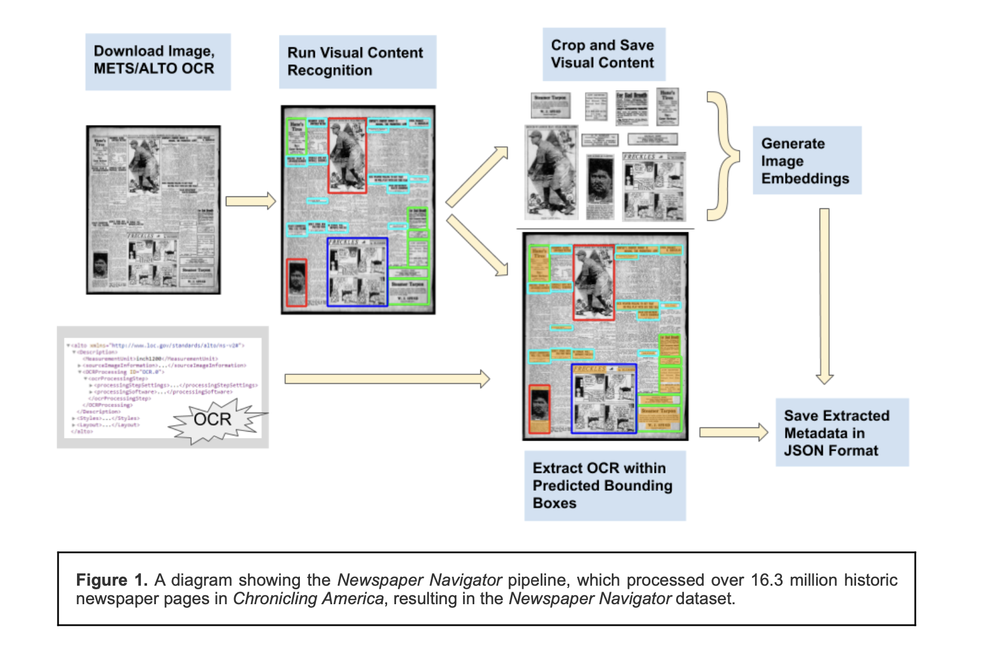
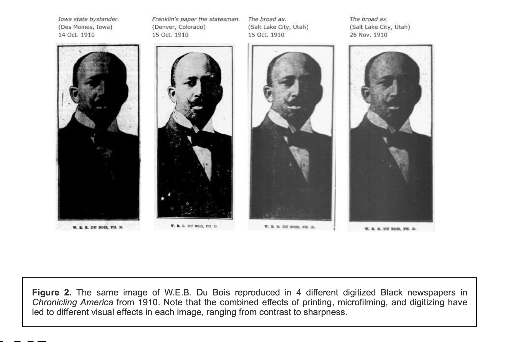
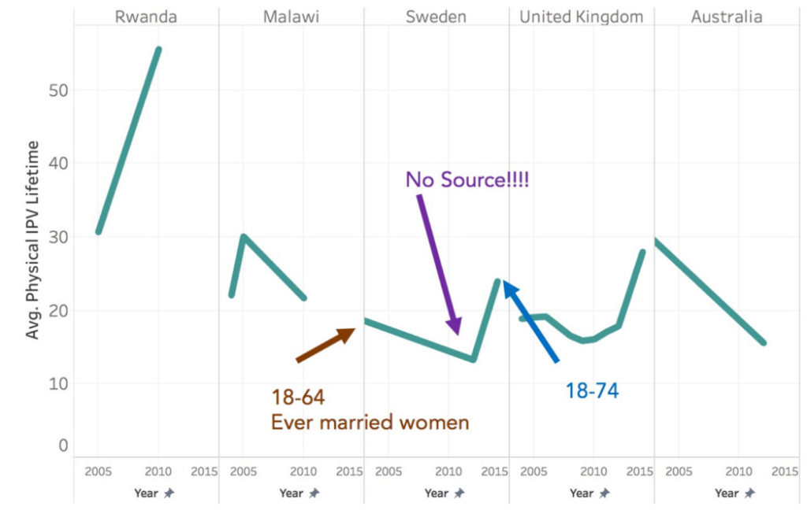

# Structure for Discussion

- What is Newspaper Navigator?
- What are data archeologies vs. data biographies?

## Newspaper Navigator

{target="_blank"}

- What is Newspaper Navigator? 
- What did it do and what problem was it built to solve? 
- What has happened to the project?

## Beyond Words & Crowdsourcing

{target="_blank"}

- What was the *Beyond Words* Project? Why and how did Lee use this in *Network Navigator*?
- What are some of the benefits and drawbacks to crowdsourcing? What is Mechanical Turk?

## Chroncicling America & Digitization

- What is the Chronicling America project and who funds it?
- What criteria determine which newspapers get digitized?
- What decisions made decades ago are now embedded in what researchers can find?

## Technical Pipeline

- At which stages are choices being made?
- Where does interpretation enter the pipeline?

## How does visual searching work?

{target="_blank"}

## Technical Challenges

- What is the importance of thresholds? 
- How did Lee discuss his interpretative choices when it comes to datafication?

## What is Data Archeology? What is a Data Biography?

- What does autoethnographic mean? What does it mean to "get to know" your data?
- How do these two approaches overlap or differ?

## How does interpretation get structured into data?

