So far in the course, when we've been writing Python code, we've either been using the Python interpreter in the terminal or saving a Python script. However, there's a third way to write Python code that's very popular - that is with Jupyter notebooks [https://jupyter.org/](https://jupyter.org/){target="_blank"}. While many of you are familiar with Jupyter notebooks, this lesson will serve as a refresher and introduction to some of the features of Jupyter notebooks, as well as how to use them with the Pandas library.

## What Are Jupyter Notebooks?

{fig-align="center"}

::: {.notes}
Jupyter notebooks are a type of computational notebook, which is a type of document that can contain both code and rich text elements, such as figures, images, links, equations, and more. When you run code in a Jupyter notebook, the results appear directly beneath the code, which differs from running scripts where we need to print the output to see it.
:::

## Brief History of Jupyter Notebooks

[](https://www.youtube.com/watch?v=NuRiz8CbvBg){target="_blank" fig-align="center"}

::: {.notes}
Jupyter notebooks originated as part of *Project Jupyter* initially in 2011, but fully released in 2014. However, the idea of code notebooks goes back much further.  I can't cover all the details here, but there's a great Youtube talk about this history if you want a deeper dive: William Horton "A Brief History of Jupyter Notebooks" 2020. [https://www.youtube.com/watch?v=NuRiz8CbvBg](https://www.youtube.com/watch?v=NuRiz8CbvBg){target="_blank"}.
:::

## Brief History of Jupyter Notebooks

{fig-align="center"}

::: {.notes}
The idea for Jupyter notebooks draws heavily from the idea of *literate programming*, which was introduced by Donald Knuth in the 1980s. Knuth created projects like LaTeX and TeX, and he argued that code should be written in a way that is understandable to humans, and that the code and the documentation should be intertwined. While developers debate whether Jupyter notebooks actually fulfill this vision, they do provide at least a partial way to combine code and documentation in a single document.
:::

## Connection To CU

{fig-align="center"}

::: {.notes}
This idea was also core to the development *Wolfram Mathematica* by the company *Wolfram Research*. For those unfamiliar, Mathematica is a computational software program used for symbolic and numerical calculations, and it has a notebook interface that allows users to combine code, text, and visualizations. If you drive to south Champaign, you'll actually see one of the headquarters for Wolfram Alpha, which was founded here by Stephen Wolfram and Theodore Gray in 1987.
:::

## Rise of IPython

[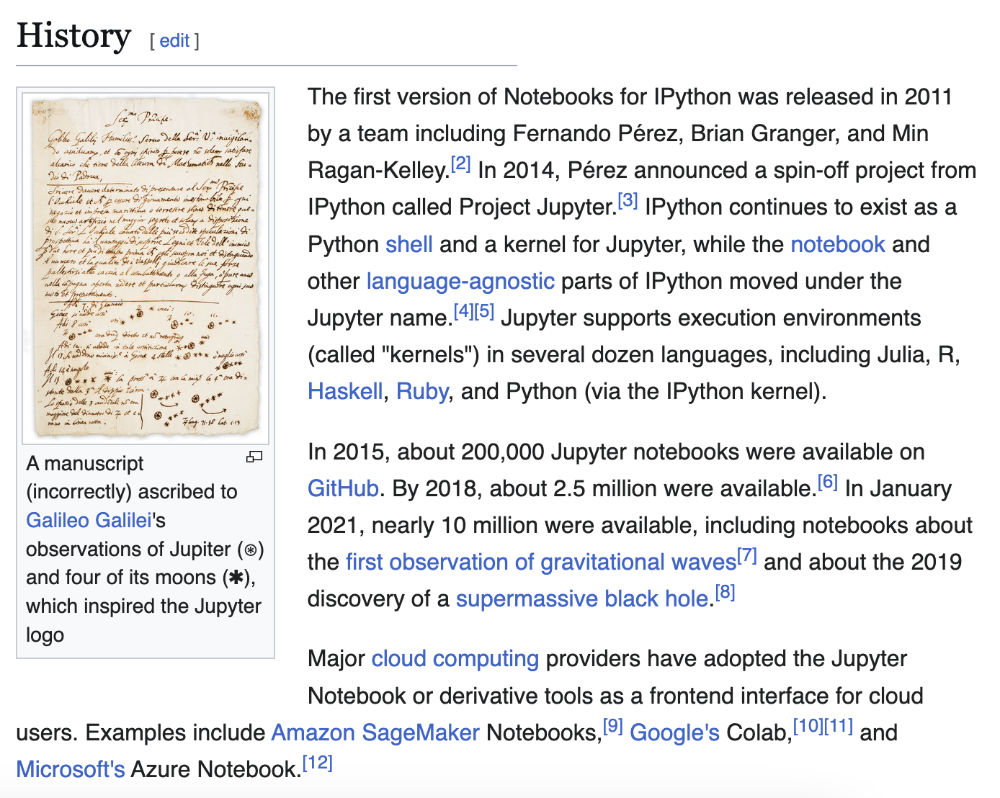](https://en.wikipedia.org/wiki/Project_Jupyter){target="_blank" fig-align="center"}

::: {.notes}
What really got Jupyter notebooks off the ground was the creation of *IPython* in 2001 as part of the creation of the `Scipy` and `Numpy` libraries, which was an interactive shell for Python. In particular, a group of developers, lead by Fernando Pérez, created the IPython notebook interface, which allowed users to create and share documents that contained live code, equations, visualizations, and narrative text for the first time in Python in 2011. This was the first version of Jupyter notebooks, and the name Jupyter is a nod to Galileo's discovery of the moons of Jupiter (you can read more details on the wikipedia page [https://en.wikipedia.org/wiki/Project_Jupyter](https://en.wikipedia.org/wiki/Project_Jupyter)).
:::

## The Notebook Wars

[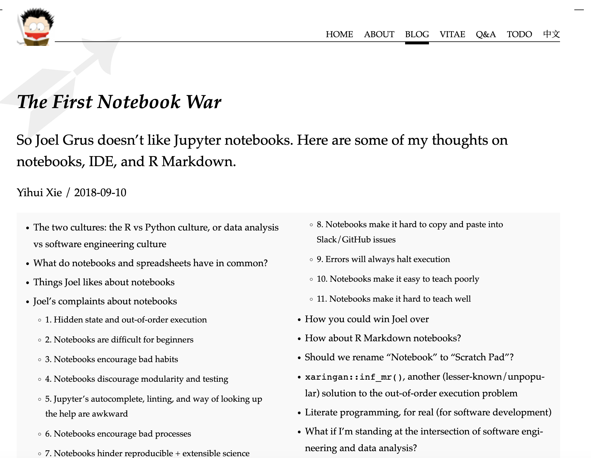](https://yihui.org/en/2018/09/notebook-war/){fig-align="center" target="_blank"}

::: {.notes}
Jupyter notebooks since their release have become enormously popular and a key infrastructure for the growth of data science since the mid-2010s. One of the things that made them so useful is that you could use them not just for Python, but also for R and Julia. For those unfamiliar, R is a programming language that is particularly popular in statistics and data science, while Julia is a newer programming language that is designed for high-performance numerical and scientific computing. R developed largely at the same time as Python, and Julia was created in 2012.

One of the big things that has happened in the last few years is the convergence of Project Jupyter with R and RStudio, through the creation of Posit, which was founded in 2022. This might be surprising to learn if you've heard people debate Python vs R, or if you've heard of the "notebook wars" of the late 2010s (you can read more about that here [https://yihui.org/en/2018/09/notebook-war/](https://yihui.org/en/2018/09/notebook-war/)). 
:::

## The Rise of Quarto

{fig-align="center"}

::: {.notes}
While developers are still debating which programming language is better, there have also been some new developments, specifically the creation and release of *Quarto*, which is like Jupyter on steroids. You can learn more about Quarto here [https://quarto.org/](https://quarto.org/) and you've already come across examples of Quarto: *The Responsible Datasets in Context Project* uses it to create their website and interactive documents. While there's more to this history, I want to flag that Jupyter notebooks didn't emerge out of thin air, and it is likely that in a decade we'll be using something else entirely.
:::

## Alternatives to Jupyter

[](https://marimo.io/){target="_blank" fig-align="center"}

::: {.notes}
While there's more to this history of Jupyter notebooks and the rise of modern data science, I want to flag that Jupyter notebooks didn't emerge out of thin air, and it is likely that in a decade we'll be using something else entirely. For instance, already there is a new notebook called *Marimo* that is increasingly popular, and it is possible that it will become more widely used in the future (you can learn more about Marimo here [https://marimo.io/](https://marimo.io/)).
:::

## Why Use Jupyter Notebooks?

:::: {.columns}
::: {.column width="50%"}
[](https://melaniewalsh.github.io/Intro-Cultural-Analytics/welcome.html){target="_blank" fig-align="center"}
:::
::: {.column width="50%"}

[](https://journalofdigitalhistory.org/en/articles/){target="_blank" fig-align="center"}
:::
::::

::: {.notes}
While this history might make you hesitant to use or learn Jupyter notebooks, they are incredibly useful for a number of reasons.For example, we already mentioned that rather than writing a script and running it, you can write code in a Jupyter notebook and then run the *cell* to see the results. This is particularly useful for data analysis and debugging, as you can see the results of your code immediately.

Some people even use Jupyter notebooks to publish books and articles. For example, Melanie Walsh's textbook *Introduction to Cultural Analytics & Python* is a collection of Jupyter notebooks, combined into a Jupyter book (you can explore the code in this GitHub repository: [https://github.com/melaniewalsh/Intro-Cultural-Analytics](https://github.com/melaniewalsh/Intro-Cultural-Analytics)). Another great example is the *Journal of Digital History*, which publishes Jupyter notebooks as articles (you can explore their articles here: [https://journalofdigitalhistory.org/](https://journalofdigitalhistory.org/)).
:::

## Getting Started: Installation

[](https://pypi.org/project/jupyter/){fig-align="center" target="_blank"}

## Getting Started: Installation

*Before we install Jupyter, what should we do?*

```sh
pip install jupyter
```

::: {.callout-tip}
## What to follow along interactively?

Download the Jupyter notebook version of this lesson: <a href="../assets/files/01-intro-notebooks.ipynb" download target="_blank">01-intro-notebooks.ipynb</a>

Open it in Jupyter and run the code examples as you read through the lesson. You can experiment, modify examples, and practice everything in real time!
:::

::: {.notes}
The first step to trying out Jupyter notebooks is to install Jupyter. We can install Jupyter with pip (if you are using anaconda, you already have Jupyter installed). First, activate your virtual environment, then run the pip install command.
:::

## Getting Started: Virtual Environment Setup

*Next, we need to tell Jupyter about our virtual environment*

```sh
python -m ipykernel install --user --name=is310-class-env #Or whatever you named your virtual environment
```

::: {.notes}
Since we are using a virtual environment, we also need to make it so that our Jupyter notebook can access our virtual environment (i.e. it knows where your Python libraries are).
:::

## Running Jupyter Notebooks & Localhost

```sh
jupyter notebook
```

*You should see the Jupyter interface open in your browser. What is the domain name?*

::: {.notes}
This command immediately opens the Jupyter interface in our browser, usually at the following address: [http://localhost:8888/tree](http://localhost:8888/tree). If it doesn't open automatically, you can copy and paste this address into your browser.

Localhost is a special name that refers to the computer you are on. So when you open a Jupyter notebook, you are opening a server on your computer that is running the Jupyter notebook interface. This is why you can only access the notebook from the computer it is running on and can't just send someone a link to your notebook.
:::

## New Notebook

{fig-align="center"}

::: {.notes}
Our first step is to create a new Python 3 notebook using the `new` button. You'll notice that when you select `new`, you have the option to create a new Python 3 notebook or to use a virtual environment. We want to create a new notebook with our virtual environment so that we have access to all the libraries we've installed.
:::

## New Notebook

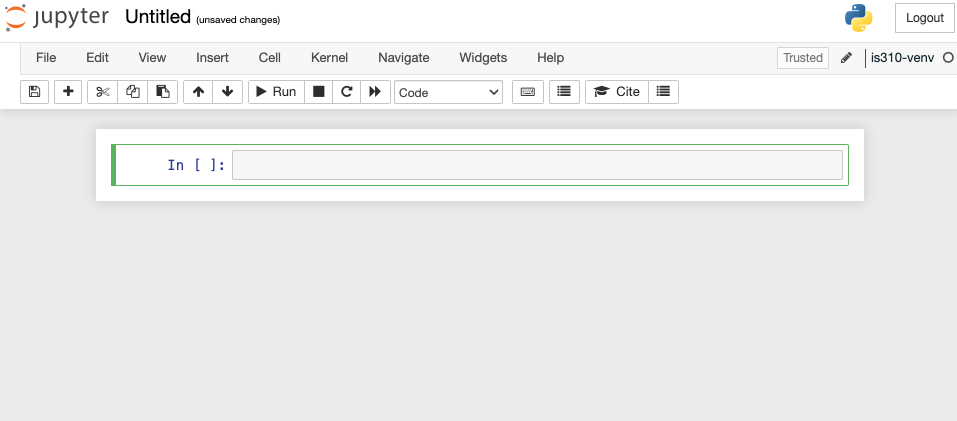{fig-align="center"}

::: {.notes}
This opens up an empty notebook. You'll notice that on the right hand side there's a box that says `Trusted` and then next to that is the name of our virtual environment. This means that our notebook is running in our virtual environment. If you want to change this, you can select the `Kernel` dropdown menu and select a different virtual environment.
:::

## Renaming & Saving Notebooks

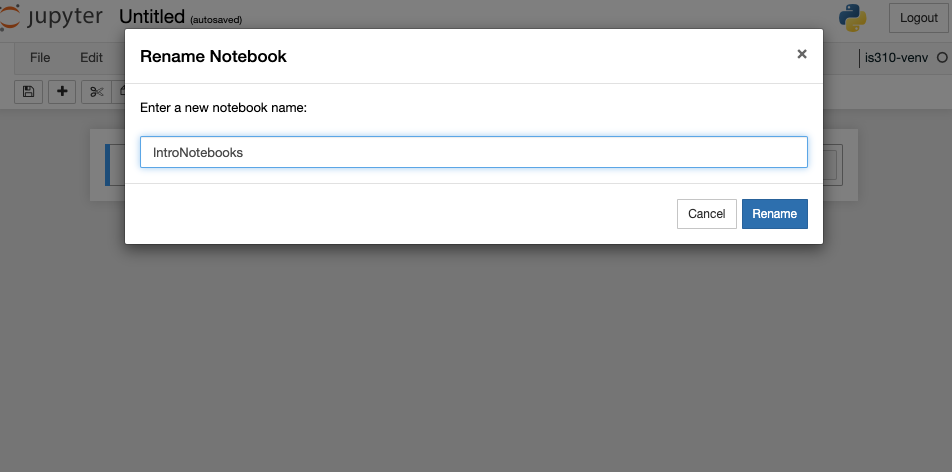{fig-align="center"}

::: {.notes}
Now currently our notebook is named `Untitled`, but if we click on that name we can rename it. I renamed my notebook `IntroNotebooks` (generally Jupyter notebooks are named using camel case, but you can name them whatever you want). Jupyter notebook autosaves your notebook, but it is always a good idea to explicitly save it, which you can do by clicking on `File` and then `Save and Checkpoint`, or by clicking the save icon in the toolbar (it is the floppy disk icon 💾).

Now when you look at your directory, you should see a new file called `IntroNotebooks.ipynb`. This is your Jupyter notebook file. Notice the extension `.ipynb` - this is the file extension for Jupyter notebooks.
:::

## Key Shortcuts

::: {.r-fit-text}
| Mac        | Jupyter Function                                                                                             | Windows       |
|:---------------------------:|:-----------------------------------------------------------------------------------------------------------:|:---------------------------:|
| `Shift` + `Return`  | Run cell  (**Both modes**)                                            | `Shift` + `Enter`     |
| `Option` + `Return`                      | Create new cell below (**Both modes**)                                          | `Alt` + `Enter`
| `B`                      | Create new cell below (**Command mode**)                                         | `B`
| `A`                      | Create new cell above (**Command mode**)                                       | `A`
| `D` + `D`                      | Delete cell (**Command mode**)                                         | `D` + `D`                    |
| `Z`                      | Undo cell action (**Command mode**)                                         | `Z`  
| `Shift` + `M`                     | Merge cells (**Command mode**)                     | `Shift` + `m`                      |
| `Control` + `Shift` + `-`                   | Split cell into two cells (**Edit mode**)   |         `Control` + `Shift` + `-`   |
| `Tab`                      | Autocomplete file/variable/function name (**Edit mode**)     | `Tab`

:::

::: {.notes}
Just like in the terminal, there are shortcuts for working with Jupyter notebooks. These shortcuts work in both Mac and Windows, with some variations in the modifier keys.
:::


## Jupyter Notebooks in VS Code

*How can we quit the Jupyter notebook server and work in VS Code instead?*

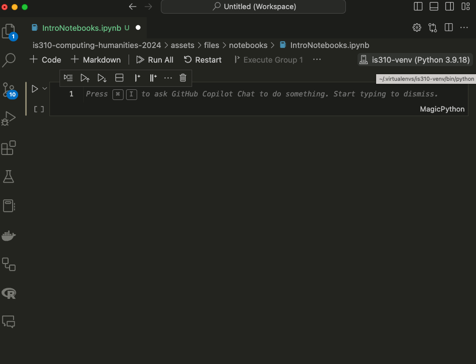{fig-align="center"}

::: {.notes}
While we can run our notebooks in the browser, we can also run them in VS Code. The benefit to running them in VS Code is that we can use the same interface for writing code and running notebooks, and we can take advantage of the other features of VS Code, such as the debugger, autocomplete, and GitHub Co-Pilot.

First, we should stop the Jupyter notebook server, which you can do by either pressing the `Quit` button on the main page or type `Ctrl`+`c` in the terminal and confirming by typing `y` and pressing `enter`. Then we can open VS Code and navigate to the directory where our notebook is located. You can either open the file only or open the entire directory.

Once you have your notebook open, you'll again see a `Select Kernel` option in the top right corner. You can select your virtual environment from this dropdown menu. And if you want, you can create a new notebook entirely in VS Code by pressing `ctrl + shift + p` and then typing `Jupyter: Create New Blank Notebook`.

And finally to save your notebook, you can press `ctrl/cmd + s` or go to `File` and then `Save`.
:::

## Writing Code & Markdown in Jupyter Notebooks

{fig-align="center"}

::: {.notes}
Now that we have our notebook, we can start writing some code. Jupyter notebooks have two types of cells: code cells and markdown cells.

Initially, the notebook will create a code cell, which is where we can write Python code. We can also change the type of cell by clicking on the cell and then selecting the type from the dropdown menu in the toolbar. We can also hover at the top or bottom of the cell and that will display a `+ Code` or `+ Markdown` button.
:::

## Writing Code & Markdown in Jupyter Notebooks

{fig-align="center"}

::: {.notes}
Let's first add our title to the notebook, by hovering at the top and selecting `+ Markdown` cell. That will create a new cell above the existing one Then type `# Introduction to Jupyter Notebooks` and press `Shift` + `Return` on a Mac or  `Shift` + `Enter` on Windows to run the cell.

Now we should see the title at the top. We can use any of the Markdown syntax we have learned so far to format our text. For example, we can use `##` for a subheading, `*` for italics, `**` for bold, and `---` for a horizontal line, etc.
:::

## Writing Code & Markdown in Jupyter Notebooks

::: {.r-fit-text}
Try pasting the following within the first cell of the Jupyter notebook. *What should we see in our Notebook?*

```python
def check_movie_release(movie):
    if movie['release_year'] < 2000:
        print(f"{movie['name']} was released before 2000")
    else:
        print(f"{movie['name']} was released after 2000")
        return movie['name']

recent_movies = []

favorite_movies =[
    {
        "name": "The Matrix IV",
        "release_year": 2022,
        "sequels": ["The Matrix I", "The Matrix II", "The Matrix III"]
    },
    {
        "name": "Star Wars IV",
        "release_year": 1977,
        "sequels": ["Star Wars V", "Star Wars VI", "Star Wars VII", "Star Wars VIII", "Star Wars IX"],
        "prequels": ["Star Wars I", "Star Wars II", "Star Wars III"]
    },
    {
        "name": "The Lord of the Rings: The Fellowship of the Ring",
        "release_year": 2001,
        "sequels": ["The Two Towers", "The Return of the King"]
    }
]

for movie in favorite_movies:
    result = check_movie_release(movie)
    if result is not None:
        recent_movies.append(result)

print(recent_movies)
```

:::

::: {.notes}

Now in a Jupyter notebook, we can still use much of the same Python syntax as our scripts. For example, going back to our [Python Refresher II: Advanced Python](../creating-curating-humanities-data/02-python-refresher-advanced), we could reuse some of the same code in this notebook (though I did add a few tweaks).

Unlike with our scripts where we would need to save our file and then type `python3 script.py`, we can just click on the cell and either press `Shift` + `Return` on a Mac or  `Shift` + `Enter` on Windows to run the cell.
:::

## Important: Notebooks Hold State

::: {.r-fit-text}
Unlike with scripts, notebooks hold variables in memory, which means that our function now exists in the notebook and we can call in a new cell.

To test this out, add a new cell below our function one by pressing the `+ Code` symbol when you hover. Then paste the following code and run it.

```python
def updated_check_movie_release(movie, released_after_year, released_before_year=2024):
    if released_after_year < movie['release_year'] and movie['release_year'] < released_before_year:
        movie['recent'] = True
    else:
        movie['recent'] = False
    return movie
```

Now we can call this function in our for-loop by updating the original code:

```python
for movie in favorite_movies:
    updated_movie = updated_check_movie_release(movie, 2020)
    if updated_movie['recent']:
        recent_movies.append(updated_movie['name'])
```
:::

::: {.notes}
Now we should see just the `The Matrix IV` in our list of recent movies. You'll notice I didn't have to move the new function above our for-loop. But what happens if I save and close, then reopen the notebook?
:::

## Important: Notebooks Hold State

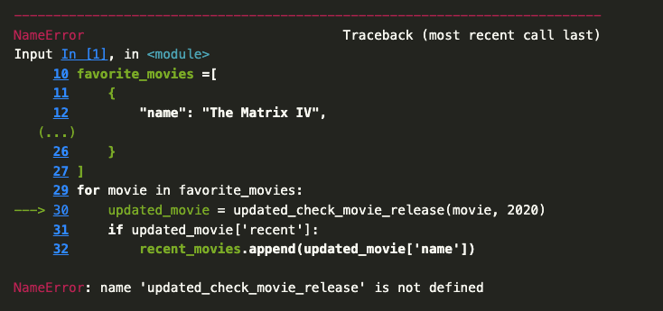{fig-align="center"}

::: {.notes}
You'll notice that we get a `NameError` when we try to run the cell. This is because the function `updated_check_movie_release` is no longer in memory. This is one of the things that makes Jupyter notebooks great to use, but easy to mess up. We can run cells in any order, which means that we can easily lose track of what's in memory. So to fix our mistake, we would need to move the updated function before we call it in the for-loop.
:::

## Introduction to Pandas

{fig-align="center"}

*The Pandas Library [https://pandas.pydata.org/docs/index.html](https://pandas.pydata.org/docs/index.html){target="_blank"}*

::: {.notes}
Jupyter notebooks are particularly useful for working with tabular data (that is data in spreadsheets), especially with the Python Library `pandas` [https://pandas.pydata.org/docs/index.html](https://pandas.pydata.org/docs/index.html). 
:::

## History of Pandas

[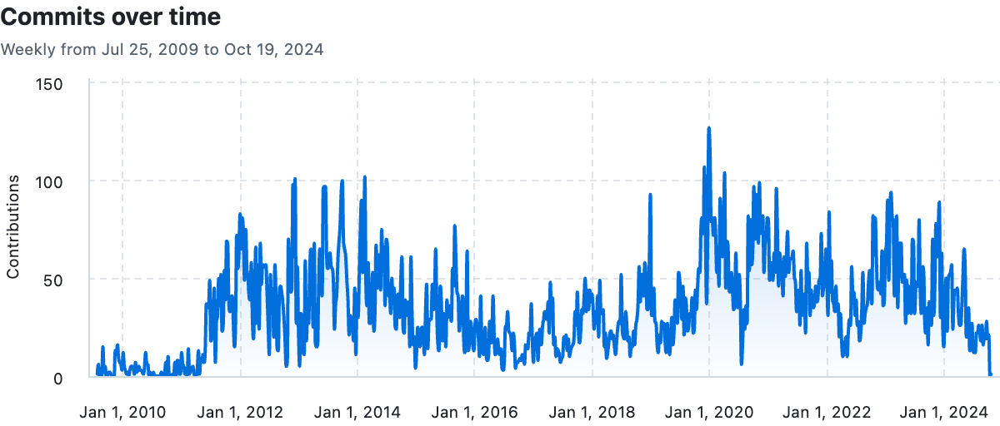](https://github.com/pandas-dev/pandas){fig-align="center" target="_blank"}

::: {.notes}
The library was started by Wes McKinney in 2008 as a tool for working with financial data, but has since become one of the most popular libraries for data analysis in Python. We can see the growth in the number of contributors to the library over the years by going to the GitHub repository [https://github.com/pandas-dev/pandas](https://github.com/pandas-dev/pandas).
:::

## History of Pandas

[](https://pandas.pydata.org/about/team.html){fig-align="center" target="_blank"}

::: {.notes}
The library also has very active documentation and we can see more about the team behind it here [https://pandas.pydata.org/about/team.html](https://pandas.pydata.org/about/team.html).
:::

## BDFL of Pandas

::: {.r-fit-text}
*Who is Wes McKinney?* 

[](https://pandas.pydata.org/about/governance.html#bdfl){fig-align="center" target="_blank"}

Highly recommend checking out his recent blog post [https://wesmckinney.com/transcripts/2026-02-10-rill-data-podcast](https://wesmckinney.com/transcripts/2026-02-10-rill-data-podcast){target="_blank"} where he talks about his vision for the future of data science.
:::

::: {.notes}
Notice that though Wes McKinney is no longer the lead developer, he is listed as the Benevolent Dictator For Life! While that's a bit of a tongue-in-cheek title, I do recommend the open-source version of McKinney's book *Python for Data Analysis* if you want to learn more about using Pandas [https://wesmckinney.com/book/](https://wesmckinney.com/book/).
:::

## Pandas Basics

First we need to install `pandas`, which we can do by visiting the documentation and following the steps under the `Getting Started` and `Installation` [https://pandas.pydata.org/docs/getting_started/install.html](https://pandas.pydata.org/docs/getting_started/install.html). 

```sh
pip install pandas
```

You're welcome to use any installation method, but I highly recommend installing into a virtual environment, and using `pip` to install [https://pandas.pydata.org/docs/getting_started/install.html#installing-from-pypi](https://pandas.pydata.org/docs/getting_started/install.html#installing-from-pypi).

## Using Pandas in Jupyter Notebooks

Now if we start to go through the tutorials in the `Getting Started` section, we can start to learn how to work with `pandas`. Specifically, this tutorial on reading and writing data with `pandas`: [https://pandas.pydata.org/docs/getting_started/intro_tutorials/02_read_write.html](https://pandas.pydata.org/docs/getting_started/intro_tutorials/02_read_write.html).

You'll notice the first line of the tutorial is the following syntax:

```python
import pandas as pd
```
*How can we check the version of Pandas?*

::: {.notes}

Remember the `as` keyword is used to give a library an alias, so that we don't have to type `pandas` each time we want to use a feature of the library. We can check that this worked, by outputting the version of Pandas, with the following:

```python
pd.__version__
```
:::

## Reading Data with Pandas

{fig-align="center"}

::: {.notes}
`pandas` is particularly powerful for reading in data from a variety of sources, including local files, remote files, and databases. It also can read in a variety of file types, including `.csv`, `.json`, `.xlsx`, and more. 
:::

## Reading Data with Pandas

[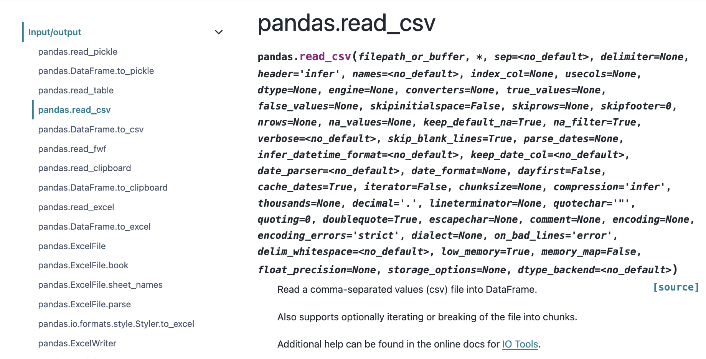](https://pandas.pydata.org/docs/reference/api/pandas.read_csv.html#pandas-read-csv){fig-align="center" target="_blank"}

::: {.notes}
In the tutorial, we can see they have the following code `titanic = pd.read_csv("data/titanic.csv")` and in the `read_csv` documentation, we can learn that the first argument to the method is the file path to the data we want to read in, specifically:

> Any valid string path is acceptable. The string could be a URL. Valid URL schemes include http, ftp, s3, gs, and file. For file URLs, a host is expected.
:::

## Reading Data with Pandas

[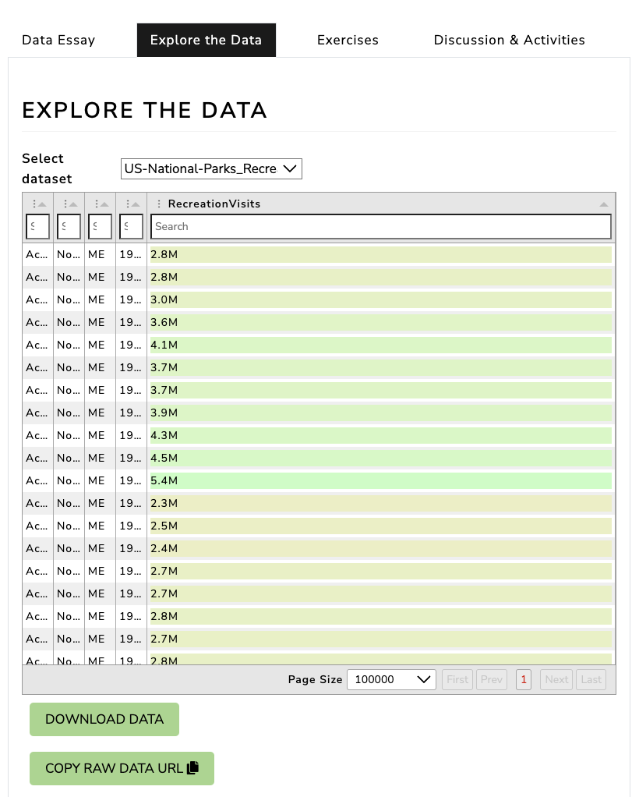 ](https://www.responsible-datasets-in-context.com/posts/np-data/?tab=explore-the-data){fig-align="center" target="_blank"}

*How could we use a remote URL to read data?*

::: {.notes}

For today's lesson, we will use the US National Parks Visit dataset. You can download the dataset from here [https://www.responsible-datasets-in-context.com/posts/np-data/?tab=explore-the-data](https://www.responsible-datasets-in-context.com/posts/np-data/?tab=explore-the-data). You'll notice you can either download the data as a `.csv` file or use the copy url option to get the remote data.
We can use either a downloaded local copy or the remote url to read the data into our notebook so that we can access the data using the built-in method from `pandas` called `read_csv()`, which we can read about here [https://pandas.pydata.org/docs/reference/api/pandas.read_csv.html#pandas-read-csv](https://pandas.pydata.org/docs/reference/api/pandas.read_csv.html#pandas-read-csv).
:::

## Read CSV with Pandas

```python
import pandas as pd

parks_data_df = pd.read_csv('https://raw.githubusercontent.com/melaniewalsh/responsible-datasets-in-context/main/datasets/national-parks/US-National-Parks_RecreationVisits_1979-2023.csv')
```

*How can we see the type of data we have in our `parks_data_df` variable?*

::: {.notes}
I named the variable holding the data `parks_data_df`, which is a common convention in data science to use the `_df` suffix to indicate that the variable is a DataFrame. I could've been a bit more expressive and named it `national_parks_visits_df`, but I wanted to keep it short for typing. You're welcome to use any naming convention you prefer, but I would recommend being consistent and using the `_df` suffix for DataFrames.

So now let's explore `parks_data_df`.

First, we can test what the variable contains by using `type(parks_data_df)`, which tells us that it is a `pandas.core.frame.DataFrame`. Notice how we aren't using the `print()` method here, but rather just typing the variable name and running the cell. That's because Jupyter notebooks will automatically print the output of the last line of a cell.

```python
type(parks_data_df)
```
:::

## What is a DataFrame?

::: {.r-fit-text}
:::: {.columns}
::: {.column width="50%"}
[](https://pandas.pydata.org/docs/reference/api/pandas.DataFrame.html#pandas.DataFrame){fig-align="center" target="_blank"}
:::
::: {.column width="50%"}


DataFrames are the primary data structures or Classes in `pandas` and are defined as:

> A DataFrame is a 2-dimensional data structure that can store data of different types (including characters, integers, floating point values, categorical data and more) in columns. It is similar to a spreadsheet, a SQL table or the data.frame in R.

*Is there a built-in Python method we could use to learn more?*
:::
::::
:::

::: {.notes}
DataFrames are the primary data structures in pandas. They are two-dimensional, meaning they have both rows and columns, and can store different types of data. Each column is essentially a Series, which is a one-dimensional data structure.

We can either visit the documentation for `DataFrame` directly here [https://pandas.pydata.org/docs/reference/api/pandas.DataFrame.html#pandas.DataFrame](https://pandas.pydata.org/docs/reference/api/pandas.DataFrame.html#pandas.DataFrame) or we can also use the Python built-in `help()` function to learn more about the DataFrame class.

```python
help(pd.DataFrame)
```
These details are very technical but we can start to get a sense that DataFrames are powerful data structures, containing both rows and columns, and that they can hold different types of data.
:::

## Exploring DataFrames

- How could we see what is in our DataFrame?
- What are some of the built-in methods we can use to explore our DataFrame? 
- How might we see the first few rows of our DataFrame?
- How might we see the number of rows and columns in our DataFrame?

## Exploring DataFrames

```python
parks_data_df.head()        # First few rows
parks_data_df.shape         # Number of rows and columns
parks_data_df.dtypes        # Data types of each column
```

::: {.notes}
These methods help you explore your data. `head()` shows the first few rows, `shape` tells you the dimensions, `dtypes` shows data types, `info()` gives a comprehensive summary, and `describe()` provides statistical summaries of numeric columns.
:::

## Pandas Data Types

::: {.r-fit-text}

| Pandas dtype | Python type | NumPy type | Usage|
|:----------:|:----------:|:----------:|:----------:|
|object | str or mixed | string_, unicode_, mixed types |Text or mixed numeric and non-numeric values |
int64 | int | int_, int8, int16, int32, int64, uint8, uint16, uint32, uint64 |  Integer numbers |
float64 | float | float_, float16, float32, float64 |Floating point numbers |
bool | bool | bool_ | True/False values |
datetime64 | NA| datetime64[ns]| Date and time values
timedelta[ns] |NA | NA | Differences between two datetimes |
category| NA| NA |Finite list of text values|

Pandas data types build from ones available in Python. This table compares Pandas to Python and another library called `numpy` (you can read more about Pandas data types here [https://pandas.pydata.org/docs/reference/arrays.html#pandas-arrays-scalars-and-data-types](https://pandas.pydata.org/docs/reference/arrays.html#pandas-arrays-scalars-and-data-types).
:::

::: {.notes}

You'll notice that some of the data types are only available in Pandas. It's important to check what data types exist in your columns, since it informs the types of data manipulation you can do with your dataset.
:::

## Exploring DataFrames

We can get an overview of our data using two additional methods: `info()` and `describe()`. The `info()` method gives us a summary of the DataFrame, including the number of non-null values in each column, while the `describe()` method gives us summary statistics for the numeric columns.

```python
parks_data_df.info()

parks_data_df.describe()
```

::: {.notes}
We can see that the `info()` method gives us a lot of useful information about our DataFrame, including the number of entries, the number of columns, the names of the columns, the number of non-null values, and the data types of each column.

We can also see that the `describe()` method gives us summary statistics for the numeric columns, including the count, mean, standard deviation, minimum, maximum, and the quartiles. Notably, we can see that the `Year` column is an integer, while the `RecreationVisits` column is a float. Because these are the only two numeric columns, they are the only ones included in the summary statistics.
:::

## Indexing & Selecting Data with Pandas

::: {.r-fit-text}
:::: {.columns}
::: {.column width="50%"}
[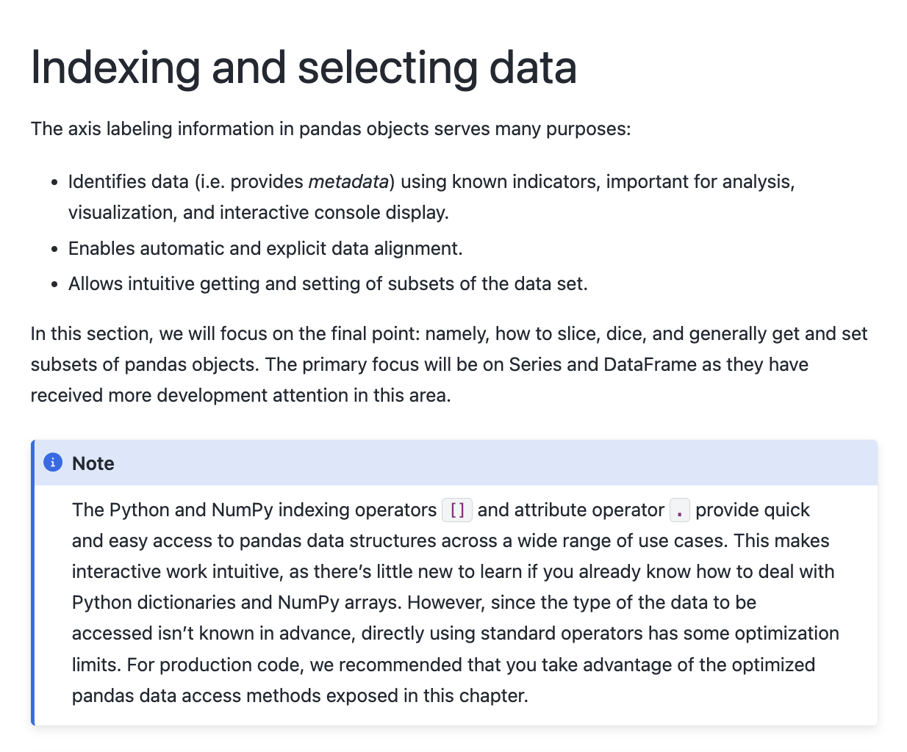](https://pandas.pydata.org/pandas-docs/stable/user_guide/indexing.html){fig-align="center" target="_blank"}
:::
::: {.column width="50%}
At a high level, we can select data using the following methods:

- **Selecting columns**: We can select a single column using a single bracket, or multiple columns using double brackets.
- **Selecting rows**: We can select rows using the `loc[]` and `iloc[]` methods.
- **Boolean indexing**: We can filter data based on conditions.
- **Setting values**: We can set values in the DataFrame using the `loc[]` method.
- **Using the `query()` method**: We can filter data using a query string.
- **Using the `filter()` method**: We can filter data based on labels.
- **Using the `at[]` and `iat[]` methods**: We can access a single value for a row/column label pair or by integer position.
:::
::::
:::

## Selecting Columns

::: {.r-fit-text}

Let's start by trying to select columns and explore the `Year` column. Try typing in one cell `parks_data_df['Year']` and then in the following cell `parks_data_df[['Year']]`. 

*What differences do you notice?*

Let's try out some examples:

- Type `parks_data_df[0:5]` in a cell and run it. What results do you get?
- Type `parks_data_df[['Year', 'Region']]` in a cell and run it. What results do you get?
:::


::: {.notes}
The difference in the output for each of these syntaxes has to do with how Pandas handles `indexing` (as a refresher, we index in Python using single square brackets).

In Pandas, using a single bracket is used to index either a single column or selected rows, and essentially refers to one dimension of the DataFrame (rather than two). Whereas two square brackets allows us to both index for a column, but then also potentially request a list of columns.
:::

## Selecting Columns

::: {.r-fit-text}
:::: {.columns}
::: {.column width="50%"}
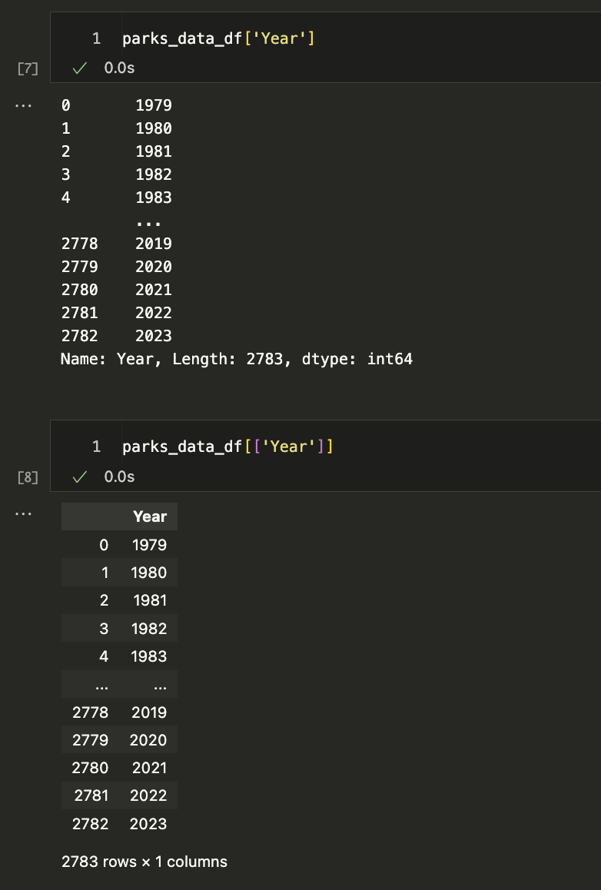
:::
::: {.column width="50%"}
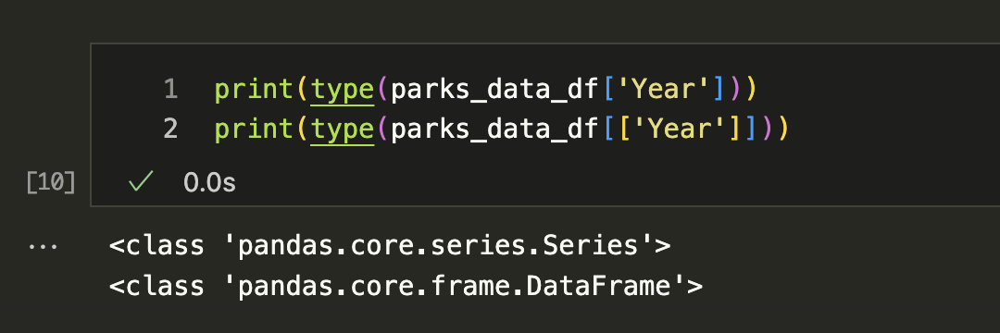
:::
::::
:::

::: {.notes}
The difference in the output for each of these syntaxes has to do with how Pandas handles `indexing` (as a refresher, we index in Python using single square brackets).

In Pandas, using a single bracket is used to index either a single column or selected rows, and essentially refers to one dimension of the DataFrame (rather than two). Whereas two square brackets allows us to both index for a column, but then also potentially request a list of columns.
:::

## Series vs DataFrame

[](https://pandas.pydata.org/docs/reference/api/pandas.Series.html#pandas-series){fig-align="center" target="_blank"}

::: {.notes}
The output here tells us that the first example is returning a class type `Series`, while the second example is returning a class type `DataFrame`. While DataFrames are two-dimensional data structures, in Pandas, Series are used to store one-dimensional data (like a column), and we can read more about them here [https://pandas.pydata.org/docs/reference/api/pandas.Series.html#pandas-series](https://pandas.pydata.org/docs/reference/api/pandas.Series.html#pandas-series).

We can see the methods that exist for `Series` are similar to those for `DataFrame`, but since Series deal with one dimension of data, some methods work slightly differently or return different types of output.
:::

## Exploring Series

*How could we get a list of all unique values in a Year column?*

Let's try the `to_list()` method, which we can read about here [https://pandas.pydata.org/docs/reference/api/pandas.Series.to_list.html](https://pandas.pydata.org/docs/reference/api/pandas.Series.to_list.html){target="_blank"}.


You should get a long list of all the values in the column as your output. However, it might be hard to tell if we have unique values. We can use the `unique()` method to see just the unique values in the column, [https://pandas.pydata.org/docs/reference/api/pandas.Series.unique.html](https://pandas.pydata.org/docs/reference/api/pandas.Series.unique.html){target="_blank"}.

## Renaming Columns

While the columns in the `parks_data_df` are capitalized, usually we try to keep column names lowercase and use underscores instead of spaces for ease of typing. *How could we rename them to be lowercased and have underscores instead of spaces?*

::: {.notes}
While the columns in the `parks_data_df` are capitalized, usually we try to keep column names lowercase and use underscores instead of spaces for ease of typing. So let's try renaming all of the columns programmatically. First, we need to get all the column names using the `columns` attribute of the `DataFrame`, which can see is an attribute in the documentation [https://pandas.pydata.org/docs/reference/api/pandas.DataFrame.columns.html](https://pandas.pydata.org/docs/reference/api/pandas.DataFrame.columns.html).

```python
parks_data_df.columns
```

Then we can use a list comprehension to create a new list of column names that are all lowercase and have underscores instead of spaces.

```python
new_column_names = [col.lower().replace(' ', '_') for col in parks_data_df.columns]
```

Finally, we can assign this new list to the `columns` attribute of the DataFrame.

```python
parks_data_df.columns = new_column_names
parks_data_df.columns
```


You'll notice that column names like `RecreationVisits` are now `recreationvisits`, which is much easier to work with but still a bit hard to read. We could use the following code

```python
import re

# We need to reload the data to reset the column names back to their original state
parks_data_df = pd.read_csv('https://raw.githubusercontent.com/melaniewalsh/responsible-datasets-in-context/main/datasets/national-parks/US-National-Parks_RecreationVisits_1979-2023.csv') # or use the local path pd.read_csv('US-National-Parks_RecreationVisits_1979-2023.csv')

# Function to split on uppercase letters and insert underscores
def split_on_uppercase(name):
    return re.sub(r'(?<!^)(?=[A-Z])', '_', name).lower()

# Apply the function to each column name
new_column_names = [split_on_uppercase(col) for col in parks_data_df.columns]
parks_data_df.columns = new_column_names
```

Now if we check the column names again, we should see that they are all lowercase and have underscores instead of spaces. However, we will only see that if we reload the original dataset, otherwise it will not work. Why is that? **Hint: Remember Jupyter Notebooks are not Python scripts!**
:::

## Filtering Data

One of the things that makes Pandas so powerful is that it allows us to filter data easily. We can filter data using boolean indexing, which allows us to select rows based on conditions, just like `if` statements in Python.

For example, if we want to filter the DataFrame to only include rows for visits to Illinois, we could select the `state` column and see how many rows have the value `IL`, we can do the following:

```python
parks_data_df[parks_data_df['state'] == 'IL']
```

## Filtering Data

Now we'll see that this gives us zero values because this dataset is only for "the current 63 National Parks administered by the United States National Park Service (NPS), from 1979 to 2023."


*How else could we have discovered this using Pandas?*

::: {.notes}
While we could've checked this map prior to filtering, we can also check the unique values in the `state` column to see what values exist.

```python
parks_data_df['state'].unique()
```

However, `unique()` only gives us the unique values in the column, but it doesn't tell us how many times each value appears.
:::

## Value Counts Method

We can use the `value_counts()` method to see how many times each value appears in the `state` column! We can read more about the method here [https://pandas.pydata.org/pandas-docs/stable/reference/api/pandas.DataFrame.value_counts.html#pandas-dataframe-value-counts](https://pandas.pydata.org/pandas-docs/stable/reference/api/pandas.DataFrame.value_counts.html#pandas-dataframe-value-counts){target="_blank"}.

```python
parks_data_df['state'].value_counts()
```

*Now what if we only wanted to include rows for a specific state?*

## Filtering Data with Boolean Indexing

```python
# Boolean indexing
parks_data_df[parks_data_df['state'] == 'CA']

# Multiple values
parks_data_df[parks_data_df['state'].isin(['CA', 'AK'])]
```

*What if we wanted to see how many rows there are for parks are in each state?*

::: {.notes}
We can filter data using boolean indexing, which allows us to select rows based on conditions just like `if` statements in Python. The `isin()` method checks if a value is in a list of values. `unique()` shows unique values in a column, and `value_counts()` shows how many times each value appears.

We could also filter for multiple states using the `isin()` method, which checks if a value is in a list of values (more info here [https://pandas.pydata.org/pandas-docs/stable/reference/api/pandas.DataFrame.isin.html#pandas.DataFrame.isin](https://pandas.pydata.org/pandas-docs/stable/reference/api/pandas.DataFrame.isin.html#pandas.DataFrame.isin)). For example, if we want to filter for both `California` and `Alaska`, we could do the following:
:::

## Grouping Data
::: {.r-fit-text}
:::: {.columns}
::: {.column width="50%"}
[](https://pandas.pydata.org/docs/user_guide/groupby.html#group-by-split-apply-combine){fig-align="center" target="_blank"}
:::
::: {.column width="50%"}
{fig-align="center"}
:::
::::
:::

::: {.notes}
To get that information, we can use the `groupby()` method, which allows us to group rows by a specific column and then perform an aggregation function on the grouped data. There's detailed documentation available here [https://pandas.pydata.org/docs/user_guide/groupby.html#group-by-split-apply-combine](https://pandas.pydata.org/docs/user_guide/groupby.html#group-by-split-apply-combine).
The above figures start to explain the logic of `groupby()`, but let's break it down further.
:::

## Grouping Data
First, we select a or multiple columns we want to group our data by. For example, in our case we could group by `state` so that we could see how many parks exist in each state.

```python
parks_data_df.groupby('state')
```

While this code works, we'll see that it only returns a `DataFrameGroupBy` object, which is not very useful on its own. To see the actual data, we could use the `get_group()` method to see the data for a specific state.

```python
parks_data_df.groupby('state').get_group('CA')
```

*How could we use groupby to count the number of parks in each state?*

## Grouping Data
```python
parks_data_df.groupby('state').size()

parks_data_df.groupby('state')['park_name'].nunique()
```

::: {.notes}
Now we see that we are getting a subset of our data! However, where `groupby()` really shines is when we want to perform a transformation on the grouped data. For example, if we want to count the number of parks in each state, we could do the following:

This code uses the `size()` method to count the number of rows in each group (you can read more about it here [https://pandas.pydata.org/pandas-docs/stable/reference/api/pandas.core.groupby.DataFrameGroupBy.size.html#pandas.core.groupby.DataFrameGroupBy.size](https://pandas.pydata.org/pandas-docs/stable/reference/api/pandas.core.groupby.DataFrameGroupBy.size.html#pandas.core.groupby.DataFrameGroupBy.size)). In this code, we're getting all the rows in the DataFrame, grouping them by the `state` column, and then counting the number of rows in each group. However, if we wanted the number of unique parks, we could use the `nunique()` method instead (you can read more about it here [https://pandas.pydata.org/pandas-docs/stable/reference/api/pandas.core.groupby.DataFrameGroupBy.nunique.html#pandas.core.groupby.DataFrameGroupBy.nunique](https://pandas.pydata.org/pandas-docs/stable/reference/api/pandas.core.groupby.DataFrameGroupBy.nunique.html#pandas.core.groupby.DataFrameGroupBy.nunique)).

While we are getting results, notice how they look slightly different than what we got when we used `size()`. This is because `nunique()` is returning a Series, while `size()` is returning a DataFrame. When you use `groupby()`, you can not only specify what columns you want to group by, but also what columns you want to aggregate, which is what we are doing with the `park_name` column.
:::

## Reseting Index

Because we are getting a Series, we can also convert it back to a DataFrame using the `reset_index()` method, which will turn the Series back into a DataFrame.

```python
parks_data_df.groupby('state')['park_name'].nunique().reset_index()
```


::: {.notes}
You'll often see `reset_index()` being used in Pandas. But what is the index? The index is a special column in Pandas that is used to identify rows. By default, Pandas assigns a unique index to each row, but we can also set our own index using the `set_index()` method. You can read more about `reset_index()` here [https://pandas.pydata.org/pandas-docs/stable/reference/api/pandas.DataFrame.reset_index.html#pandas-dataframe-reset-index](https://pandas.pydata.org/pandas-docs/stable/reference/api/pandas.DataFrame.reset_index.html#pandas-dataframe-reset-index)  and `set_index()` here [https://pandas.pydata.org/pandas-docs/stable/reference/api/pandas.DataFrame.set_index.html#pandas.DataFrame.set_index](https://pandas.pydata.org/pandas-docs/stable/reference/api/pandas.DataFrame.set_index.html#pandas.DataFrame.set_index).
:::

## Common Aggregation Methods

::: {.r-fit-text}
How could we create a new variable `parks_per_state_df` and what aggregation should we use to count the number of unique parks in each state?

| Pandas method | Explanation |
|:----------:|:----------:|
|`.count()`| Number of non-null observations|
|`.sum()`| Sum of values|
|`.mean()`| Mean of values|
|`.median()`| Median of values|
| `.min()` | Minimum value|
| `.max()`| Maximum value|
| `.mode()`| Mode|
| `.std()`| Sample standard deviation of values |
| `.describe()` | Compute set of summary statistics for Series or each DataFrame column|
| `.value_counts()` | Count unique values in a Series|
| `.nunique()` | Count unique values in a Series|
| `.size()` | Count number of rows in each group|


:::

::: {.notes}
```python
parks_per_state_df = parks_data_df.groupby('state')['park_name'].nunique().reset_index()
```

`nunique()` is just one of many methods we could use with `groupby()`. We could also use `sum()`, `mean()`, `min()`, `max()`, and more. Here's a short summary table of some of the built-in methods we can use with both Series, DataFrames, and GroupBy objects, and you can see more in the user guide here: [https://pandas.pydata.org/pandas-docs/stable/user_guide/basics.html#descriptive-statistics](https://pandas.pydata.org/pandas-docs/stable/user_guide/basics.html#descriptive-statistics).
:::

## Renaming Columns

*How could we rename the `park_name` column to `num_parks` to more accurately reflect its content?* 

More info available here [https://pandas.pydata.org/pandas-docs/stable/reference/api/pandas.DataFrame.rename.html#pandas-dataframe-rename](https://pandas.pydata.org/pandas-docs/stable/reference/api/pandas.DataFrame.rename.html#pandas-dataframe-rename){target="_blank"}.

::: {.notes}

```python
parks_per_state_df.rename(columns={'park_name': 'num_parks'})
```
Now we have a new DataFrame that contains the number of parks in each state, but you'll notice that the column names are identical to the original `parks_data_df`. That's because `groupby()` does not automatically rename the columns. So we can rename the columns to something more descriptive using the `rename()` method (more info available here [https://pandas.pydata.org/pandas-docs/stable/reference/api/pandas.DataFrame.rename.html#pandas-dataframe-rename](https://pandas.pydata.org/pandas-docs/stable/reference/api/pandas.DataFrame.rename.html#pandas-dataframe-rename)).
We can rename columns to something more descriptive. The `rename()` method takes a dictionary mapping old column names to new ones. The `inplace=True` argument modifies the DataFrame directly rather than returning a new one.
:::

## Inplace vs Not In Place

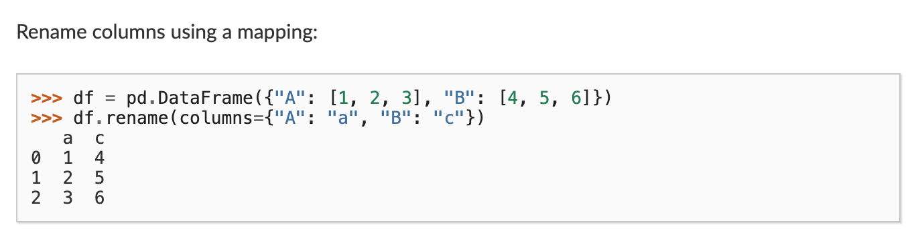

::: {.notes}

As you can see in this figure, we can use the `rename()` method, which requires passing a dictionary to the `columns` parameter, where the keys are the old column names and the values are the new column names.

```python
parks_per_state_df.rename(columns={'park_name': 'num_parks'})
```

However one issue with this code is that if we use `parks_per_state_df` in a new cell, it won't show this new column name. To save our result we need to use the `inplace` argument in rename.

```python
parks_per_state_df.rename(columns={'park_name': 'num_parks'}, inplace=True)
```
:::

## Inplace vs Not In Place

Many methods in Pandas have an `inplace` argument, which allows us to modify the DataFrame directly rather than returning a new DataFrame. For example, the `sort_values()` method also has an `inplace` argument.

```python
parks_per_state_df.sort_values(by='num_parks', ascending=False, inplace=True)
```

Now when we run this cell, `parks_per_state_df` will have the new column, and be sorted by the number of parks in descending order.

## Adding New Data

*How could we add Illinois to our DataFrame?*

::: {.notes}
Finally, so far we have been using only data from the `parks_data_df` DataFrame, but we can also add new data. For example, if we wanted to add `IL` to our DataFrame, we could do the following:

:::
## Adding New Data

```python
new_state = pd.DataFrame({'state': ['IL'], 'num_parks': [0]})
parks_per_state_df = pd.concat([parks_per_state_df, new_state], ignore_index=True)
```

*Any alternatives?*

::: {.notes}
Let's break this down. First, we create a new DataFrame called `new_state` that contains the new data we want to add. There are many ways we could create this DataFrame, but we used a dictionary where the keys are the column names and the values are lists of the data we want to add. Alternatively, we could also use a list of dictionaries, like the following:

```python
new_state = pd.DataFrame([{'state': 'IL', 'num_parks': 0}])
```

The core thing is that we are using the `DataFrame` class to create a new DataFrame, and passing in data that has the same column names as the original DataFrame. You'll notice I'm assigning `num_parks` as `0`, since we know that there are no parks in Illinois. However, we could also have used `NaN` to indicate that we don't have data for that state.
:::

## Adding New Data

```python
import numpy as np

new_state = pd.DataFrame({'state': ['IL'], 'num_parks': [np.nan]})
new_state = pd.DataFrame([{'state': 'IL', 'num_parks': None}])
```

::: {.notes}
`NaN` stands for "Not a Number" and is Pandas' way of indicating missing data. There's two ways we could create a `NaN`. We could either use the Python keyword `None` or we could use the `numpy` library, which has a built-in `nan` value. 
The choice of when to use zero or `NaN` requires thinking about how we want to use this data. In our case, `0` makes more sense since we know that there are no national parks run by NPS in Illinois.
:::

## Combining DataFrames

*How can we combine DataFrames?*

. . .

```python
combined_parks_per_state_df = pd.concat([parks_per_state_df, new_state], ignore_index=True)
```

::: {.notes}
Finally, in this code, we are using a new method, the `pd.concat()` method. This method is one of many that exist for joining two DataFrames together. The `ignore_index=True` argument tells Pandas to reset the index of the new DataFrame. We'll get more into merging and joining DataFrames in the next lesson, but for now, just understand that this method is letting us combine two DataFrames together.
:::

## Quick Exercise: Answering Questions with Pandas

::: {.r-fit-text}
In the documentation for the National Parks Dataset, Walsh and Keyes have an `Exercises` page that you can find here: [https://www.responsible-datasets-in-context.com/posts/np-data/exercises-python/NP-Data-Groupby-Pandas.html](https://www.responsible-datasets-in-context.com/posts/np-data/exercises-python/NP-Data-Groupby-Pandas.html).

In that exercise, they have three questions:

1. What is the average number of visits for each state?
2. What is the average number of visits for each National Park?
3. How many National Parks are there in each state?

:::

## Quick Exercise: Answering Questions with Pandas
::: {.r-fit-text}
Let's try and answer them together with what we have learned so far! In your `is310-coding-assignments` repository, create a new folder called `pandas-eda` and in that folder create a new Jupyter Notebook called `NationalParksEDA.ipynb`. Feel free to also move your `IntroNotebooks.ipynb` into that folder as well.

In the Notebook, you should start by adding a title in Markdown and a brief description of what you are doing. Then, you can import the necessary libraries and read in the dataset.

Then you should create a section for each question, where you can write the code to answer the question. You can use the methods we learned in this lesson, such as `groupby()`, `mean()`, and `size()`, to help you answer the questions.

To create a section, you can use the `#` symbol in Markdown to create a header. For example, you could use `## Average Number of Visits for Each State` for the first question, which would create a second-level header.
:::