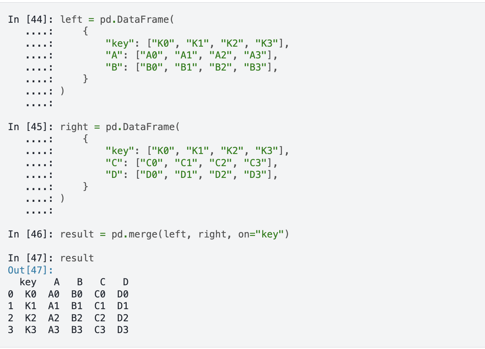
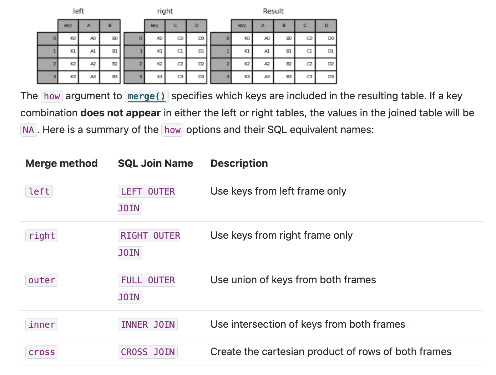
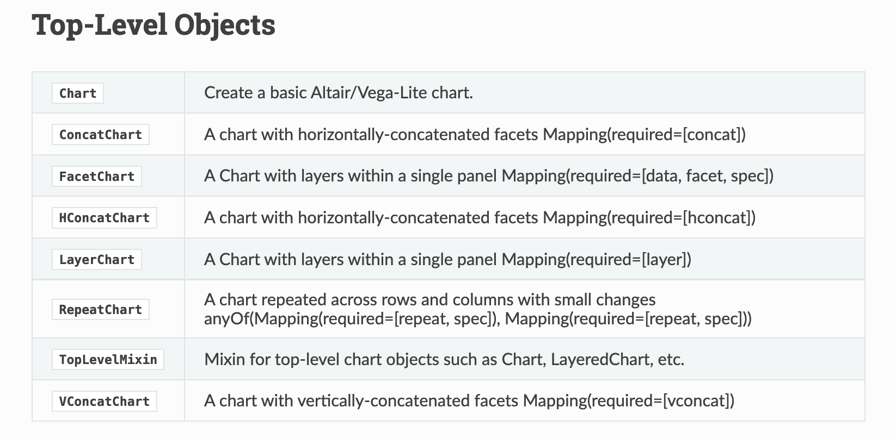
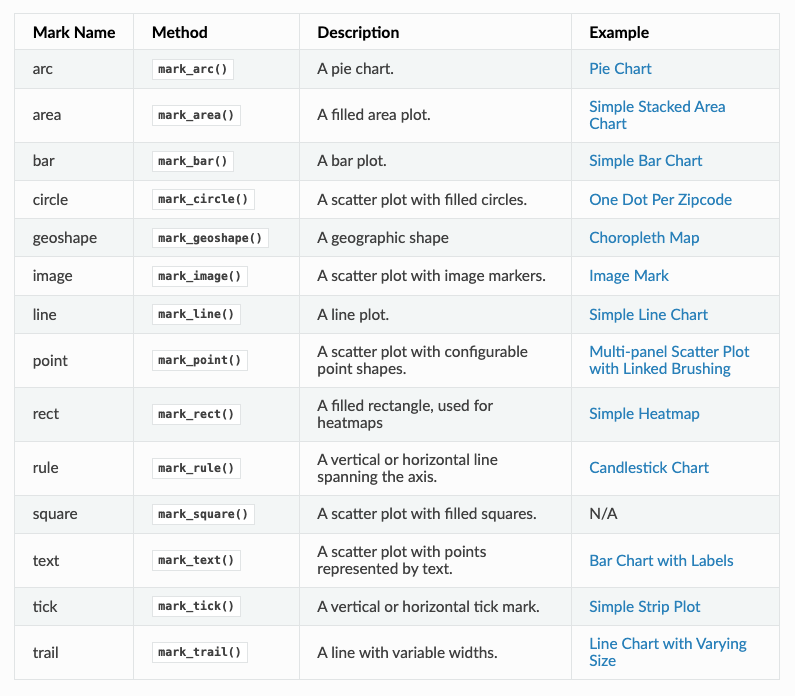
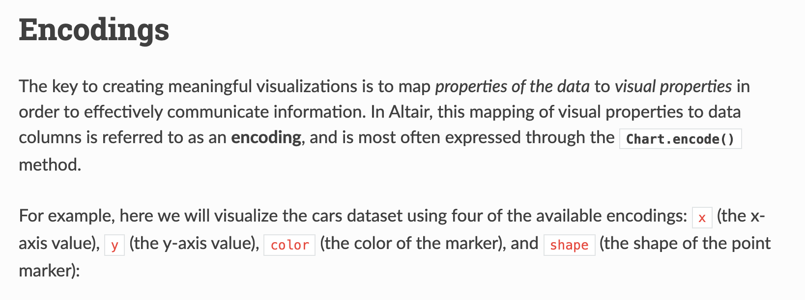

## Last Lesson Recap

In our last lesson, we tried to answer the following questions:

1. What is the average number of visits for each state?
2. What is the average number of visits for each National Park?
3. How many National Parks are there in each state?

*Anyone want to share their solutions?*

## My Solution

Here's the solution code:

```python
import re
import pandas as pd

parks_data_df = pd.read_csv('https://raw.githubusercontent.com/melaniewalsh/responsible-datasets-in-context/main/datasets/national-parks/US-National-Parks_RecreationVisits_1979-2023.csv')

def split_on_uppercase(name):
    return re.sub(r'(?<!^)(?=[A-Z])', '_', name).lower()

new_column_names = [split_on_uppercase(col) for col in parks_data_df.columns]
parks_data_df.columns = new_column_names

print(parks_data_df.groupby(['state'])['recreation_visits'].mean().reset_index())
print(parks_data_df.groupby(['park_name'])['recreation_visits'].mean().reset_index())
print(parks_data_df.groupby(['state'])['park_name'].nunique().reset_index())
```

We could store each of these in new variables, but we also want to visualize this data. That's what we're exploring today.

## A New Dataset: Top 500 Novels

[](https://www.responsible-datasets-in-context.com/posts/top-500-novels/top-500-novels.html){fig-align="center" target="_blank" width="600"}

First, we need to create a new Jupyter notebook in our `pandas-eda` folder called `Top500NovelsEDA.ipynb` and then load in the data. As a reminder, how can we **read** data in Pandas?

::: {.notes}
Rather than working with just the National Parks data, we can also start to explore the remainder of the datasets from the *Responsible Datasets in Context Project*. Specifically, let's take a look at the "Top 500 Greatest Novels" dataset by Anna Preus and Aashna Sheth.

This dataset compiles metadata about 500 novels ranked highly across multiple sources, including OCLC holdings and Goodreads ratings. It's a great example of a dataset that is part curated list and part bibliographic metadata.
:::

## Loading the Novels Data

To load the dataset, we need to look at the GitHub repository [https://github.com/melaniewalsh/responsible-datasets-in-context/tree/main/datasets/top-500-novels](https://github.com/melaniewalsh/responsible-datasets-in-context/tree/main/datasets/top-500-novels){target="_blank"} and find the raw URL for the `final_merged_dataset_no_full_text.tsv` file. Then we can use `pd.read_csv()` to load it:

```python
novels_df = pd.read_csv(
    "https://raw.githubusercontent.com/melaniewalsh/responsible-datasets-in-context/"
    "main/datasets/top-500-novels/final_merged_dataset_no_full_text.tsv",
)
```

*Why didn't this work though?*

## Tab-Separated Values & Encoding

If we run this locally, we should see the following error:
```bash
ParserError: Error tokenizing data. C error: Expected 1 fields in line 163, saw 3
```

*What is encoding?*


::: {.notes}
This error is telling us that there is an issue with the way the data is formatted. In this case, the dataset is actually a tab-separated values (TSV) file, which means that we need to specify the `sep` parameter when we read it in. Encoding errors are common when working with data, especially data that was produced by others. The reason for this is that different operating systems and software use different character encodings to represent text. When we save a file, it is encoded in a specific way, and when we open it, we need to know how it was encoded in order to read it correctly.

`ISO-8859-1` and `utf-8` are both character encodings used to represent text in computers. `ISO-8859-1`, also known as `Latin-1`, is a single-byte encoding that can represent the first 256 Unicode characters but only covers Western European languages. On the other hand, `utf-8` is far more popular because it is a variable-width character encoding that can encode all possible Unicode characters.
:::

## Revised Loading the Novels Data

In our case, we didn't need to specify the encoding, but if we did, we could have added the `encoding` parameter to our `read_csv()` method.

```python
# Import data
novels_df = pd.read_csv("https://raw.githubusercontent.com/melaniewalsh/responsible-datasets-in-context/main/datasets/top-500-novels/final_merged_dataset_no_full_text.tsv", sep="\t", encoding='utf-8')
```

## Missing Data in Pandas

```python
novels_df.info()
```

```bash
author_field_of_activity  329 non-null    object
author_occupation         458 non-null    object
```

In the last lesson, we covered how we could add null values to a DataFrame, but now we want to explore how we can work with them. Pandas has a lot of documentation for handling **missing data** that you can read here [https://pandas.pydata.org/docs/user_guide/missing_data.html](https://pandas.pydata.org/docs/user_guide/missing_data.html){target="_blank"}. For our purposes, we're mostly concerned with the `isna()` and `notna()` methods. *What does 329 non-null mean?* Let's return to the [documentation to find out](https://www.responsible-datasets-in-context.com/posts/top-500-novels/top-500-novels.html?tab=data-essay#whats-in-the-data){target="_blank"}.

::: {.notes}
The `info()` method shows us that some columns have missing values. For example, `author_field_of_activity` has 329 non-null values, which means 171 values are missing.

Why? This column comes from VIAF — the Virtual International Authority File. VIAF is a service that links authority records across libraries and institutions. Not every author in our dataset has a VIAF record, which is why some values are missing.

Pandas has a lot of documentation for handling missing data at https://pandas.pydata.org/docs/user_guide/missing_data.html.
:::

## AUTHOR_FIELD_OF_ACTIVITY

From the documentation, we can learn the following about this column:

> AUTHOR_FIELD_OF_ACTIVITY: Author's primary fields of activity, according to VIAF. VIAF includes data from multiple global partner institutions, but we only collect VIAF data associated with the Library of Congress (LOC).

## VIAF: The Virtual International Authority File

:::: {.columns}
::: {.column width="50%"}
{fig-align="center"}
:::
::: {.column width="50%"}

:::
::::

::: {.notes}
For those unfamiliar, VIAF stands for the Virtual International Authority File, which is a service that provides a way to link and share information about authors and their works across different libraries and institutions. The idea for VIAF originated in 1998 as an experiment in trying to link authority records. As a reminder, authority records are standardized records that provide information about a specific entity, such as an author or a work, like MARC records. VIAF was officially launched in 2003 and is operated by the Online Computer Library Center (OCLC) in partnership with various national libraries and institutions.

The impetus for the creation of VIAF was not just sharing information, but what LIS scholar Christine L. Borgman calls the "scaling problem in name disambiguation" in her book *Big Data, Little Data, No Data: Scholarship in the Networked World*. We've already talked about this briefly in discussing the challenges of "cleaning data", but the rise of multiple digital libraries and archives has made it increasingly difficult to accurately identify and attribute works to their correct authors, which is where projects like VIAF come in. However, as we discussed in class, there are still challenges with this system. For example, authors are not the ones who enter data into VIAF. Instead, it is often librarians or archivists who are responsible for creating and maintaining these records. This means that there can be discrepancies in how authors are represented, and it can be difficult to ensure that all works by a particular author are accurately attributed to them.
:::

## Handling Missing Values

Now knowing this background, we can start to explore which authors have missing values in this column. We can do this by using the `isna()` method to check for missing values in the `author_field_of_activity` column.

```python
novels_df[novels_df['author_field_of_activity'].isna()]
```

::: {.notes}
Here we are using the `isna()` method to **filter** our DataFrame to only show rows where the `author_field_of_activity` column is null.
:::

## Handling Missing Values

If we wanted to see only rows where the column is not null, we could use the `notna()` method instead.

```python
novels_df[novels_df['author_field_of_activity'].notna()]
```

This will give us a DataFrame with all the authors who have a field of activity listed. We could also use the `~` operator to negate the boolean values returned by `isna()`.

```python
novels_df[~novels_df['author_field_of_activity'].isna()]
```

::: {.notes}
We haven't seen the `~` operator before, but it is a common way to negate boolean values in Python. So for example, if we had a boolean variable `x` that was `True`, then `~x` would be `False`. In addition, Pandas also has `isnull()` and `notnull()` methods that can be used interchangeably with `isna()` and `notna()`.
:::

## Handling Missing Values

Finally, if we wanted to get rid of all rows in the `novels_df` DataFrame that have missing values in the `author_field_of_activity` column, we could either use our filtering logic to assign the result to a new variable or we could use the `dropna()` method.

```python
novels_df_cleaned = novels_df.dropna(subset=['author_field_of_activity'])
```

`dropna()` is a powerful method that can be used to remove missing values from a DataFrame. The `subset` parameter allows us to specify which columns we want to check for missing values. If we don't specify a subset, `dropna()` will remove any row that has a missing value in any column.

## Handling Missing Values

::: {.r-fit-text style="font-size: 0.45em"}
Here's a quick overview of the most common methods for handling missing values in Pandas:

| Pandas Method | Description | Usage |
|---------------|-------------|-------|
| `isna()`      | Boolean mask for missing values | `df.isna().sum()` to count missing |
| `notna()`     | Boolean mask for non-missing values | Inverse of `isna()` |
| `isnull()`    | Alias for `isna()` | Interchangeable with `isna()` |
| `notnull()`   | Alias for `notna()` | Interchangeable with `notna()` |
| `dropna()`    | Removes rows/columns with missing values | Use `subset=` to target columns |
| `fillna()`    | Fills missing values | Replace with a value or interpolate |
:::

::: {.notes}
Knowing how to work with missing data is important since we often have gaps when working with cultural datasets. Furthermore, it's important to know that certain methods like `groupby()` will automatically ignore missing values, so we should always check the distribution of our data before we start analyzing it.
:::

## Merging Data With Pandas

[](https://data.post45.org/){fig-align="center" target="_blank"}

::: {.notes}
Now that we are understanding how to work with missing data, we can also start to explore how to augment our dataset in various ways. One of the most common ways to do this is through **merging** datasets together.

We've already seen one approach `pd.concat()` that allows us to concatenate DataFrames (aka add them together), but now we want to focus on the `merge()` method.

First though we need another dataset to merge with our `novels_df`. We could take a look at sites like Kaggle to find more datasets, or more specific ones like the *Post45 Data Collective*, which "peer reviews and houses literary and cultural data from 1945 to the present" [https://data.post45.org/](https://data.post45.org/).
:::

## NYT Bestsellers Dataset

Let's use the one about *New York Times* Hardcover Fiction Bestsellers, 1931–2020, created by Jordan Pruett [https://data.post45.org/nyt-fiction-bestsellers-data/](https://data.post45.org/nyt-fiction-bestsellers-data/){target="_blank"}. 


::: {.notes}

According to the documentation, this dataset contains the following:

> The New York Times Hardcover Fiction Bestsellers (1931–2020) contains three related datasets. The first dataset provides a tabular representation of the hardcover fiction bestseller list of The New York Times every week between 1931 and 2020. The second dataset provides title-level data for every unique title that appeared on the hardcover fiction bestseller list during this time period. The third dataset provides HathiTrust Digital Library identifiers for every unique title that appeared on the hardcover fiction bestseller list and that also has a corresponding volume in the HathiTrust Digital Library.

> Previous research using similar data has been limited to partial segments of the list, such as the top 200 longest-running bestsellers since a certain date (Piper and Portelance, 2016) or bestsellers from only particular years (Sorenson, 2007). By contrast, this dataset covers the full list since its inception in 1931, along with each reported work's title, author(s), date of appearance, and rank.

Getting this additional dataset will allow us to explore the relationship between the *New York Times* bestsellers and the top 500 novels as recorded by OCLC.
:::

## Loading the NYT Bestsellers Data

If we click on the `Explore/download data` for the first dataset, we see a new page that has the remote url for the dataset: [https://raw.githubusercontent.com/ecds/post45-datasets/main/nyt_full.tsv](https://raw.githubusercontent.com/ecds/post45-datasets/main/nyt_full.tsv){target="_blank"}. 

```python
nyt_bestsellers_df = pd.read_csv(
    "https://raw.githubusercontent.com/ecds/post45-datasets/main/nyt_full.tsv",
    sep="\t",
    encoding='utf-8'
)
```

*How coul we explore this dataset?*

::: {.notes}
Now that we have both datasets loaded, we can start to explore them. Let's take a look at the columns in the `nyt_bestsellers_df.info()` DataFrame.

Which gives us the following output:

```bash
<class 'pandas.core.frame.DataFrame'>
RangeIndex: 60386 entries, 0 to 60385
Data columns (total 6 columns):
 #   Column    Non-Null Count  Dtype 
---  ------    --------------  ----- 
 0   year      60386 non-null  int64 
 1   week      60386 non-null  object
 2   rank      60386 non-null  int64 
 3   title_id  60386 non-null  int64 
 4   title     60386 non-null  object
 5   author    60376 non-null  object
dtypes: int64(3), object(3)
memory usage: 2.8+ MB
```

We can see that this dataset has 60386 rows and 6 columns. The columns are `year`, `week`, `rank`, `title_id`, `title`, and `author`. We can also see that the `author` column has ten missing values, but that overall, this dataset has very few null values and is much larger than the `novels_df` DataFrame.
:::

## Merging Data with Pandas

{fig-align="center"}

Pandas has built in functionality that let's us merge together DataFrames so that we can perform analysis on the combined dataset, with extensive documentation [https://pandas.pydata.org/docs/user_guide/merging.html](https://pandas.pydata.org/docs/user_guide/merging.html){target="_blank"}.

::: {.notes}
Now we can start to merge the two DataFrames together. We've mentioned merging datasets a bit when we discussed joining data in class and SQL, but now we want to dig into details. Often times when we're working with datasets, we will have our data split into multiple `csv` files or have differently shaped datasets (i.e. some of them will have more rows or columns than other datasets). While this documentation shows a number of ways to combined datasets (`concat` let's you combine datasets by stacking them on top of each other, `join` let's you combine datasets by joining them on a common index, and `merge` let's you combine datasets by joining them on a common column), we will focus on the `merge` method.

Often when working with datasets, our data is split across multiple files or has different shapes. Pandas lets us merge DataFrames together. The core method is `merge()`, which takes several key parameters:

- `left` / `right` — the DataFrames to merge
- `how` — the type of join: `left`, `right`, `inner`, or `outer`
- `on` — the column(s) to join on

There's also `concat()` which stacks DataFrames on top of each other, and `join()` which joins on the index.
:::

## Merging Syntax



::: {.notes}
If we take a look at the documentation, we see the syntax above, which shows us that in Pandas we use the `merge()` function to combine datasets. The `merge()` function takes in a number of parameters, but the most important ones are `left`, `right`, `how`, and `on`. The `left` and `right` parameters are the DataFrames we want to merge, the `how` parameter is the type of join we want to undertake, and the `on` parameter is the column we want to join the DataFrames on.
:::

## Types of Joins

{fig-align="center"}

::: {.notes}
You'll notice that we can see a description of the types of `how` parameters we can use. These are the same types of joins that we discussed in class and in SQL. The `how` parameter can be set to `left`, `right`, `outer`, or `inner`. The `left` join will return all the rows from the left DataFrame and the matching rows from the right DataFrame. The `right` join will return all the rows from the right DataFrame and the matching rows from the left DataFrame. The `outer` join will return all the rows from the left DataFrame and the right DataFrame. The `inner` join will return only the rows that match in both DataFrames.
:::

## Finding Common Columns

Now that we are starting to understand this logic, we can consider how we might merge our datasets. First, we can double check the columns in our `novels_df` and `nyt_bestsellers_df` DataFrames to see if there are any common columns we can use to merge them.

```python
novels_df.columns, nyt_bestsellers_df.columns
```

*How can we find the common columns?*

. . .

```python
set(novels_df.columns).intersection(set(nyt_bestsellers_df.columns))
```

*What happens when we merge on these two columns?*

::: {.notes}

We could eyeball the likely similar columns, but we can also use the `intersection()` method to find the common columns. `intersection()` is a built-in Python method that returns the common elements between two sets. `set()` is another built-in Python method that creates a `set object`, which is an unordered collection of unique elements (somewhat similar to `tuples`). Sets can be very useful when you want to find the **unique** elements in a list. In this case, we are using `set()` to convert the column names of both DataFrames into sets, and then using `intersection()` to find the common columns.
:::

## Attempting to Merge

```python
merged_df = novels_df.merge(nyt_bestsellers_df, how='left', on=['author', 'title'])
```

While this code should work, you'll notice if you print out the `merged_df` DataFrame that while there are new columns from the `nyt_bestsellers_df` in our `merged_df` there only `NaN` values in those columns. *Why is that?*

::: {.notes}

To figure out where we went wrong, we need to check the values in the `author` and `title` columns in both DataFrames, and specifically see if any of them exist in both DataFrames. We can do this by using the `isin()` and `nunique()` method to get the unique values in each column.

```python
shared_authors = novels_df[novels_df['author'].isin(nyt_bestsellers_df['author'])]['author'].nunique()
shared_titles = novels_df[novels_df['title'].isin(nyt_bestsellers_df['title'])]['title'].nunique()

print(f"Number of shared authors: {shared_authors}")
print(f"Number of shared titles: {shared_titles}")
```

This output tells us that while there are 122 shared authors, there are no shared titles. This is surprising, so let's investigate further. There's a number of ways we could solve this mystery, but let's first try seeing what the most prolific authors are in both datasets.
:::

## Investigating the Most Prolific Authors

```python
novels_df[novels_df['author'].isin(nyt_bestsellers_df['author'])]['author'].value_counts().head(5)
```

```python
nyt_bestsellers_df[nyt_bestsellers_df['author'].isin(novels_df['author'])]['author'].value_counts()
```

::: {.notes}

This gives us the following output:

```bash
John Grisham          19
John Steinbeck         8
Nicholas Sparks        7
Stephen King           7
Dan Brown              5
Name: author, dtype: int64
```

And now let's do the same for the `nyt_bestsellers_df` DataFrame.

This gives us the following output:

```bash
Stephen King               892
John Grisham               789
David Baldacci             396
Nicholas Sparks            390
Herman Wouk                375
```

We can see that across both datasets `Stephen King` and `John Grisham` are the most prolific authors, but we still don't know why there are no shared titles. Let's try filtering for the titles in the `novels_df` and `nyt_bestsellers_df` DataFrames.
:::

## The Problem: Title Casing

```python
novel_titles = novels_df[novels_df.author == "Stephen King"].title.unique()
nyt_titles = nyt_bestsellers_df[nyt_bestsellers_df.author == "Stephen King"].title.unique()
```

```bash
novels:  ['The Stand' 'It' 'The Shining' ...]
NYT:     ['THE SHINING' 'THE STAND' 'IT' ...]
```

::: {.notes}
We can see that King has had many bestsellers and that there is overlap in the titles. However, the titles in the `nyt_bestsellers_df` DataFrame are all uppercase, while the titles in the `novels_df` DataFrame are capitalized. This is the reason why there are no shared titles in the two DataFrames — and it's a perfect segue into talking about Pandas' built-in string methods.
:::

## String Methods in Pandas

::: {.r-fit-text style="font-size: 0.25em"}
| Pandas String Method | Explanation |
|---------------------|-------------|
| `df['column'].str.lower()` | Lowercase all values |
| `df['column'].str.upper()` | Uppercase all values |
| `df['column'].str.capitalize()` | Capitalize the first letter of each value |
| `df['column'].str.replace('old', 'new')` | Replace all instances of one string with another |
| `df['column'].str.split('delimiter')` | Split a column by a delimiter |
| `df['column'].str.strip()` | Remove leading and trailing whitespace |
| `df['column'].str.len()` | Count characters in each value |
| `df['column'].str.contains('pattern')` | Check if a column contains a pattern |
| `df['column'].str.startswith('pattern')` | Check if a column starts with a pattern |
| `df['column'].str.endswith('pattern')` | Check if a column ends with a pattern |
| `df['column'].str.count('pattern')` | Count occurrences of a pattern in each value |
| `df['column'].str.extract('pattern')` | Extract the first regex match in each value |
| `df['column'].str.findall('pattern')` | Find all regex matches in each value |

An in-depth discussion of these methods is available in the Pandas documentation [https://pandas.pydata.org/docs/user_guide/text.html](https://pandas.pydata.org/docs/user_guide/text.html){target="_blank"}.
:::

::: {.notes}
Pandas has a rich set of string methods accessible through the `.str` accessor. We've already seen `str.capitalize()` used to fix the NYT title casing. But these methods are useful any time you need to clean or analyze string columns.

Full documentation: [https://pandas.pydata.org/docs/user_guide/text.html](https://pandas.pydata.org/docs/user_guide/text.html){target="_blank"}
:::

## Fixing the Casing & Merging

```python
# Preserve original, create normalized version
nyt_bestsellers_df = nyt_bestsellers_df.rename(columns={'title': 'nyt_title'})
nyt_bestsellers_df['title'] = nyt_bestsellers_df['nyt_title'].str.capitalize()
```

If we rerun our shared titles check, we should now see some overlap:

```python
shared_titles = novels_df[novels_df['title'].isin(nyt_bestsellers_df['title'])]['title'].nunique()
print(f"Number of shared titles: {shared_titles}")
```


::: {.notes}
In our case, we can use `str.capitalize()` to fix the title casing problem in `nyt_bestsellers_df`. Notice how we first rename the original column so we don't lose it, then create a new normalized `title` column:
We rename the original `title` column first so we don't lose data, then create a normalized version. After this fix we get 12 shared titles — not many, but enough to work with.
:::

## Final Merge

```python
inner_merged_df = novels_df.merge(nyt_bestsellers_df, how='inner', on=['author', 'title'])
outer_merged_df = novels_df.merge(nyt_bestsellers_df, how='outer', on=['author', 'title'])
left_merged_df = novels_df.merge(nyt_bestsellers_df, how='left', on=['author', 'title'])
print(f"Inner merge length: {len(inner_merged_df)}")
print(f"Outer merge length: {len(outer_merged_df)}")
print(f"Left merge length: {len(left_merged_df)}")
```
This should give us the following output:

```bash
Inner merge length: 231
Outer merge length: 60876
Left merge length: 721
```
So our final merge will be the left merge, which keeps all the novels and adds NYT bestseller data where available.
```python
combined_novels_nyt_df = novels_df.merge(nyt_bestsellers_df, how='left', on=['author', 'title'])
```
::: {.notes}
The different merge types give very different row counts:
- Left (721): all 500 novels, some repeated for multiple NYT appearances
- Inner (231): only novels that appeared on both lists
- Outer (60876): everything from both datasets

We'll use the left merge so we keep the full novels dataset.
:::

## The Full Combined Dataset

::: {.r-fit-text}
Now that we have our combined DataFrame, we also want to bring in the full text of each novel so we can start to explore the text data directly. I've included a pre-built version of the combined dataset that has the scraped and cleaned Project Gutenberg texts, plus pre-computed word and pronoun counts, which you can download from Canvas. You can read about the process of creating it [here](../materials/interpreting-communicating-humanities-data/02-eda-data-viz-final.html#additional-notes){target="_blank"}.

The pre-built dataset includes:

- All novel metadata (genre, author, publication year, ratings, etc.)
- NYT bestseller columns where matched
- Pre-computed columns: `word_counts`, `he_counts`, `she_counts`, `they_counts`

In the rest of this lesson, I will be working with the fully run dataset that includes the text data and pre-computed columns, but you can also follow along with the smaller viz-only dataset if you want to keep things fast.
:::

::: {.notes}
The full dataset (152 MB) includes the scraped Project Gutenberg texts for each novel. For the lesson page we use a smaller viz-only CSV that has the metadata and pre-computed columns — no raw text. This keeps the page fast to load.
:::

## Counting Characters and Words

The simplest measure of a text is its length. We can count the number of characters in each novel using `str.len()`:

```python
combined_novels_nyt_df['novel_length_chars'] = combined_novels_nyt_df['eng_text'].str.len()
combined_novels_nyt_df[['title', 'author', 'novel_length_chars']].sort_values('novel_length_chars', ascending=False).head(10)
```

To get a more useful **word count**, we can split the text on spaces and count the resulting list:

```python
combined_novels_nyt_df['novel_length_words'] = combined_novels_nyt_df['eng_text'].str.split().str.len()
combined_novels_nyt_df[['title', 'author', 'novel_length_words']].sort_values('novel_length_words', ascending=False).head(10)
```

## Searching for Patterns With `str.contains()`

`str.contains()` checks whether each value in a column matches a given pattern. This is useful for filtering rows, counting occurrences, or finding subsets of a dataset. For example, how many of the novels in our dataset include the word "war" in their `genre` field?

```python
combined_novels_nyt_df[combined_novels_nyt_df['genre'].str.contains('war', case=False, na=False)][['title', 'author', 'genre']]
```

::: {.notes}
The `case=False` argument makes the search case-insensitive, and `na=False` tells Pandas to treat missing values as non-matches rather than raising an error.
:::

## How did we generate the counts columns?

We can also use `str.contains()` on the text column itself. For example, let's count how many novels contain the word "she" at all:

```python
combined_novels_nyt_df['mentions_she'] = combined_novels_nyt_df['eng_text'].str.contains(r'\bshe\b', case=False, na=False)
combined_novels_nyt_df['mentions_she'].value_counts()
```

Here we use a **regex** pattern `\bshe\b` — the `\b` characters are "word boundaries" that ensure we match the standalone word "she" rather than the letters inside words like "sheer" or "fisherman."

*Next week will cover more advanced text analysis techniques.*

## Counting Occurrences With `str.count()`

Rather than just knowing *whether* a word appears, `str.count()` tells us *how many times* it appears. This is especially useful for comparing word frequencies across documents. Let's count pronouns to start exploring gender representation across our novels:

```python
combined_novels_nyt_df['he_counts'] = combined_novels_nyt_df['eng_text'].str.count(r'\bhe\b')
combined_novels_nyt_df['she_counts'] = combined_novels_nyt_df['eng_text'].str.count(r'\bshe\b')
combined_novels_nyt_df['they_counts'] = combined_novels_nyt_df['eng_text'].str.count(r'\bthey\b')

combined_novels_nyt_df[['title', 'author', 'genre', 'he_counts', 'she_counts', 'they_counts']].head(10)
```

::: {.notes}
You'll notice that `he` tends to be much more frequent than the other two pronouns. Now this might be because of the novels we have in our dataset, but it could also be a reflection of the texts themselves. This kind of question is exactly what EDA is for!
:::

## Extracting Information With `str.extract()`

`str.extract()` uses a regular expression to pull specific pieces of text out of a string. For example, each of our Project Gutenberg URLs follows a consistent pattern — we could extract the book ID number from it:

```python
combined_novels_nyt_df['pg_book_id'] = combined_novels_nyt_df['pg_eng_url'].str.extract(r'/epub/(\d+)/')
combined_novels_nyt_df[['title', 'pg_eng_url', 'pg_book_id']].head(5)
```

::: {.notes}
The pattern `(\d+)` matches one or more digits, and the parentheses tell `str.extract()` to return that matched group. This kind of extraction is useful any time you have structured information embedded in a string column — for example, extracting years from date strings, or domain names from URLs.

Pandas string methods are great for simple pattern matching, but they treat text as a raw sequence of characters. In the next lesson, we'll move into **tokenization** — the process of breaking text into meaningful linguistic units — which gives us more powerful tools for things like counting actual word forms, handling punctuation, and comparing texts across genres.
:::


## Exploratory Data Analysis

[](https://programminghistorian.org/en/lessons/sentiment-analysis){fig-align="center" target="_blank"}

::: {.notes}
Since we are working with datasets with significant documentation, we have a fairly good sense of what is in these datasets. However, often you will be working with datasets that are less documented, and so it is important to understand how to explore them. This process is often called *Exploratory Data Analysis*.
:::

## John W. Tukey & The History of EDA

:::: {.columns}
::: {.column width="50%" .r-fit-text}
[](https://projecteuclid.org/download/pdf_1/euclid.aoms/1177704711){fig-align="center" target="_blank"}
:::
::: {.column width="50%" .r-fit-text style="font-size: 0.45em"}
In the paper, Tukey writes:

> For a long time I have thought I was a statistician, interested in inferences from the particular to the general. But as I have watched mathematical statistics evolve, I have had cause to wonder and to doubt. [...] All in all, I have come to feel that my central interest is in *data analysis*, which I take to include, among other things: procedures for analyzing data, techniques for interpreting the results of such procedures, ways of planning the gathering of data to make its analysis easier, more precise or more accurate, and all the machinery and results of (mathematical) statistics which apply to analyzing data.
:::
::::

::: {.notes}
You've likely heard this term before, but let's historically contextualize this idea. The term *Exploratory Data Analysis* (EDA) was popularized by John W. Tukey, one of the most famous statisticians and mathematicians of the 20th century. Tukey was one of the first to formally define the concept of data analysis in 1962 paper titled "The Future of Data Analysis."

Such a framing might seem straightforward today in the age of Data Science, but at the time it was a radical shift for how we thought about working with data.
:::

## Bell Labs

{fig-align="center"}

::: {.notes}

You'll notice in that image from the paper, which you can download [here](https://projecteuclid.org/download/pdf_1/euclid.aoms/1177704711) if you're curious, that Tukey was affiliated with Princeton University and Bell Telephone Laboratories when he published the paper. Both of these were key institutions in the development of modern computing and statistics. For example, if you've heard of Alan Turing or Claude Shannon, they were also affiliated with Bell Labs, and Tukey worked with both of them, especially during World War II.

This infographic gives a sense of some of the inventions and discoveries that happened at Bell Labs, which was one of the most important research and development organizations in the 20th century. In the case of Tukey, he's credited not just with exploratory data analysis but also coining both the terms `bit`, a portmanteau of binary digit, and `software` in 1958. Tukey was a very eclectic scholar, and worked on everything from developing better sampling methods after reviewing the [Kinsey report](https://en.wikipedia.org/wiki/Kinsey_Reports), which was a landmark study of human sexuality released in two books in 1948 and 1953, to developing better methods for election polling.
:::

## Tukey's Principles of EDA

{fig-align="center"}

::: {.notes}
His central thoughts on EDA became the basis for his 1977 book *Exploratory Data Analysis*, where he argued that EDA could help suggest hypotheses that could be then tested statistically.

Such a shift might again seem obvious today, but at the time most statisticians focused on "confirmatory data analysis", that is testing a hypothesis statistically rather than exploring the data first to see what might be possible. Tukey's innovation helped set the groundwork for a lot of modern data science, where we tend to be closer to detectives trying to look for clues rather than approaching data with firm assumptions about what it represents.

While there are not firm principles for EDA, Tukey argued that it should cover the following concepts:

- understanding the data's underlying structure and extracting important variables
- detecting outliers and anomalies
- and testing underlying assumptions through visualizations, statistics, and other methods, without initially focusing on formal modeling or hypothesis testing. This approach differs with traditional hypothesis-driven analyses, promoting a more flexible and intuitive investigation into the data.
:::
## EDA With Pandas: The Toolkit

::: {.r-fit-text}
How Pandas helps us implement Tukey's principles of EDA:

1. **Explore structure** — `head()`, `tail()`, `sample()`, `.shape`, `.dtypes`
2. **Summarize** — `describe()`
3. **Sort & rank** — `sort_values()`, `nsmallest()`, `nlargest()`
4. **Check missing** — `isna().any()`, `isna().sum()`
5. **Visualize** — `plot()`
:::

::: {.notes}
Tukey argued EDA should cover: understanding the data's underlying structure, detecting outliers and anomalies, and testing underlying assumptions through visualizations and statistics — without initially focusing on formal modeling.

With Pandas we can implement these systematically:

```python
combined_novels_nyt_df.dtypes          # data types
combined_novels_nyt_df.describe()      # summary statistics
combined_novels_nyt_df.sort_values('year')  # sorted view
combined_novels_nyt_df.isna().any()    # any missing values?
```
:::

## Visualizing Data With Pandas

[](https://pandas.pydata.org/pandas-docs/stable/reference/api/pandas.DataFrame.plot.html){fig-align="center" target="_blank"}

::: {.notes}

Now that we have a sense of the distribution of our data, we can start to visualize it to see if we can answer our questions.

:::

## Matplotlib & Plots

::: {.r-fit-text}
`plot` is built into Pandas and is a wrapper around the `matplotlib` library [https://matplotlib.org/](https://matplotlib.org/){target="_blank"}, one of the most popular Python libraries for data visualization. The documentation lists the kinds of plots we can create:

- 'line' : line plot (default)
- 'bar' : vertical bar plot
- 'barh' : horizontal bar plot
- 'hist' : histogram
- 'box' : boxplot
- 'kde' : Kernel Density Estimation plot
- 'density' : same as 'kde'
- 'area' : area plot
- 'pie' : pie plot
- 'scatter' : scatter plot (DataFrame only)
- 'hexbin' : hexbin plot (DataFrame only)
:::
::: {.notes}
Pandas also has a robust User Guide on how to plot here [https://pandas.pydata.org/pandas-docs/stable/user_guide/visualization.html](https://pandas.pydata.org/pandas-docs/stable/user_guide/visualization.html){target="_blank"}.
:::

## How to Visualize Our Data?

*What if we wanted to create a scatter plot looking at the relationship between the `pub_year` and `top_500_rank` columns? How can we create this graph?*


::: {.notes}
```python
combined_novels_nyt_df.plot(kind='scatter', x='pub_year', y='top_500_rank')
```
:::

## How to Visualize Our Data?

*What if we wanted to explore the relationship between `genre` and the average `top_500_rank` for each genre? How can we create this graph?*


::: {.notes}
```python
combined_novels_nyt_df.groupby('genre')['top_500_rank'].mean().plot(kind='bar')
```
Now that we are starting to see how we can visualize our data, we need to start thinking more deeply about what questions might be of interest to us and how the shape of this data influences how we can answer these questions.
:::

## "Cleaning" Data With Pandas

As we've discussed previously, `cleaning` data is core part of working with data but also one that tends to get overlooked or rarely foregrounded, even though it is extremely important for any interpretation. In our current example, we've already started to clean our data by merging the DataFrames together and transforming the data to make it more amenable to analysis. We might also want to subset the data, since as we can see above not every book has a genre:

```python
subset_combined_novels_nyt_df = combined_novels_nyt_df[combined_novels_nyt_df.genre.notna()]
```

## Cleaning Data: GIGO

[](https://www.atlasobscura.com/articles/is-this-the-first-time-anyone-printed-garbage-in-garbage-out){fig-align="center" target="_blank" width="400"}

::: {.notes}
As we discussed in class, a lot of what motivates this "cleaning", whether that means normalizing distributions, removing null values, and even transforming some of the data to standardize it, is the concept of **GIGO**.

GIGO stands for "Garbage In, Garbage Out" and the term has been used for decades in computing to refer to when data entry errors would produce faulty results. Rob Stenson has a great  post exploring the history of the term all the way back to Charles Babbage, one of the first inventors of the computer, [https://www.atlasobscura.com/articles/is-this-the-first-time-anyone-printed-garbage-in-garbage-out](https://www.atlasobscura.com/articles/is-this-the-first-time-anyone-printed-garbage-in-garbage-out).

GIGO is important because it essentially means that the quality of your data analysis is always dependent on the quality of your data.

However, for as much as we want to prioritize quality, what are some of the downsides or tradeoffs of cleaning data? Some potential considerations include:

- losing the specificity of the original data (especially a danger for historic data but also for data collected by certain institutions)
- privileging computational power over data quality or accuracy
- releasing datasets publicly without documenting these changes

This list is by no means exhaustive! But number one thing to remember with datasets is that **the act of collecting data is in of itself an interpretation**. And so cleaning data adds another layer of interpretation (sometimes many layers) to the dataset, which is why its crucial to keep a record of how you transform your data.

It is also important to realize that even with cleaning you will never have a *perfect* dataset and to remember that this is often an *iterative process* and not a one time thing. You will likely need to re-transform your data many times depending on your methods.

One best practice is to save multiple versions of your dataset as `csv` files, so that you don't either overwrite your original data or have to rerun previous transformations. Remember that with Pandas we can read and write `csv` files using `pd.read_csv()` and `{name of your dataframe}.to_csv()`.
:::

## Types of Data

{fig-align="center"}

::: {.notes}

In addition to thinking about our choices, it is also important to think about the types of data we are working with.

Data broadly divides into qualitative (categorical) and quantitative (numerical) types. These map loosely onto Pandas dtypes but go beyond them.

This graph outlines the main types of data you might encounter, which largely breaks down between qualitative (categorical) or quantitative (numerical). Now these data types somewhat overlap with our `.dtypes` in Pandas, but they also go beyond. For example, what in our dataset might be `Nominal` versus `Ordinal`, or `Discrete` versus `Continuous`? To help answer this question, we are going to explore data visualization more in depth with the Python library `Altair`.
:::

## Data Visualization in Python

:::: {.columns}
::: {.column width="50%"}

:::
::: {.column width="50%"}

:::
::::

::: {.notes}
Up to now we've been using Pandas built in `plot` methods to display our data. While this is helpful for quick analyses, you'll likely want more options for both how you visualize the data and interact with it.
As you can see in these graphics, in Python, there are a number of visualization libraries, including `Matplotlib`, `Seaborn`, and `Plotly` that have extensive communities and documentation. 
:::
## Data Visualization With Altair

[](https://altair-viz.github.io/index.html){fig-align="center" target="_blank"}

::: {.notes}
Today we're going to focus on [Vega-Altair](https://altair-viz.github.io/index.html), which is a Python library built on top of Vega and Vega-Lite - two visualization libraries for JavaScript. Previously, this library was known as just `Altair` so for brevity in this lesson we will refer to it as such. The library was started in 2016 by Jake VanderPlas and has since grown to be one of the most popular libraries for data visualization in Python.
:::

## Installing Altair

Remember to activate your virtual environment!

```sh
pip install "altair[all]"
```

::: {.notes}
Notice that this time when installing we have a slightly new syntax: `[all]`. This syntax just means that we will be installing all of Altair's dependencies **and** optional dependencies.
:::

## Using Altair

Now we can try out Altair with one of the built-in datasets

```python
import altair as alt
from altair.datasets import data

source = data.cars()

alt.Chart(source).mark_circle(size=60).encode(
    x='Horsepower',
    y='Miles_per_Gallon',
    color='Origin',
    tooltip=['Name', 'Origin', 'Horsepower', 'Miles_per_Gallon']
)
```

::: {.notes}
Because we are using Altair in a Jupyter Notebook we also need to add a few settings (you read more about this here [https://altair-viz.github.io/user_guide/display_frontends.html#](https://altair-viz.github.io/user_guide/display_frontends.html#)).

If you are running your Notebook in the browser, you can run the following after you import Altair (more info here [https://altair-viz.github.io/user_guide/display_frontends.html#displaying-in-jupyter-notebook](https://altair-viz.github.io/user_guide/display_frontends.html#displaying-in-jupyter-notebook)):

```python
# Optional in Jupyter Notebook: requires an up-to-date vega nbextension.
# alt.renderers.enable('notebook')
```

If you are running it in VS Code, you can run the following (more info here [https://altair-viz.github.io/user_guide/display_frontends.html#displaying-in-vscode](https://altair-viz.github.io/user_guide/display_frontends.html#displaying-in-vscode)):

```python
# Optional in VS Code
# alt.renderers.enable('mimetype')
```

If you don't see the graph and you're running your Jupyter notebook in the browser, you might need to set the kernel of your notebook [https://stackoverflow.com/questions/47295871/is-there-a-way-to-use-pipenv-with-jupyter-notebook](https://stackoverflow.com/questions/47295871/is-there-a-way-to-use-pipenv-with-jupyter-notebook) or set the vega extension with following:

```sh
jupyter nbextension install --sys-prefix --py vega
```

:::

## Altair Class

[](https://altair-viz.github.io/user_guide/generated/toplevel/altair.Chart.html#altair.Chart){fig-align="center" target="_blank"}

::: {.notes}
First we are specifying a new [`Chart` class](https://altair-viz.github.io/user_guide/generated/toplevel/altair.Chart.html#altair.Chart). In Altair, there are a number of Chart types that we'll delve into later but it essentially is the basic class we'll be working with (more information here [https://altair-viz.github.io/user_guide/api.html#top-level-objects](https://altair-viz.github.io/user_guide/api.html#top-level-objects)).
:::

## Altair Marks

[](https://altair-viz.github.io/user_guide/marks/index.html){fig-align="center" target="_blank"}

::: {.notes}

We pass our data to the `Chart` and then specify the type of `mark` we are using (in our case we are using `mark_point()` to make points). In Altair, we can use all types of marks to represent our data [https://altair-viz.github.io/user_guide/marks/index.html](https://altair-viz.github.io/user_guide/marks/index.html).
:::

## Altair Encodings

:::: {.columns}
::: {.column width="50%"}
[](https://altair-viz.github.io/user_guide/encodings/index.html){fig-align="center" target="_blank"}
:::
::: {.column width="50%"}
[](https://altair-viz.github.io/user_guide/encodings/index.html#data-types){fig-align="center" target="_blank"}
:::
::::

::: {.notes}
Finally, we specify the `encoding` of our graph, which is how we map our data to visual properties. In our example, we are encoding `Horsepower` to the x-axis, `Miles_per_Gallon` to the y-axis, and `Origin` to the color of the points. We are also adding a `tooltip` encoding that allows us to see more information about each point when we hover over it.
:::

## Trying It Out

Now that we understand a bit of Altair's syntax, let's try to recreated our `genre` by average `top_500_rank` plot that we made previously. To do this, we don't have to do `groupby`, instead Altair can handle most of the logic for us:

```python
alt.Chart(combined_novels_nyt_df[['genre', 'top_500_rank']]).mark_bar().encode(
	x="genre:N",
	y="mean(top_500_rank):Q",
)
```

You can read more about aggregation here [https://altair-viz.github.io/user_guide/transform/aggregate.html#aggregation-functions](https://altair-viz.github.io/user_guide/transform/aggregate.html#aggregation-functions){target="_blank"}.

::: {.notes}

We can see that some of the syntax is similar to the initial example. We are passing in our DataFrame to the `Chart` class, calling the `mark_bar` method, and then encoding the `x` and `y` axis. But some of this syntax is also new.

For instance, we are specifying the `encodings` using the `N` for nominal and `Q` for quantitative. We are also using an `aggregate` function to calculate the `mean`.

You can also see links to examples using these aggregations here [https://altair-viz.github.io/user_guide/encodings/index.html#aggregation-functions](https://altair-viz.github.io/user_guide/encodings/index.html#aggregation-functions).

While it's great we can recreate this plot, what's the point exactly? After all we can do this in `plot` without having to use another library. 

The value of using a library like Altair is that it is built to implement the idea of a `Grammar of Graphics`. 
:::

## The Grammar of Graphics

:::: {.columns}
::: {.column width="50%"}
{fig-align="center"}
:::
::: {.column width="50%" .r-fit-text}
In *The Grammar of Graphics*, every visualization is built using the following core components:

1. Data: The dataset that you want to visualize.
2. Mappings: How the data variables map to visual properties like axes, colors, or sizes.
3. Geometries (Marks): The basic shapes used to represent the data, such as points, lines, bars, etc.
4. Statistical transformations: Aggregations or transformations applied to the data, such as grouping, counting, or averaging.
5. Scales: How data values are translated into visual values, like positioning on the x- or y-axis.
6. Coordinates: The coordinate system used, such as Cartesian or polar coordinates.
7. Faceting: How the data is split into different panels or sections to show comparisons.
:::
::::

::: {.notes}
*The Grammar of Graphics* is both a concept and book published in 1999 by Leland Wilkinson, a statistician and computer scientist. Wilkinson developed this idea from his experience in developing SYSTAT, a statistical software package he founded in 1983, where he saw the need for a more structured and flexible framework for data visualization.

Wilkinson's grammar aimed to define a set of rules or components that could describe any kind of statistical graphic, from simple bar charts to complex scatter plots and heatmaps. By breaking down graphics into fundamental elements (like data, geometries, and scales), his grammar provides a way to think of visualizations as composable and modular—allowing users to understand and generate diverse charts based on clear principles. Wilkinson's ideas have influenced many modern visualization tools and libraries like `ggplot2` in R, as well as Altair.

Altair is built around these principles, making it easier to create clear and interpretable visualizations by specifying each component in your code. This approach is not only flexible but also emphasizes transparency, helping you understand how your data is represented visually. It's also more extensible, allowing for more complex and interactive visualizations, such as linked plots or selections, which would be difficult to achieve with simpler plotting libraries.

By embracing the Grammar of Graphics, Altair enables you to think more abstractly about the relationship between data and visualization, offering a consistent, rule-based system to produce a wide variety of visual outputs.
:::


## Adding Color, Tooltip & Title

*What is this code visualizing?*

```python
alt.Chart(combined_novels_nyt_df[['genre', 'top_500_rank', 'title']]).mark_bar().encode(
    x="genre:N",
    y="count():Q",
    color=alt.Color("top_500_rank:Q", scale=alt.Scale(scheme="viridis")),
    tooltip=["genre:N", "count():Q", "top_500_rank:Q", "title"]
).properties(
    title="Top 500 Novels by Genre",
    width=600,
    height=400
)
```

::: {.notes}
Let's try out some of Altair's more advanced functionality to see how it implements this Grammar of Graphics.

For example, we could rather than looking at the relationship between `genre` and average `top 500 rank`, instead look at the relationship between book titles, genre, and that rank with the following code:

We can add several new encodings:
- `color` — encode a third variable visually
- `tooltip` — show values on hover
- `properties()` — set title, width, height

`alt.Color()` lets us customize the color scale — here we're using the "viridis" color scheme, which is perceptually uniform and colorblind-friendly.

We can also use Altair to visualize the pronoun counts we calculated earlier. To do this we need to reshape our data using a **melt** operation:
:::

## Pronoun Counts by Genre

*How could we visualize if certain genres more likely to use particular pronouns? What columns would we pass to Altair as encodings?*

. . .

Let's explore this code!

```python
melted_df = pd.melt(
    combined_novels_nyt_df,
    id_vars=['title', 'author', 'pub_year', 'genre'],
    value_vars=['he_count', 'she_count', 'they_count'],
    var_name='pronoun',
    value_name='pronoun_count'
).assign(pronoun=lambda df: df['pronoun'].str.replace('_count', ''))
```

## Reshaping Data With Pandas

{fig-align="center"}

::: {.notes}

Melting in Pandas is a way to reshape your data from wide to long, since sometimes you want to look at the relationship between multiple columns. In this case, we are melting the `they_counts`, `she_counts`, and `he_counts` columns into a single long-form DataFrame with the pronoun name in one column and the count in another. A "wide" DataFrame has one column per pronoun (`he_count`, `she_count`, `they_count`). A "long" DataFrame has one row per pronoun-novel combination, with a `pronoun` column and a `count` column. Altair works much better with long-form data.

`pd.melt()` transforms a wide DataFrame into a long one. Key parameters:

- `id_vars` — columns to keep as-is (they identify the row)
- `value_vars` — columns to "melt" into rows
- `var_name` — name for the new column that holds the old column names
- `value_name` — name for the new column that holds the values

This is one of the most useful reshaping operations in Pandas. You'll also encounter `pivot()` and `pivot_table()` which do the reverse. More at: https://pandas.pydata.org/docs/user_guide/reshaping.html
:::

## Putting It All Together

```python
import pandas as pd
import altair as alt
melted_df = pd.melt(
    combined_novels_nyt_df,
    id_vars=['title', 'author', 'pub_year', 'genre'],
    value_vars=['he_counts', 'she_counts', 'they_counts'],
    var_name='pronoun',
    value_name='pronoun_count'
).assign(pronoun=lambda df: df['pronoun'].str.replace('_count', ''))

selection = alt.selection_point(fields=['pronoun'], bind='legend')

alt.Chart(melted_df[melted_df['genre'].notna()][['genre', 'pronoun', 'pronoun_count']]).mark_bar().encode(
    x=alt.X('genre:N', title='Genre', sort='-y'),
    y=alt.Y('sum(pronoun_count):Q', title='Total Pronoun Count'),
    color=alt.Color('pronoun:N', title='Pronoun'),
    opacity=alt.condition(selection, alt.value(1), alt.value(0.2)),
    tooltip=[
        alt.Tooltip('genre:N', title='Genre'),
        alt.Tooltip('pronoun:N', title='Pronoun'),
        alt.Tooltip('sum(pronoun_count):Q', title='Count', format=',')
    ]
).add_params(selection).properties(
    title='Pronoun Counts by Genre',
    width=600,
    height=400
)
```


## Altair Interactivity: Selections

Full interactivity documentation: [https://altair-viz.github.io/user_guide/interactions/index.html](https://altair-viz.github.io/user_guide/interactions/index.html){target="_blank"}

```python
selection = alt.selection_point(fields=['genre'], bind='legend')

alt.Chart(...).mark_bar().encode(
    ...
    opacity=alt.condition(selection, alt.value(1), alt.value(0.2))
).add_params(selection)
```

::: {.notes}
`alt.selection_point()` creates an interactive selection. By binding it to the legend (`bind='legend'`), clicking a legend item highlights that category and fades the rest.

`alt.condition()` applies a conditional encoding — full opacity for selected items, 20% opacity for everything else. This is a core pattern for interactive filtering in Altair.

This visualization starts to let us ask research questions: are certain genres more likely to use masculine pronouns? Does that change over time? These are exactly the kinds of hypotheses that EDA can surface before we move to more rigorous methods.
:::

## Handling Dates in Altair

*What happens if we use `pub_year` directly as a temporal encoding?*

```python
alt.Chart(combined_novels_nyt_df[[ 'pub_year', 'genre']]).mark_bar().encode(
	x="pub_year:T",
	y="count():Q",
	color="genre:N"
)
```

::: {.notes}

We could also see these patterns over time. Altair is great at visualizing dates, however, you'll notice our primary date column, `pub_year` only has the year in it. If we try to use it in Altair as is, we get the following graph:
Altair's `:T` (temporal) encoding expects a proper datetime column, not a plain integer. 
:::

## Dates in Pandas

To fix this, we can create a `pub_date` column:

```python
combined_novels_nyt_df['pub_date'] = pd.to_datetime(
    combined_novels_nyt_df['pub_year'].astype(str) + '-01-01',
    errors='coerce'
)
```

We append `-01-01` to make a full date string (January 1st of each year), then use `pd.to_datetime()` to parse it. `errors='coerce'` turns any unparseable values into NaT (Not a Time) rather than raising an error.

## Top 500 Novels by Genre Over Time

*Click a genre in the legend to highlight it*

```python
#| label: fig-genres-over-time
#| fig-cap: "Top 500 Novels by Genre Over Time"

selection = alt.selection_point(fields=['genre'], bind='legend')

alt.Chart(combined_novels_nyt_df[[ 'pub_date', 'genre' ]]).mark_bar().encode(
    x=alt.X('pub_date:T', title='Publication Year'),
    y=alt.Y('count():Q', title='Number of Novels'),
    color=alt.Color('genre:N', title='Genre'),
    tooltip=['genre:N', 'count():Q'],
    opacity=alt.condition(selection, alt.value(1), alt.value(0.2))
).add_params(selection).transform_filter(
    alt.datum.genre != None
).properties(
    title='Top 500 Novels by Genre Over Time',
    width=800,
    height=400
)
```
::: {.notes}
This is our final chart — it combines everything we've learned: the merged dataset, Altair's Grammar of Graphics, temporal encoding, and interactive selections.

The chart shows how the genre composition of canonized novels has shifted across publication years. Try clicking different genres to isolate them. Notice that "Novel" (unclassified) dominates early periods, while specific genre labels become more common in the 20th century — is that a feature of the novels themselves, or of how genre metadata was assigned?

The full code for this chart is in the lesson materials.
:::

## Homework: Exploring and Visualizing Culture

::: {.r-fit-text}
Create a new Jupyter Notebook in `is310-coding-assignments/pandas-eda/`.

- Title it in CamelCase reflecting your focus (e.g. `GenderTrendsInTopNovels`)
- Use `Altair` for all visualizations
- Include prose interpreting each chart
- Engage critically with the data — identify patterns, gaps, potential biases

Post your link in the [GitHub discussion](https://github.com/CultureAsData-UIUC/is310-spring-2026/discussions/9).
:::

::: {.notes}
There are no right or wrong answers for this assignment. The goal is to start implementing EDA as Tukey envisioned it — as a detective process, not a confirmatory one.

You could focus on comparisons between the two datasets, correlations between metadata fields, or use the pre-computed text columns to start exploring language patterns. Whatever you choose, make sure you can explain your choices and what the visualizations actually show.

Remember to include either remote or local access to the datasets, avoid pushing your virtual environment, and document your folder with a README.md.
:::


