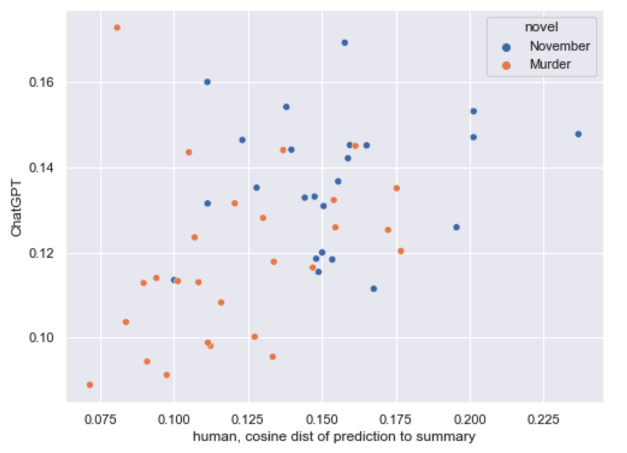
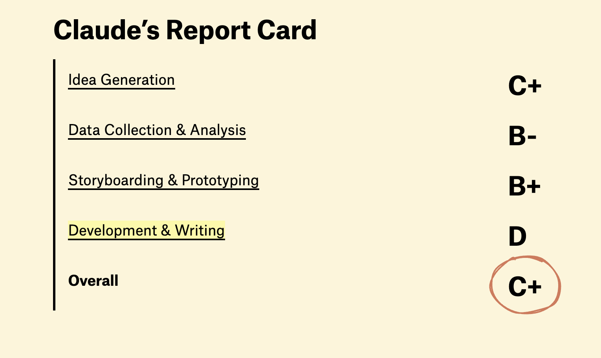

# What does it mean to work with culture as data in the age of AI?

Two readings today showing us very different approaches!

Let's start with [Underwood piece](https://tedunderwood.com/2024/01/05/can-language-models-predict-the-next-twist-in-a-story/){target="_blank"}...

# What is distant reading?

> While distant reading has taught us a lot about the history of fiction, it hasn’t done much yet to explain why we keep turning pages.

:::: {.columns}
::: {.column width="50%"}

::: 
::: {.column width="50%"}

:::
::::

#

::: {.r-fit-text .column width=100%}

:::

How does Underwood study suspense and what makes it difficult?

# 

Why is it a problem that these models have already seen these books? How does Underwood attempt to get around this problem?

#

What does Underwood find when it comes to the Baskervilles? How is he using computation to measure LLM results?

# Let's Compare to the Pudding Piece

*How did Samora and Pera-McGhee use AI compared to Underwood?*

# 

Why did the authors score Claude this way? Do you agree with their assessments? Did you like the Claude story?

# Big Questions 

- When can we trust AI for working with culture as data?
- What are the limits of using it for analysis vs other tasks?
- What happens to creativity and originality with these tools?