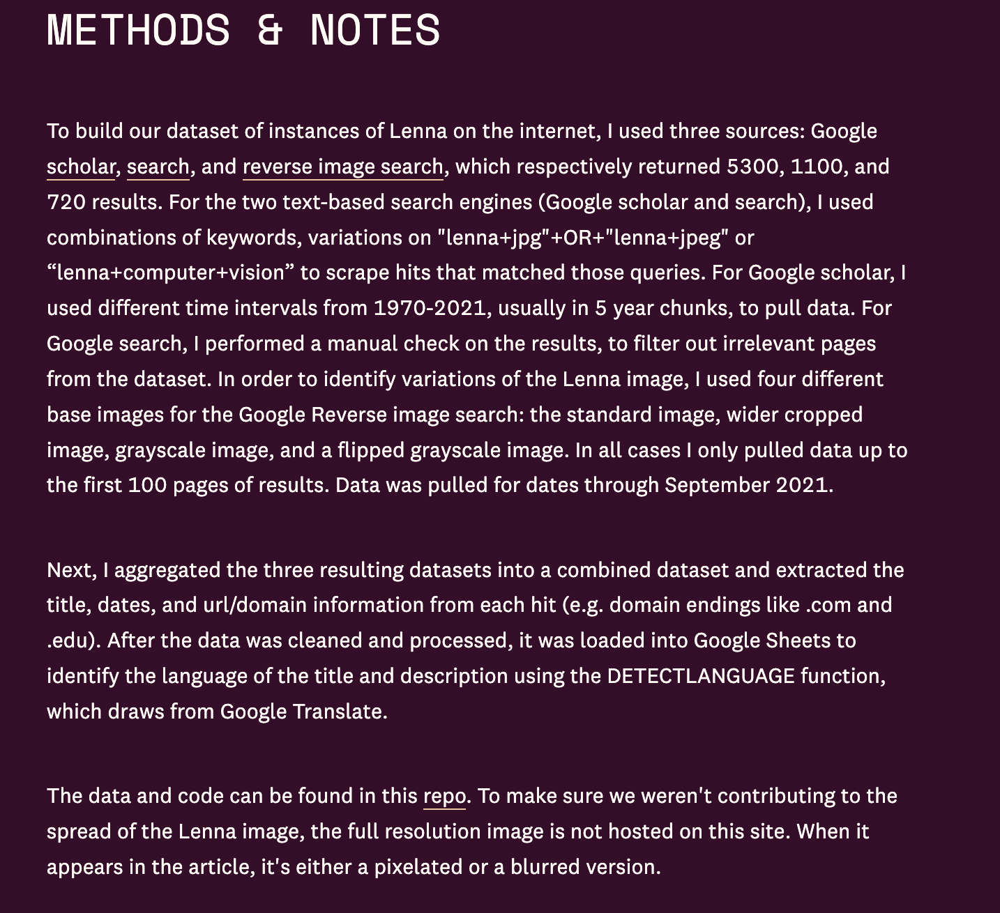

## What do we do with cultural data, once it is collected?

::: {.notes}
- Frame the day: collection is not the end of the story
- Today is about what comes after — preserve, share, restrict, retire?
- Three case studies: Mukurtu, CCP, Lenna — each a different answer
:::

## Today's discussion: When and how should we share cultural data?

## Let's Start with the Christen Piece

Why does Christen open her article with the Slashdot story about the Aboriginal archive and its use of new DRM?

{target="_blank"}

::: {.notes}
- The framing arrived before the project could speak for itself
- "Aboriginal DRM" — collapses access protocols into corporate digital locks
- One commenter: "No one elected some anthropologist and gave him/her the Godlike power..."
- Another: "This doesn't sound like DRM. It sounds like access control."
- Christen's point: the *vocabulary* available was the problem
- Open or closed, free or proprietary, public or private — false binaries
- "Individuals can make choices, but collectives, communities and groups are somehow suspicious"
- Note the asymmetry: Facebook privacy settings = good, community access protocols = censorship
:::

## What is Mukurtu? How was it developed and why?

{target="_blank"}

::: {.notes}
**Origin (2007)**
- Mukurtu Wumpurrarni-kari archive in Tennant Creek, Central Australia, with the Warumungu community
- "Mukurtu" = dilly bag in Warumungu; "Wumpurrarni-kari" = belonging to the Warumungu people
- Elders redefined "mukurtu" as "a safe keeping place" — protect AND circulate
- Originally stand-alone, browser-based — built for one community

**The pattern Christen kept seeing**
- Consultations with indigenous communities, archivists, librarians, museum scholars worldwide
- Encountered shared "ethical systems of accountability in which access is determined by particular sets of relationships or knowledge systems"
- Different communities, parallel needs:
  - Squamish Nation (Canada): clan/family system
  - Citizen Potawatomi (Oklahoma): 47 families
  - Maori (NZ): kin-based networks
  - Zuni libraries: cultural-based metadata standards w/ Library of Congress
  - Maasai (Kenya): commercial vs. internal circulation, IP management

**Why a platform, not another custom build**
- Many communities had built expensive one-off systems — obsolescence, no shared maintenance, no community of users to keep them alive
- Lesson borrowed from open source: participatory development = a shared, adaptable platform sustained by its users
- Worth surfacing the irony: the OSS movement is itself grounded in "information wants to be free," yet its participatory model is the part Mukurtu adopts

**Mukurtu CMS (Dec 20, 2010)**
- Open source, free, standards-based
- Three-layer architecture: Drupal 7 (scaffolding) → Mukurtu CMS (protocol-driven access layer) → community content
- Goal: community *ownership* of their own archiving systems

**Deployment principles**
- "Two-click mantra" — any task in two or fewer clicks; refuses techno-determinism
- Literacy + connectivity not assumed (Ginsburg 2008)
- Train-the-trainer + community empowerment embedded in every iteration
- Christen's critique: "a laptop on every desk" without attending to human needs, desires, and attitudes is hollow access
:::

## What are the origins and problems with the idea of information wanting to be free?

::: {.notes}
- Genealogy matters — the slogan didn't arrive fully formed
- Stewart Brand, 1984 Hacker Conference: "information wants to be expensive... information wants to be free... these two fighting against each other"
- Richard Stallman, 1990: shifts from price to *freedom to copy and adapt* — moral/social register, not economic
- John Perry Barlow, 1994: "Declaration of Independence of Cyberspace" — laundry list of what info "wants"
- Wired (1997) calls it "the single dominant ethic in this community"
- Ask: what does it mean to *personify* information? What gets erased when info has wants?
- Student annotation: "this is a funny sentence given that it personifies information"
- - Christen: meme gets retrofitted to American founding narratives
- Jefferson on ideas as "expansible over all space, like fire" — but this is selectively quoted
- Brandeis: "free as the air to common use" — but he says "after voluntary communication to others"
- That "voluntary" half is what gets dropped
- Hyde: "the commons were not open; they were stinted" — commons were always regulated, exclusive, governed by use rights
- The meme erases: colonial collecting, who voluntarily shared and who didn't, the labor and protocols that made commons function
:::

## Why is digital rights management important for cultural data?

- What makes Mukurtu different from other digital platforms?
- What is the problem of copyright in the context of indigenous cultural data?

{target="_blank"}

::: {.notes}
- Nissenbaum (quoted by Christen): "What people care most about is not simply restricting the flow of information but ensuring that it flows appropriately"
- "Restriction" is the wrong frame — it codes any access decision as negative
- Mukurtu starts from *existing* social systems and information circulation routes
- Granular: a person could be a woman, from the Jones family, with relations to Patta and Parrta country
- TK Labels: extend fair use into culturally specific access conditions for materials already in the public domain
- This is not DRM — protocols are revisable, dynamic, community-controlled
- Compare: the system you join (Facebook, Instagram) vs. the system that answers to you

“On December 20, 2010, more than three years after the original Mukurtu Wumpurrarni-kari archive was installed in Tennant Creek, my collaborators and I launched Mukurtu CMS: an open source, free, standards-based community archive and content management system aimed at the specific needs of indigenous peoples globally (http://www.mukurtu.org). Mukurtu translates directly to “dilly bag” in the Warumungu language. However, the Warumungu elders I worked with in Tennant Creek redefined the term as a “safe keeping place.” That is, the platform, like the dilly bag, is meant to protect and preserve cultural materials while also circulating and sharing them.” (Christen, 2012, p. 2883)

“At its core, Mukurtu CMS allows for and is driven by relationships: community, individual, familial, clan, ancestral, etc. That is, the system takes as its philosophical and architectural starting points the already-existing social systems and information circulation routes of any given community. Mukurtu CMS allows users—from small community archives to tribal museums, to individual or family users—to infuse their voices, their cultural concerns, and their notions of sociality and historicity into the system. For as Helen Nissenbuam points out in her exhaustive study of privacy, “What people care most about is not simply restricting the flow of information but ensuring that it flows appropriately” (2010, p. 2). Perhaps restriction is the wrong word. Instead of making any type of access choice a negative, we might look at choices about circulation models as reflecting the diversity of peoples around the world—a diversity not to be celebrated in and of itself, but to be acknowledged within the spectrum of access models.” (Christen, 2012, p. 2887)

“Copyright in the U.S. context has recently driven much of the dialogue about access, use, and “fair use.” Copyright is a particular social and legal solution to a tension between content creators, content consumers, and content distributers; it should not, however, be the benchmark for how we understand the range of possibilities for managing knowledge circulation (Boyle, 2008, pp. 2–5). Mukurtu CMS takes an agnostic view toward licensing that accounts for the diverse legal and social needs of indigenous communities globally as they manage and share their digital cultural heritage and knowledge with third parties. For any piece of content or collection, one can choose between traditional copyright, Creative Commons licenses, and our own traditional knowledge (TK) licenses and labels for any materials to be shared externally.12” (Christen, 2012, p. 2887)

“Clearly, Mukurtu CMS is not a DRM system in any sense. Contrary to the remarks on Slashdot that I quoted at the start of this article, the software neither locks anything up, nor closes anyone out. Mukurtu CMS provides software solutions that allow any community to define their own access parameters and protocols for sharing. These are all open, in the sense that the platform allows anyone who sets up an instance of Mukurtu CMS to constantly change, add, delete, and update their protocols, categories, and communities. In this way, the platform allows users—variously defined and self identified—to customize and adapt the system to their needs. Social networking sites are championed merely because they allow individual users to define who sees their posts or choose who can interact with them. Those who celebrate this functionality because it helps to ensure individual privacy are nonetheless confounded when an archiving and content management tool aimed at indigenous peoples incorporates access permissions for members of their own communities. The comments on Slashdot make it clear that the technology was not in question, but its application to specific communities: Individuals can make choices, but collectives, communities and groups are somehow suspicious.” (Christen, 2012, p. 2888)
:::

## How does this relate to the Colored Conventions Project? 

{target="_blank"}

::: {.notes}
- 1830-1900s: 600+ state and national Colored Conventions across North America
- First convention 1830 at Mother Bethel AME, Philadelphia — response to Ohio's exclusionary laws
- Frederick Douglass, George T. Downing, plus thousands whose names were forgotten
- Foreman: "The abolitionist movement has both illuminated and obscured the importance of nineteenth-century Black activism"
- Well-preserved abolitionist archives vs. scattered convention records
- CCP = scholarly + community research project, transcribing/archiving/curating
- 2,500+ contributors; partnership-based by design
- Note the parallel to Mukurtu: the *form* of the project mirrors the *content* (collective Black organizing → collective digital project)
:::

## What are some of the core CCP Principles?

{target="_blank"}

::: {.notes}
- Inspired by the Jemez Principles for Democratic Organizing (1996, named after Jemez pueblo, NM) — note the cross-movement lineage
- Center Black women's labor and leadership — refuse the erasure that *official records* perform
- Black people as **data creators**, not just data subjects
- Equitable compensation, acknowledgement, attribution
- "We seek to avoid exploiting Black subjects as data and to account for the contexts out of which Black subjects as data arise"
- "We seek to name Black people and communities as an affirmation of the Black humanity inherent in Black data/curation"
- Naming as resistance — the opposite of "miscellaneous slavery documents"
- The CCP principles end with: "all data and datasets are shaped by decisions about whose histories are recorded, remembered, and valued"
- One of your students annotated this exact line — "this is a direct challenge to the 'objectivity' of historical data"
- Connect to Christen: the public domain was *populated by decisions* too
- The move both projects make: surface the decisions, change who gets to make them
- CCP enacts what Mukurtu architects: data practices that mirror community structures
:::

## How does this relate to the Lenna Image piece?

{target="_blank"}

::: {.notes}
- The Pudding piece by Ding, Diehm, McGhee (Oct 2021)
- Lenna Forsén: 1972 Playboy centerfold, cropped to a head-and-shoulder shot, became a standard test image in image processing
- One of the first images on ARPANET → standard benchmark in CS, EE, image processing courses for decades
- Engineering folklore — "everyone uses Lenna"
- Forsén did not consent to this use; later asked to be retired
- "I retired from modelling a long time ago. It's time I retired from tech, too"
- Note: this is the inverse of the Mukurtu/CCP framing — not "how do we keep this circulating" but "how do we let this stop"
:::

## How did the Pudding track the spread of the image?

::: {.notes}
- Pudding methodology: scraped Google Scholar, search, reverse image search to track thousands of instances
- Pre-1990: mostly .org domains — research/military
- Post-1990: .com, .edu, then everywhere
- Image hits peaked in 1995 — Playboy controversy canonized it in engineering folklore
- One of "the only women this well referenced, respected, and remembered" in the field — known for a nude photo
- Student annotation: "the problem isn't just Forsén's consent, but what it signals to women in engineering about whose contributions actually get recognized"
:::

## Why ask if "can data die?"

::: {.notes}
- Central question of the piece — and of the day
- Forsén's request to retire her image is the *inverse* of the Mukurtu/CCP move:
  - Mukurtu/CCP: how do we keep this circulating, with care?
  - Lenna: how do we let this stop?
- The Pudding diagnosis: "while social norms are changing toward non-consensual data collection, digital norms seem to be moving in the opposite direction"
- ML and storage advances make data misuse easier, not harder
- Pudding's call: build "tools and policies that empower data subjects to have a say in what happens to their data… including allowing their data to die"
- Discussion prompts:
  - What would it take, technically, for an image to actually retire?
  - What would it take, socially?
  - Christen's TK Labels are one tool; CCP's principles are another. What's the equivalent for individual data subjects?
:::

## Why do we need alternatives to how data is managed and shared?

- What are some of the tradeoffs between privacy and openness in data management?
- What are the problems with valuing openness and public domain as default?
- What are some of the ways we can ensure communities have a say in how their data is managed and shared?

::: {.notes}
- **Mukurtu**: protocols *with* community — circulation governed by existing social systems
- **CCP**: collective work *by* community + allies — data practice mirrors movement form
- **Lenna**: consent *from* the data subject — including the right to stop circulating
- These aren't the same problem with the same solution
- Indigenous cultural heritage, Black political history, individual non-consensual likeness — different stakes, different tools
- But shared move: refuse the default of "open = good, restriction = bad"
- All three insist that *who decides* is the question
- Pick a project you've worked on or want to work on. Who are the communities your data implicates?
- What would it mean to design *with* them rather than *about* them?
- What rights to your work as a data subject do you wish you had?
- Where in your future work could a TK Label, a CCP-style principle, or a Lenna-style retirement actually sit?
- Bring it back: "human beings must decide" — which humans, which decisions, on which timeline?
:::

## Spectrum of Openness

{target="_blank"}

::: {.notes}
- The Turing Way: community-driven guide to reproducible, ethical, inclusive data science
- Particularly useful for cultural data work
- Today's readings give us *why* it matters; this section gives us *how* to operationalize
- The bridge: every commitment we just discussed has to land somewhere — in a README, a metadata field, a license choice
- Image credit: Scriberia for The Turing Way, CC-BY 4.0
:::

## Documentation as a lamp in the dark forest

{target="_blank"}

::: {.notes}
- Documentation feels boring — it isn't. It's the difference between a project that lives and one that dies on a hard drive
- Without it: confusion, errors, no reproducibility, no future use
- The lamp/map metaphor — documentation helps others (including future-you) find their way
- For cultural data this is *more* important, not less, because the interpretive choices need to travel with the data
- Concrete asks for your final projects:
  - README.md in your repo
  - Data dictionary / codebook for variables
  - Notes on what's *missing* and why
- Frame documentation as a chance to articulate the principles you want others to follow when engaging your materials
:::

## Tidy data, briefly

{target="_blank"}

::: {.notes}
- Adapted from Broman & Woo, "Data Organization in Spreadsheets"
- Save in interoperable formats — CSV/TSV over .xlsx
- Be consistent — units, date formats, spellings, naming
- One thing per cell, no merged cells, no color-coding as data
- Make it a rectangle — no headers/footers floating above the table
- Dates as YYYY-MM-DD (ISO 8601)
- Use NA/NULL for missing data; don't leave cells blank — and document the missingness
- Descriptive column names — "participant_age" not "col3"
- Backups in multiple locations
- These aren't aesthetic preferences — they're what lets your data be reused
:::

## Digital publishing: Some considerations for your final projects!

No universal answers, but every project answers each of these implicitly, so make it explicit:

- **Audience** — Who is your audience? Scholars, general public, a specific community? Different audiences need different framings!
- **Accessibility** — How accessible are your materials? Do you include alt text, open access, alternative formats, plain language summaries, etc?
- **Interactivity** — How interactive are your materials? When do multimedia and interactive visualizations help, and when are they decoration?
- **Sustainability** — How sustainable is your project? Who maintains this in 5 years?
- **Politics/Ethics** — How does your project engage with communities? Do you have informed consent? Are you considering privacy and future use?
- 
::: {.notes}
- Connect back: Mukurtu's TK Labels, CCP's principles, Forsén's request to retire — each is an answer to one of these questions
:::

## Your Group Work & Principles

Let's revisit [the GitHub Guidelines](../assessments/05-github-style-guide.qmd){target="_blank"}

::: {.notes}
- For your final projects, I want to see you make these choices visible
- Not just "I built this" but "I built this *for* these people, with *these* commitments, knowing *these* limits"
- Documentation isn't separate from the argument — it IS part of the argument
- The README is where your ethics live in code
- Last prompt before we wrap: pick one of the five considerations. What's the hardest one for your project? Why?
:::